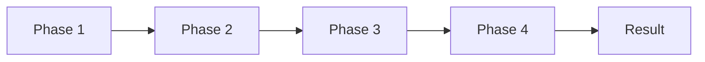
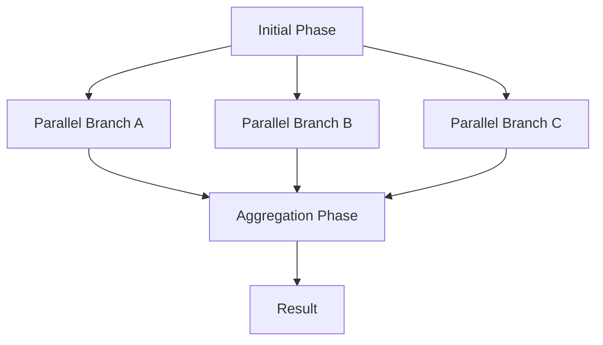
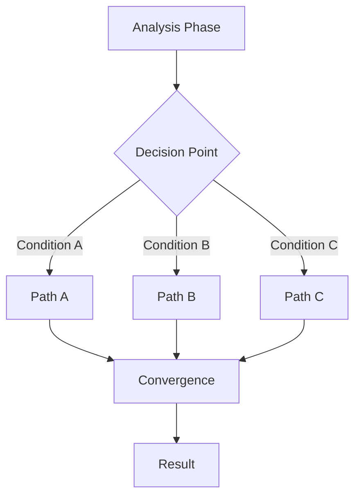
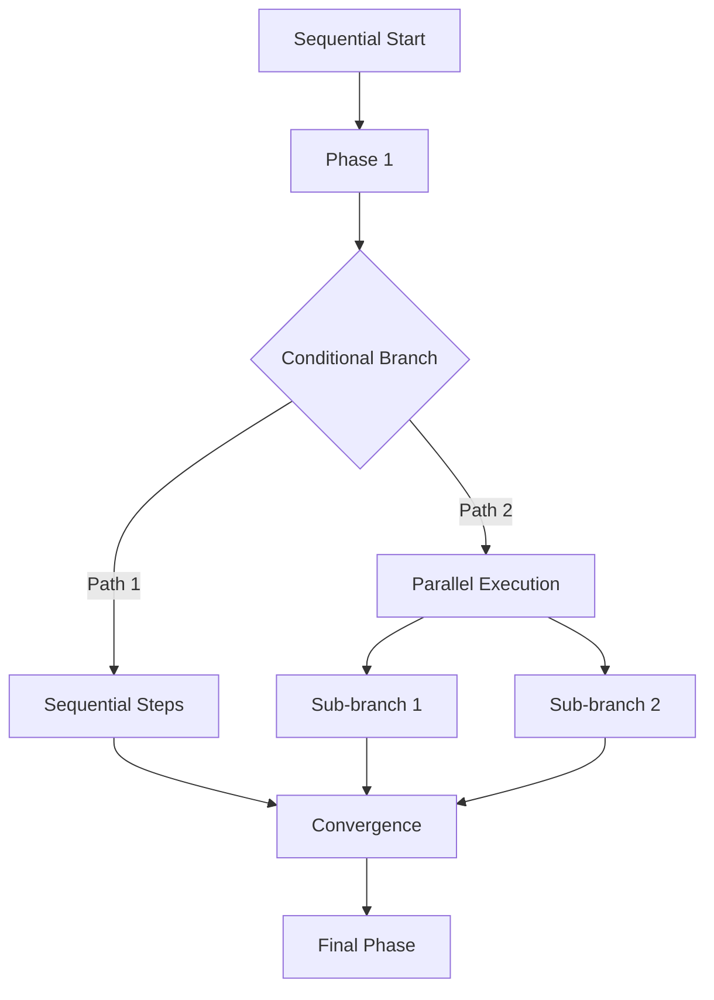

# Workflow Pattern Analysis

## Overview

This document provides a comprehensive analysis of workflow coordination patterns used in multi-agent orchestration. Understanding these patterns is crucial for creating efficient, maintainable workflows that maximize agent capabilities.

## Core Workflow Patterns

### 1. Sequential Workflows

Sequential workflows represent linear task progression where each phase depends on the previous one.



#### Characteristics
- **Linear Dependency**: Each phase requires completion of the previous phase
- **Context Accumulation**: Information builds progressively through phases
- **Simple Error Handling**: Failures can be handled at each phase
- **Predictable Execution**: Clear, deterministic flow

#### Use Cases
- Step-by-step processes (e.g., build → test → deploy)
- Data transformation pipelines
- Approval workflows
- Progressive enhancement scenarios

#### Example Pattern
```markdown
## Phase 1: Foundation
- Use Task tool with subagent_type="architect"
- Output: Architecture design
- Context for next: Design specifications

## Phase 2: Implementation
- Use Task tool with subagent_type="developer"
- Input: Architecture from Phase 1
- Output: Implementation code
- Context accumulation: Design + Code
```

### 2. Parallel Workflows

Parallel workflows enable concurrent execution of independent tasks, improving efficiency.



#### Characteristics
- **Independent Execution**: Branches run concurrently
- **Resource Optimization**: Better utilization of available agents
- **Complex Synchronization**: Requires careful result aggregation
- **Performance Benefits**: Reduced overall execution time

#### Use Cases
- Multi-platform development (web + mobile + API)
- Independent feature implementation
- Parallel quality checks (testing + security + performance)
- Distributed data processing

#### Example Pattern
```markdown
## Phase 1: Parallel Development
### Branch A: Frontend
- Use Task tool with subagent_type="frontend-developer"
- Independent execution

### Branch B: Backend
- Use Task tool with subagent_type="backend-developer"
- Independent execution

### Branch C: Mobile
- Use Task tool with subagent_type="mobile-developer"
- Independent execution

## Phase 2: Integration
- Use Task tool with subagent_type="integration-engineer"
- Aggregate results from all branches
```

### 3. Conditional Workflows

Conditional workflows implement decision-based branching for dynamic execution paths.



#### Characteristics
- **Dynamic Path Selection**: Runtime decision making
- **Flexible Execution**: Adapts to different scenarios
- **Complex Logic**: Requires clear decision criteria
- **Fallback Support**: Can include default paths

#### Use Cases
- Technology selection (AWS vs Azure vs GCP)
- Payment processing (Stripe vs PayPal)
- Deployment strategies (blue-green vs canary)
- Error recovery paths

#### Example Pattern
```markdown
## Phase 1: Analysis
- Use Task tool with subagent_type="analyst"
- Output: Recommendation and criteria

## Phase 2: Conditional Implementation
### If Condition: Cloud Provider = AWS
- Use Task tool with subagent_type="aws-specialist"

### Elif Condition: Cloud Provider = Azure
- Use Task tool with subagent_type="azure-specialist"

### Else: Default to GCP
- Use Task tool with subagent_type="gcp-specialist"
```

### 4. Hybrid Workflows

Hybrid workflows combine multiple patterns for complex orchestration scenarios.



#### Characteristics
- **Maximum Flexibility**: Combines all pattern types
- **Complex Coordination**: Requires sophisticated management
- **Optimal Efficiency**: Uses best pattern for each phase
- **Challenging Design**: Needs careful planning

#### Use Cases
- Full application development lifecycle
- Complex data processing pipelines
- Multi-stage deployment processes
- Enterprise integration scenarios

## Pattern Selection Criteria

### Decision Matrix

| Criteria | Sequential | Parallel | Conditional | Hybrid |
|----------|------------|----------|-------------|---------|
| Task Dependencies | High | Low | Medium | Variable |
| Execution Speed | Slower | Faster | Medium | Optimized |
| Complexity | Low | Medium | Medium | High |
| Error Handling | Simple | Complex | Medium | Complex |
| Resource Usage | Low | High | Medium | Variable |
| Flexibility | Low | Medium | High | Maximum |

### Selection Guidelines

1. **Use Sequential When:**
   - Tasks have strict dependencies
   - Context must flow linearly
   - Simple, predictable process
   - Order is critical

2. **Use Parallel When:**
   - Tasks are independent
   - Performance is critical
   - Resources are available
   - Results can be aggregated

3. **Use Conditional When:**
   - Multiple valid approaches exist
   - Runtime decisions needed
   - Different scenarios require different handling
   - Flexibility is important

4. **Use Hybrid When:**
   - Complex requirements
   - Multiple patterns needed
   - Optimization is critical
   - Full orchestration control required

## Context Management Strategies

### Sequential Context Flow
```python
context = {}
for phase in workflow.phases:
    phase_result = execute_phase(phase, context)
    context.update(phase_result)
```

### Parallel Context Isolation
```python
base_context = prepare_base_context()
results = parallel_execute([
    (branch_a, base_context.copy()),
    (branch_b, base_context.copy()),
    (branch_c, base_context.copy())
])
merged_context = merge_results(results)
```

### Conditional Context Branching
```python
analysis_context = analyze_requirements()
if analysis_context['condition'] == 'A':
    context = execute_path_a(analysis_context)
elif analysis_context['condition'] == 'B':
    context = execute_path_b(analysis_context)
else:
    context = execute_default_path(analysis_context)
```

## Performance Characteristics

### Execution Time Analysis

| Pattern | Best Case | Average Case | Worst Case |
|---------|-----------|--------------|------------|
| Sequential | O(n) | O(n) | O(n) |
| Parallel | O(1) | O(log n) | O(n) |
| Conditional | O(1) | O(n/2) | O(n) |
| Hybrid | O(1) | O(√n) | O(n) |

Where n = number of tasks/phases

### Resource Utilization

1. **Sequential**: Minimal resource usage, one agent at a time
2. **Parallel**: Maximum resource usage, multiple concurrent agents
3. **Conditional**: Variable usage based on path selection
4. **Hybrid**: Optimized usage based on phase requirements

## Anti-Patterns to Avoid

### 1. Unnecessary Parallelization
- Don't parallelize dependent tasks
- Avoid parallel execution for trivial tasks
- Consider overhead vs benefits

### 2. Over-Complex Conditionals
- Limit decision tree depth
- Avoid nested conditionals beyond 3 levels
- Provide clear default paths

### 3. Context Pollution
- Don't pass unnecessary context
- Avoid mutable shared state in parallel branches
- Clean up context between phases

### 4. Pattern Misuse
- Don't use hybrid for simple workflows
- Avoid sequential for independent tasks
- Don't force patterns where they don't fit

## Optimization Strategies

### 1. Pattern Combination
```markdown
## Optimized Hybrid Example
Phase 1: Sequential analysis
Phase 2: Conditional technology selection
Phase 3: Parallel implementation
Phase 4: Sequential integration
```

### 2. Dynamic Pattern Selection
```python
def select_pattern(requirements):
    if has_dependencies(requirements):
        if has_alternatives(requirements):
            return 'hybrid'
        return 'sequential'
    elif can_parallelize(requirements):
        return 'parallel'
    else:
        return 'conditional'
```

### 3. Adaptive Workflows
- Start with simple patterns
- Evolve based on execution metrics
- Optimize bottlenecks
- Learn from patterns

## Validation and Testing

### Pattern Validation Checklist

- [ ] Dependencies correctly identified
- [ ] Parallel branches truly independent
- [ ] Conditional logic complete and clear
- [ ] Context flow properly designed
- [ ] Error handling comprehensive
- [ ] Resource requirements considered
- [ ] Performance implications evaluated

### Testing Strategies

1. **Unit Testing**: Test individual phases
2. **Integration Testing**: Test phase transitions
3. **Pattern Testing**: Validate pattern behavior
4. **Performance Testing**: Measure execution characteristics
5. **Failure Testing**: Verify error handling

## Future Directions

### Emerging Patterns

1. **Reactive Workflows**: Event-driven execution
2. **Adaptive Workflows**: Self-modifying based on results
3. **Distributed Workflows**: Cross-system orchestration
4. **ML-Optimized Workflows**: Pattern selection via machine learning

### Pattern Evolution

- Automated pattern detection
- Dynamic pattern optimization
- Hybrid pattern generation
- Context-aware pattern selection

## Conclusion

Understanding workflow patterns is essential for creating effective multi-agent orchestrations. Each pattern has its strengths and ideal use cases. The key to success is:

1. Analyzing requirements thoroughly
2. Selecting appropriate patterns
3. Implementing proper context management
4. Optimizing for performance
5. Maintaining simplicity where possible

By mastering these patterns, you can create workflows that are efficient, maintainable, and scalable.