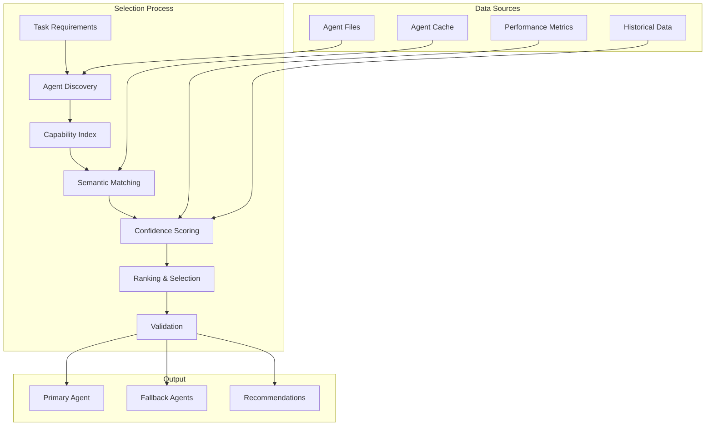

# Agent Selection Design

## Overview

Agent selection is a critical component of the workflow creator system. This document details the design and implementation of the dynamic agent selection mechanism that matches tasks to the most suitable agents from our ecosystem of 40+ specialized agents.

## Selection Philosophy

### Core Principles

1. **Dynamic Discovery**: Agents are discovered and analyzed at runtime
2. **Semantic Matching**: Use NLP to understand capabilities beyond keywords
3. **Confidence Scoring**: Quantitative assessment of agent-task fit
4. **Fallback Strategies**: Always have alternative options
5. **Performance Awareness**: Consider agent model requirements and speed

## Agent Selection Architecture



## Agent Discovery Process

### File-Based Discovery

```python
class AgentDiscoveryService:
    """Discovers and analyzes available agents from filesystem"""
    
    def __init__(self, agents_directory: Path):
        self.agents_directory = agents_directory
        self.discovery_cache = {}
        self.last_scan_time = None
    
    async def discover_agents(self) -> Dict[str, AgentInfo]:
        """Scan agent files and extract comprehensive information"""
        agents = {}
        
        for agent_file in self.agents_directory.glob("*.md"):
            # Check cache validity
            if self._is_cached(agent_file):
                agents[agent_file.stem] = self.discovery_cache[agent_file.stem]
                continue
            
            # Parse agent file
            agent_info = await self._parse_agent_file(agent_file)
            if agent_info:
                agents[agent_info.name] = agent_info
                self.discovery_cache[agent_info.name] = agent_info
        
        self.last_scan_time = datetime.utcnow()
        return agents
```

### Agent Information Extraction

```python
@dataclass
class AgentInfo:
    """Comprehensive agent information structure"""
    name: str                    # Unique identifier
    description: str             # Brief capability summary
    model: str                   # Required model (opus/sonnet/haiku)
    capabilities: List[str]      # Extracted capabilities
    focus_areas: List[str]       # Specialization areas
    technologies: List[str]      # Supported technologies
    output_formats: List[str]    # Expected outputs
    performance_metrics: Dict    # Historical performance data
    compatibility_score: float   # Inter-agent compatibility
    
    def __post_init__(self):
        self.capability_vector = self._compute_capability_vector()
        self.technology_set = set(self.technologies)
```

## Capability Indexing

### Multi-Dimensional Index

```python
class CapabilityIndex:
    """Multi-dimensional index for efficient agent search"""
    
    def __init__(self):
        # Primary indexes
        self.capability_index = {}   # capability -> [agents]
        self.technology_index = {}   # technology -> [agents]
        self.domain_index = {}       # domain -> [agents]
        self.model_index = {}        # model -> [agents]
        
        # Secondary indexes
        self.pattern_index = {}      # workflow_pattern -> [agents]
        self.performance_index = {}  # performance_tier -> [agents]
        
        # Semantic index
        self.semantic_embeddings = {}  # agent -> embedding
    
    async def index_agent(self, agent_info: AgentInfo):
        """Index agent across multiple dimensions"""
        # Capability indexing
        for capability in agent_info.capabilities:
            self.capability_index.setdefault(capability, []).append(agent_info)
        
        # Technology indexing
        for tech in agent_info.technologies:
            self.technology_index.setdefault(tech, []).append(agent_info)
        
        # Model indexing
        self.model_index.setdefault(agent_info.model, []).append(agent_info)
        
        # Semantic indexing
        embedding = await self._compute_semantic_embedding(agent_info)
        self.semantic_embeddings[agent_info.name] = embedding
```

### Semantic Embedding

```python
class SemanticEmbedder:
    """Compute semantic embeddings for agents and tasks"""
    
    def __init__(self):
        self.embedding_model = SentenceTransformer('all-MiniLM-L6-v2')
        self.embedding_cache = {}
    
    async def compute_agent_embedding(self, agent_info: AgentInfo) -> np.ndarray:
        """Generate semantic embedding for agent capabilities"""
        # Combine all text representations
        text_representation = " ".join([
            agent_info.description,
            " ".join(agent_info.capabilities),
            " ".join(agent_info.focus_areas),
            " ".join(agent_info.technologies)
        ])
        
        # Check cache
        cache_key = hashlib.md5(text_representation.encode()).hexdigest()
        if cache_key in self.embedding_cache:
            return self.embedding_cache[cache_key]
        
        # Compute embedding
        embedding = self.embedding_model.encode([text_representation])[0]
        self.embedding_cache[cache_key] = embedding
        
        return embedding
```

## Matching Algorithm

### Multi-Stage Matching Process

```python
class AgentMatcher:
    """Sophisticated agent matching with multiple strategies"""
    
    def __init__(self, capability_index: CapabilityIndex, embedder: SemanticEmbedder):
        self.capability_index = capability_index
        self.embedder = embedder
        self.matching_strategies = [
            self.exact_capability_match,
            self.semantic_similarity_match,
            self.technology_alignment_match,
            self.domain_expertise_match,
            self.performance_based_match
        ]
    
    async def match_agents_to_task(self, task: Task) -> List[AgentMatch]:
        """Find best agents for a task using multiple strategies"""
        all_matches = {}
        
        # Apply each matching strategy
        for strategy in self.matching_strategies:
            matches = await strategy(task)
            for match in matches:
                if match.agent.name in all_matches:
                    # Combine scores from multiple strategies
                    all_matches[match.agent.name].score += match.score
                else:
                    all_matches[match.agent.name] = match
        
        # Normalize and rank matches
        matches_list = list(all_matches.values())
        self._normalize_scores(matches_list)
        
        return sorted(matches_list, key=lambda x: x.confidence, reverse=True)
```

### Matching Strategies

#### 1. Exact Capability Match

```python
async def exact_capability_match(self, task: Task) -> List[AgentMatch]:
    """Match based on exact capability requirements"""
    matches = []
    
    # Extract required capabilities from task
    required_capabilities = self._extract_capabilities(task.description)
    
    for capability in required_capabilities:
        if capability in self.capability_index.capability_index:
            agents = self.capability_index.capability_index[capability]
            for agent in agents:
                matches.append(AgentMatch(
                    agent=agent,
                    score=1.0,  # Exact match gets full score
                    match_type="exact_capability",
                    matched_on=capability
                ))
    
    return matches
```

#### 2. Semantic Similarity Match

```python
async def semantic_similarity_match(self, task: Task) -> List[AgentMatch]:
    """Match based on semantic similarity of descriptions"""
    matches = []
    
    # Compute task embedding
    task_embedding = await self.embedder.compute_task_embedding(task)
    
    # Compare with all agent embeddings
    for agent_name, agent_embedding in self.capability_index.semantic_embeddings.items():
        similarity = cosine_similarity([task_embedding], [agent_embedding])[0][0]
        
        if similarity > 0.3:  # Minimum threshold
            agent = self._get_agent_info(agent_name)
            matches.append(AgentMatch(
                agent=agent,
                score=similarity,
                match_type="semantic_similarity",
                similarity_score=similarity
            ))
    
    return matches
```

#### 3. Technology Alignment Match

```python
async def technology_alignment_match(self, task: Task) -> List[AgentMatch]:
    """Match based on technology requirements"""
    matches = []
    
    # Extract technology mentions from task
    technologies = self._extract_technologies(task.description)
    
    for tech in technologies:
        if tech in self.capability_index.technology_index:
            agents = self.capability_index.technology_index[tech]
            for agent in agents:
                # Calculate technology coverage
                coverage = len(set(technologies) & agent.technology_set) / len(technologies)
                matches.append(AgentMatch(
                    agent=agent,
                    score=coverage,
                    match_type="technology_alignment",
                    technologies_matched=list(set(technologies) & agent.technology_set)
                ))
    
    return matches
```

## Confidence Scoring

### Multi-Factor Confidence Calculation

```python
class ConfidenceScorer:
    """Calculate confidence scores for agent-task matches"""
    
    def __init__(self):
        self.scoring_weights = {
            'capability_match': 0.3,
            'semantic_similarity': 0.25,
            'technology_alignment': 0.2,
            'model_appropriateness': 0.15,
            'historical_performance': 0.1
        }
    
    async def calculate_confidence(self, match: AgentMatch, task: Task) -> float:
        """Calculate comprehensive confidence score"""
        scores = {}
        
        # Capability match score
        scores['capability_match'] = self._score_capability_match(match, task)
        
        # Semantic similarity score
        scores['semantic_similarity'] = match.similarity_score if hasattr(match, 'similarity_score') else 0
        
        # Technology alignment score
        scores['technology_alignment'] = self._score_technology_alignment(match, task)
        
        # Model appropriateness score
        scores['model_appropriateness'] = self._score_model_appropriateness(match.agent, task)
        
        # Historical performance score
        scores['historical_performance'] = self._score_historical_performance(match.agent, task)
        
        # Weighted combination
        confidence = sum(
            scores[factor] * weight 
            for factor, weight in self.scoring_weights.items()
        )
        
        return min(confidence, 1.0)  # Cap at 1.0
```

### Scoring Components

```python
def _score_capability_match(self, match: AgentMatch, task: Task) -> float:
    """Score based on capability coverage"""
    required_capabilities = self._extract_capabilities(task.description)
    agent_capabilities = set(match.agent.capabilities)
    
    if not required_capabilities:
        return 0.5  # Neutral score if no specific capabilities required
    
    coverage = len(required_capabilities & agent_capabilities) / len(required_capabilities)
    specificity = len(required_capabilities & agent_capabilities) / len(agent_capabilities)
    
    return (coverage * 0.7) + (specificity * 0.3)

def _score_model_appropriateness(self, agent: AgentInfo, task: Task) -> float:
    """Score based on model suitability for task complexity"""
    task_complexity = self._assess_task_complexity(task)
    
    if agent.model == 'opus':
        return 1.0 if task_complexity == 'high' else 0.7
    elif agent.model == 'sonnet':
        return 1.0 if task_complexity == 'medium' else 0.8
    elif agent.model == 'haiku':
        return 1.0 if task_complexity == 'low' else 0.5
    
    return 0.5  # Default neutral score
```

## Fallback Strategies

### Multi-Level Fallback System

```python
class FallbackSelector:
    """Select fallback agents for resilience"""
    
    def __init__(self):
        self.fallback_levels = [
            self.similar_capability_fallback,
            self.same_domain_fallback,
            self.general_purpose_fallback,
            self.manual_intervention_fallback
        ]
    
    async def select_fallbacks(self, primary_agent: AgentInfo, task: Task, num_fallbacks: int = 3) -> List[AgentInfo]:
        """Select appropriate fallback agents"""
        fallbacks = []
        excluded_agents = {primary_agent.name}
        
        for fallback_strategy in self.fallback_levels:
            candidates = await fallback_strategy(primary_agent, task, excluded_agents)
            
            for candidate in candidates:
                if candidate.name not in excluded_agents:
                    fallbacks.append(candidate)
                    excluded_agents.add(candidate.name)
                    
                    if len(fallbacks) >= num_fallbacks:
                        return fallbacks
        
        return fallbacks
```

## Selection Validation

### Pre-Selection Validation

```python
class SelectionValidator:
    """Validate agent selections before workflow generation"""
    
    async def validate_selection(self, agent: AgentInfo, task: Task) -> ValidationResult:
        """Comprehensive validation of agent selection"""
        checks = {
            'capability_coverage': self._check_capability_coverage(agent, task),
            'model_availability': self._check_model_availability(agent),
            'resource_requirements': self._check_resource_requirements(agent, task),
            'compatibility_check': self._check_agent_compatibility(agent, task),
            'performance_threshold': self._check_performance_threshold(agent)
        }
        
        passed = all(check.passed for check in checks.values())
        
        return ValidationResult(
            passed=passed,
            checks=checks,
            recommendations=self._generate_recommendations(checks, agent, task)
        )
```

## Performance Optimization

### Caching Strategy

```python
class AgentSelectionCache:
    """Cache agent selections for performance"""
    
    def __init__(self):
        self.selection_cache = TTLCache(maxsize=1000, ttl=3600)  # 1 hour TTL
        self.hit_rate_monitor = HitRateMonitor()
    
    async def get_cached_selection(self, task_hash: str) -> Optional[List[AgentMatch]]:
        """Retrieve cached agent selection"""
        if task_hash in self.selection_cache:
            self.hit_rate_monitor.record_hit()
            return self.selection_cache[task_hash]
        
        self.hit_rate_monitor.record_miss()
        return None
    
    async def cache_selection(self, task_hash: str, selection: List[AgentMatch]):
        """Cache agent selection with TTL"""
        self.selection_cache[task_hash] = selection
```

### Batch Selection

```python
class BatchAgentSelector:
    """Optimize agent selection for multiple tasks"""
    
    async def select_agents_batch(self, tasks: List[Task]) -> Dict[Task, List[AgentMatch]]:
        """Select agents for multiple tasks efficiently"""
        # Group similar tasks
        task_groups = self._group_similar_tasks(tasks)
        
        results = {}
        for group_key, grouped_tasks in task_groups.items():
            # Select agents for the group
            group_agents = await self._select_for_group(grouped_tasks)
            
            # Assign to individual tasks
            for task in grouped_tasks:
                results[task] = self._customize_for_task(group_agents, task)
        
        return results
```

## Monitoring and Analytics

### Selection Metrics

```python
class SelectionMetrics:
    """Track agent selection performance and patterns"""
    
    def __init__(self):
        self.metrics = {
            'selection_time': [],
            'confidence_scores': [],
            'fallback_usage': 0,
            'agent_utilization': defaultdict(int),
            'match_type_distribution': defaultdict(int)
        }
    
    async def record_selection(self, selection_event: SelectionEvent):
        """Record metrics for agent selection"""
        self.metrics['selection_time'].append(selection_event.duration)
        self.metrics['confidence_scores'].append(selection_event.confidence)
        self.metrics['agent_utilization'][selection_event.agent_name] += 1
        self.metrics['match_type_distribution'][selection_event.match_type] += 1
        
        if selection_event.is_fallback:
            self.metrics['fallback_usage'] += 1
```

## Future Enhancements

### Machine Learning Integration

```python
class MLAgentSelector:
    """Machine learning enhanced agent selection"""
    
    def __init__(self):
        self.selection_model = self._load_selection_model()
        self.feature_extractor = FeatureExtractor()
    
    async def predict_best_agent(self, task: Task) -> AgentPrediction:
        """Use ML to predict best agent for task"""
        # Extract features
        features = await self.feature_extractor.extract(task)
        
        # Make prediction
        prediction = self.selection_model.predict(features)
        
        return AgentPrediction(
            agent_name=prediction['agent'],
            confidence=prediction['confidence'],
            alternative_agents=prediction['alternatives']
        )
```

### Adaptive Selection

```python
class AdaptiveAgentSelector:
    """Learn from execution results to improve selection"""
    
    async def update_selection_model(self, execution_result: ExecutionResult):
        """Update selection model based on execution feedback"""
        if execution_result.success:
            # Reinforce successful selections
            await self._reinforce_selection(execution_result)
        else:
            # Learn from failures
            await self._adjust_from_failure(execution_result)
```

## Conclusion

The agent selection system is designed to be:

1. **Intelligent**: Uses multiple matching strategies and semantic understanding
2. **Flexible**: Supports various selection criteria and fallback strategies
3. **Performant**: Optimized with caching and indexing
4. **Reliable**: Includes validation and fallback mechanisms
5. **Adaptive**: Learns from historical performance

This comprehensive approach ensures that the workflow creator can consistently match tasks with the most suitable agents, leading to successful workflow execution and optimal results.