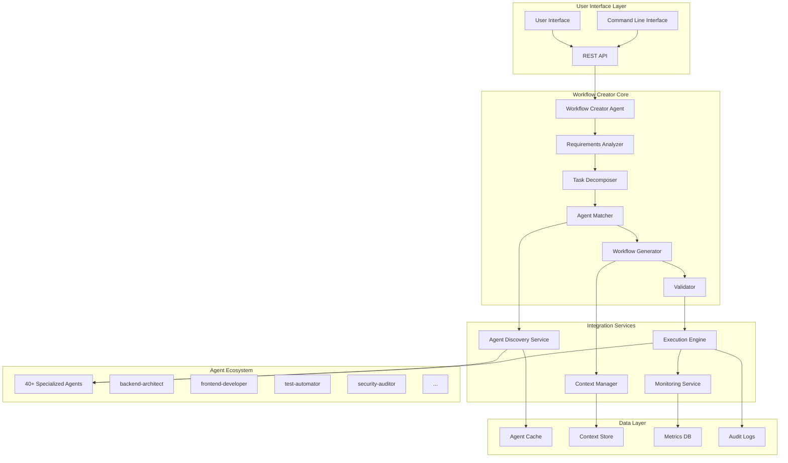
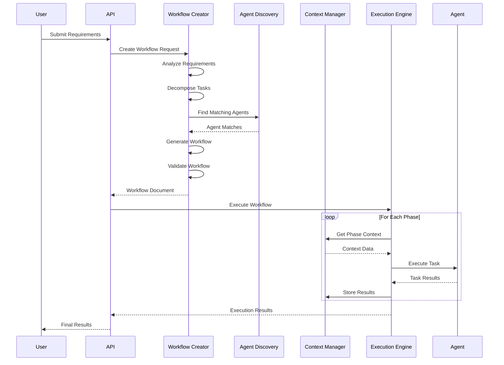
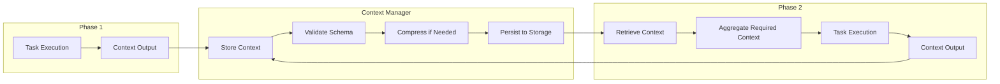
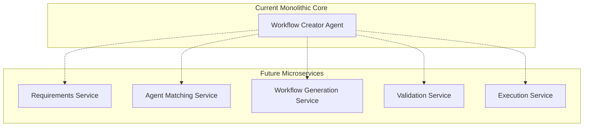

# Workflow Creator Architecture

## Overview

The Workflow Creator Agent represents a sophisticated orchestration system designed to bridge the gap between complex user requirements and our extensive agent ecosystem. This document outlines the architectural decisions, design principles, and system components that make intelligent multi-agent coordination possible.

## System Architecture



## Core Design Principles

### 1. Separation of Concerns

Each component has a single, well-defined responsibility:

- **Requirements Analyzer**: Parses and understands user needs
- **Task Decomposer**: Breaks down complex requirements
- **Agent Matcher**: Finds optimal agent-task pairings
- **Workflow Generator**: Creates structured workflow documents
- **Validator**: Ensures workflow quality and completeness

### 2. Loose Coupling

Components interact through well-defined interfaces, enabling:
- Independent development and testing
- Easy component replacement
- Flexible system evolution
- Reduced maintenance complexity

### 3. High Cohesion

Related functionality is grouped together:
- Agent discovery and matching logic
- Context management and persistence
- Workflow generation and validation
- Execution coordination and monitoring

### 4. Extensibility

The architecture supports growth and evolution:
- Plugin-based agent discovery
- Configurable workflow patterns
- Extensible validation rules
- Modular execution strategies

## Component Architecture

### Workflow Creator Agent Core

```python
class WorkflowCreatorAgent:
    """Core orchestration agent with comprehensive workflow generation capabilities"""
    
    def __init__(self):
        self.requirements_analyzer = RequirementsAnalyzer()
        self.task_decomposer = TaskDecomposer()
        self.agent_matcher = AgentMatcher()
        self.workflow_generator = WorkflowGenerator()
        self.validator = WorkflowValidator()
    
    async def create_workflow(self, user_requirements: str) -> WorkflowDocument:
        # Phase 1: Analyze requirements
        analysis = await self.requirements_analyzer.analyze(user_requirements)
        
        # Phase 2: Decompose into tasks
        tasks = await self.task_decomposer.decompose(analysis)
        
        # Phase 3: Match agents to tasks
        agent_assignments = await self.agent_matcher.match(tasks)
        
        # Phase 4: Generate workflow
        workflow = await self.workflow_generator.generate(
            analysis, tasks, agent_assignments
        )
        
        # Phase 5: Validate workflow
        validation_result = await self.validator.validate(workflow)
        
        if not validation_result.is_valid:
            workflow = await self.refine_workflow(workflow, validation_result)
        
        return workflow
```

### Requirements Analyzer

```python
class RequirementsAnalyzer:
    """Analyzes user requirements and extracts actionable insights"""
    
    def __init__(self):
        self.nlp_processor = NLPProcessor()
        self.domain_classifier = DomainClassifier()
        self.complexity_assessor = ComplexityAssessor()
    
    async def analyze(self, requirements: str) -> RequirementsAnalysis:
        return RequirementsAnalysis(
            primary_objectives=self._extract_objectives(requirements),
            technical_domains=self.domain_classifier.classify(requirements),
            complexity_level=self.complexity_assessor.assess(requirements),
            success_criteria=self._extract_success_criteria(requirements),
            constraints=self._identify_constraints(requirements),
            dependencies=self._analyze_dependencies(requirements)
        )
```

### Agent Discovery Service

```python
class AgentDiscoveryService:
    """Dynamically discovers and indexes available agents"""
    
    def __init__(self, agents_directory: Path):
        self.agents_directory = agents_directory
        self.capability_index = CapabilityIndex()
        self.semantic_matcher = SemanticMatcher()
        self.agent_cache = AgentCache()
    
    async def discover_agents(self) -> Dict[str, AgentInfo]:
        """Scan and analyze all available agents"""
        agents = {}
        
        for agent_file in self.agents_directory.glob("*.md"):
            agent_info = await self._parse_agent_file(agent_file)
            if agent_info:
                agents[agent_info.name] = agent_info
                await self.capability_index.index_agent(agent_info)
        
        return agents
    
    async def find_matching_agents(self, task: Task) -> List[AgentMatch]:
        """Find agents best suited for a specific task"""
        candidates = await self.capability_index.search(task.requirements)
        
        matches = []
        for candidate in candidates:
            similarity = await self.semantic_matcher.calculate_similarity(
                task.description, candidate.capabilities
            )
            
            if similarity > 0.3:  # Minimum threshold
                matches.append(AgentMatch(
                    agent=candidate,
                    similarity_score=similarity,
                    confidence=self._calculate_confidence(similarity, candidate, task)
                ))
        
        return sorted(matches, key=lambda x: x.confidence, reverse=True)
```

### Context Management System

```python
class ContextManager:
    """Manages context flow and persistence across workflow phases"""
    
    def __init__(self):
        self.context_store = ContextStore()
        self.schema_validator = ContextSchemaValidator()
        self.compressor = ContextCompressor()
    
    async def store_phase_context(self, phase_id: str, context: Dict) -> None:
        """Store context from completed phase"""
        # Validate context structure
        await self.schema_validator.validate(context)
        
        # Compress if necessary
        if self._estimate_size(context) > MAX_CONTEXT_SIZE:
            context = await self.compressor.compress(context)
        
        # Store with metadata
        await self.context_store.store(phase_id, {
            'data': context,
            'timestamp': datetime.utcnow(),
            'size': self._estimate_size(context),
            'compressed': context != context  # Check if compressed
        })
    
    async def get_context_for_phase(self, phase_id: str, requirements: List[str]) -> Dict:
        """Retrieve and aggregate context needed for a phase"""
        aggregated_context = {}
        
        for requirement in requirements:
            context_value = await self._find_context_value(requirement)
            if context_value:
                aggregated_context[requirement] = context_value
            else:
                raise ContextMissingError(f"Required context '{requirement}' not found")
        
        return aggregated_context
```

## Data Flow Architecture

### Request Processing Flow



### Context Flow Management



## Scalability Architecture

### Horizontal Scaling

```python
class ScalableWorkflowCreator:
    """Horizontally scalable workflow creator with load balancing"""
    
    def __init__(self):
        self.load_balancer = LoadBalancer()
        self.worker_pool = WorkerPool()
        self.result_aggregator = ResultAggregator()
    
    async def create_workflow_distributed(self, requirements: str) -> WorkflowDocument:
        # Distribute analysis across workers
        analysis_tasks = self._split_analysis_tasks(requirements)
        analysis_results = await self.worker_pool.execute_parallel(analysis_tasks)
        
        # Aggregate results
        combined_analysis = await self.result_aggregator.combine(analysis_results)
        
        # Continue with workflow generation
        return await self._generate_workflow(combined_analysis)
```

### Caching Strategy

```python
class WorkflowCache:
    """Multi-level caching for performance optimization"""
    
    def __init__(self):
        self.l1_cache = MemoryCache()  # Fast, small capacity
        self.l2_cache = RedisCache()   # Medium speed, larger capacity
        self.l3_cache = DatabaseCache() # Persistent, unlimited capacity
    
    async def get_workflow(self, requirements_hash: str) -> Optional[WorkflowDocument]:
        # Try L1 cache first
        workflow = await self.l1_cache.get(requirements_hash)
        if workflow:
            return workflow
        
        # Try L2 cache
        workflow = await self.l2_cache.get(requirements_hash)
        if workflow:
            await self.l1_cache.set(requirements_hash, workflow)
            return workflow
        
        # Try L3 cache
        workflow = await self.l3_cache.get(requirements_hash)
        if workflow:
            await self.l2_cache.set(requirements_hash, workflow)
            await self.l1_cache.set(requirements_hash, workflow)
            return workflow
        
        return None
```

## Security Architecture

### Access Control

```python
class SecurityManager:
    """Comprehensive security management for workflow operations"""
    
    def __init__(self):
        self.auth_service = AuthenticationService()
        self.authz_service = AuthorizationService()
        self.audit_logger = AuditLogger()
    
    async def authorize_workflow_creation(self, user: User, requirements: str) -> bool:
        # Authenticate user
        if not await self.auth_service.authenticate(user):
            await self.audit_logger.log_auth_failure(user)
            return False
        
        # Check permissions
        required_permissions = self._analyze_required_permissions(requirements)
        if not await self.authz_service.has_permissions(user, required_permissions):
            await self.audit_logger.log_authz_failure(user, required_permissions)
            return False
        
        await self.audit_logger.log_workflow_creation(user, requirements)
        return True
```

### Data Protection

```python
class DataProtectionService:
    """Handles sensitive data protection and privacy compliance"""
    
    def __init__(self):
        self.encryptor = ContextEncryptor()
        self.sanitizer = DataSanitizer()
        self.compliance_checker = ComplianceChecker()
    
    async def protect_context(self, context: Dict) -> Dict:
        # Sanitize sensitive data
        sanitized_context = await self.sanitizer.sanitize(context)
        
        # Check compliance requirements
        compliance_result = await self.compliance_checker.check(sanitized_context)
        if not compliance_result.compliant:
            raise ComplianceViolationError(compliance_result.violations)
        
        # Encrypt sensitive fields
        protected_context = await self.encryptor.encrypt_sensitive_fields(
            sanitized_context
        )
        
        return protected_context
```

## Monitoring and Observability

### Metrics Collection

```python
class MetricsCollector:
    """Collects and aggregates system metrics"""
    
    def __init__(self):
        self.prometheus_client = PrometheusClient()
        self.custom_metrics = CustomMetrics()
    
    async def record_workflow_metrics(self, workflow_execution: WorkflowExecution):
        # Standard metrics
        self.prometheus_client.increment('workflows_created_total')
        self.prometheus_client.histogram('workflow_execution_duration_seconds').observe(
            workflow_execution.duration
        )
        
        # Custom metrics
        await self.custom_metrics.record({
            'agent_utilization': workflow_execution.agent_utilization,
            'context_size_bytes': workflow_execution.total_context_size,
            'pattern_type': workflow_execution.pattern_type,
            'success_rate': workflow_execution.success_rate
        })
```

### Health Monitoring

```python
class HealthMonitor:
    """Monitors system health and performance"""
    
    async def check_system_health(self) -> HealthStatus:
        checks = await asyncio.gather(
            self._check_agent_availability(),
            self._check_context_store_health(),
            self._check_execution_engine_health(),
            self._check_resource_utilization()
        )
        
        return HealthStatus(
            overall_status=self._calculate_overall_status(checks),
            component_statuses=checks,
            timestamp=datetime.utcnow()
        )
```

## Deployment Architecture

### Containerized Deployment

```yaml
# docker-compose.yml
version: '3.8'
services:
  workflow-creator:
    image: workflow-creator:latest
    ports:
      - "8000:8000"
    environment:
      - DATABASE_URL=postgresql://user:pass@db:5432/workflows
      - REDIS_URL=redis://redis:6379
    depends_on:
      - db
      - redis
  
  agent-discovery:
    image: agent-discovery:latest
    volumes:
      - ./agents:/app/agents:ro
    environment:
      - AGENTS_DIRECTORY=/app/agents
  
  context-manager:
    image: context-manager:latest
    environment:
      - STORAGE_BACKEND=postgresql
      - ENCRYPTION_KEY=${ENCRYPTION_KEY}
  
  execution-engine:
    image: execution-engine:latest
    environment:
      - TASK_QUEUE_URL=redis://redis:6379
      - MAX_CONCURRENT_WORKFLOWS=10
```

### Kubernetes Deployment

```yaml
apiVersion: apps/v1
kind: Deployment
metadata:
  name: workflow-creator
spec:
  replicas: 3
  selector:
    matchLabels:
      app: workflow-creator
  template:
    metadata:
      labels:
        app: workflow-creator
    spec:
      containers:
      - name: workflow-creator
        image: workflow-creator:latest
        ports:
        - containerPort: 8000
        env:
        - name: DATABASE_URL
          valueFrom:
            secretKeyRef:
              name: db-credentials
              key: url
        resources:
          requests:
            memory: "512Mi"
            cpu: "250m"
          limits:
            memory: "1Gi"
            cpu: "500m"
```

## Future Architecture Considerations

### Microservices Evolution



### Event-Driven Architecture

```python
class EventDrivenWorkflowCreator:
    """Event-driven architecture for better scalability and flexibility"""
    
    def __init__(self):
        self.event_bus = EventBus()
        self.event_handlers = {
            'requirements_analyzed': self.handle_requirements_analyzed,
            'agents_matched': self.handle_agents_matched,
            'workflow_generated': self.handle_workflow_generated,
            'workflow_validated': self.handle_workflow_validated
        }
    
    async def create_workflow(self, requirements: str):
        # Emit initial event
        await self.event_bus.emit('workflow_creation_requested', {
            'requirements': requirements,
            'timestamp': datetime.utcnow()
        })
```

## Conclusion

The Workflow Creator architecture is designed for:

1. **Scalability**: Horizontal scaling and efficient resource utilization
2. **Maintainability**: Clear separation of concerns and modular design
3. **Extensibility**: Plugin-based architecture and configurable components
4. **Reliability**: Comprehensive error handling and monitoring
5. **Security**: Multi-layered security and compliance features
6. **Performance**: Caching, optimization, and efficient algorithms

This architecture provides a solid foundation for intelligent multi-agent orchestration while remaining flexible enough to evolve with changing requirements and emerging technologies.