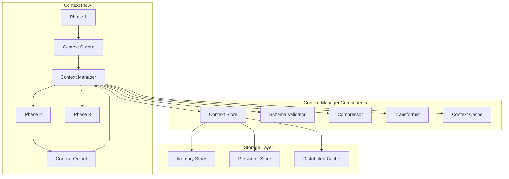

# Context Management Design

## Overview

Context management is the backbone of multi-agent coordination, ensuring information flows seamlessly between workflow phases while maintaining data integrity, managing size constraints, and optimizing performance. This document details the design of our comprehensive context management system.

## Context Management Philosophy

### Core Principles

1. **Information Continuity**: Preserve critical information across phases
2. **Selective Propagation**: Pass only relevant context forward
3. **Size Optimization**: Manage context within token limits
4. **Schema Validation**: Ensure context structure integrity
5. **Performance Focus**: Minimize overhead and latency

## Context Architecture



## Context Data Model

### Context Structure

```python
@dataclass
class PhaseContext:
    """Context data from a workflow phase"""
    phase_id: str
    phase_name: str
    timestamp: datetime
    data: Dict[str, Any]
    metadata: ContextMetadata
    size_bytes: int
    compressed: bool
    schema_version: str
    
@dataclass
class ContextMetadata:
    """Metadata about context content"""
    agent_name: str
    execution_time: float
    token_count: int
    key_decisions: List[str]
    output_artifacts: List[str]
    dependencies: List[str]
    quality_score: float
```

### Context Schema Definition

```python
class ContextSchema:
    """Define and validate context schemas"""
    
    def __init__(self):
        self.schemas = {
            'architecture_design': {
                'api_contracts': {'type': 'object', 'required': True},
                'database_schema': {'type': 'object', 'required': True},
                'service_boundaries': {'type': 'array', 'required': True},
                'technology_stack': {'type': 'object', 'required': False}
            },
            'implementation': {
                'source_code': {'type': 'object', 'required': True},
                'test_coverage': {'type': 'number', 'required': False},
                'dependencies': {'type': 'array', 'required': True},
                'build_artifacts': {'type': 'array', 'required': False}
            }
        }
    
    def validate(self, context_type: str, context_data: Dict) -> ValidationResult:
        """Validate context against schema"""
        schema = self.schemas.get(context_type)
        if not schema:
            return ValidationResult(valid=False, error="Unknown context type")
        
        errors = []
        for field, rules in schema.items():
            if rules['required'] and field not in context_data:
                errors.append(f"Missing required field: {field}")
            elif field in context_data:
                if not self._validate_type(context_data[field], rules['type']):
                    errors.append(f"Invalid type for field {field}")
        
        return ValidationResult(valid=len(errors) == 0, errors=errors)
```

## Context Flow Management

### Context Propagation Strategy

```python
class ContextPropagator:
    """Manages context flow between phases"""
    
    def __init__(self):
        self.propagation_rules = PropagationRules()
        self.context_filter = ContextFilter()
        self.context_enricher = ContextEnricher()
    
    async def propagate_context(
        self, 
        source_phase: str, 
        target_phase: str, 
        full_context: Dict
    ) -> Dict:
        """Propagate context from source to target phase"""
        # Apply propagation rules
        rules = self.propagation_rules.get_rules(source_phase, target_phase)
        
        # Filter context based on rules
        filtered_context = await self.context_filter.filter(full_context, rules)
        
        # Enrich with additional information if needed
        enriched_context = await self.context_enricher.enrich(
            filtered_context, 
            target_phase
        )
        
        return enriched_context
```

### Selective Context Passing

```python
class ContextFilter:
    """Filter context based on relevance and rules"""
    
    def __init__(self):
        self.relevance_analyzer = RelevanceAnalyzer()
        self.size_optimizer = SizeOptimizer()
    
    async def filter(self, context: Dict, rules: PropagationRules) -> Dict:
        """Apply filtering rules to context"""
        filtered = {}
        
        # Apply explicit rules
        for key, value in context.items():
            if rules.should_include(key):
                filtered[key] = value
            elif rules.should_transform(key):
                filtered[key] = rules.transform(key, value)
        
        # Apply relevance-based filtering
        if rules.use_relevance_filtering:
            filtered = await self.relevance_analyzer.filter_by_relevance(
                filtered, 
                rules.target_phase_type
            )
        
        # Optimize size if needed
        if self._estimate_size(filtered) > rules.max_size:
            filtered = await self.size_optimizer.optimize(filtered, rules.max_size)
        
        return filtered
```

## Context Compression

### Intelligent Compression Strategy

```python
class ContextCompressor:
    """Compress context while preserving critical information"""
    
    def __init__(self):
        self.compression_strategies = [
            self.summarize_verbose_text,
            self.extract_key_points,
            self.remove_redundancy,
            self.compress_data_structures,
            self.archive_artifacts
        ]
    
    async def compress(self, context: Dict, target_size: int) -> Dict:
        """Compress context to fit within size constraints"""
        current_size = self._estimate_size(context)
        
        if current_size <= target_size:
            return context
        
        compressed = deepcopy(context)
        
        # Apply compression strategies progressively
        for strategy in self.compression_strategies:
            compressed = await strategy(compressed)
            new_size = self._estimate_size(compressed)
            
            if new_size <= target_size:
                break
        
        # Add compression metadata
        compressed['_compression_metadata'] = {
            'original_size': current_size,
            'compressed_size': new_size,
            'compression_ratio': new_size / current_size,
            'strategies_applied': [s.__name__ for s in self.compression_strategies[:i+1]]
        }
        
        return compressed
```

### Compression Techniques

```python
async def summarize_verbose_text(self, context: Dict) -> Dict:
    """Summarize long text fields while preserving key information"""
    summarizer = TextSummarizer()
    
    for key, value in context.items():
        if isinstance(value, str) and len(value) > 1000:
            summary = await summarizer.summarize(value, max_length=200)
            context[key] = {
                'summary': summary,
                'full_text_archived': True,
                'archive_key': await self._archive_full_text(key, value)
            }
    
    return context

async def extract_key_points(self, context: Dict) -> Dict:
    """Extract key decisions and critical data"""
    key_extractor = KeyPointExtractor()
    
    if 'decisions' in context:
        context['decisions'] = await key_extractor.extract_critical_decisions(
            context['decisions']
        )
    
    if 'analysis' in context:
        context['analysis'] = await key_extractor.extract_key_findings(
            context['analysis']
        )
    
    return context
```

## Context Storage

### Multi-Tier Storage Architecture

```python
class ContextStore:
    """Multi-tier context storage system"""
    
    def __init__(self):
        self.memory_store = MemoryContextStore()      # Hot data
        self.redis_store = RedisContextStore()        # Warm data
        self.database_store = DatabaseContextStore()  # Cold data
        self.archive_store = S3ArchiveStore()        # Archived data
        
        self.storage_policy = StoragePolicy()
    
    async def store(self, phase_id: str, context: PhaseContext):
        """Store context with appropriate tier selection"""
        tier = self.storage_policy.determine_tier(context)
        
        if tier == StorageTier.HOT:
            await self.memory_store.store(phase_id, context)
            # Also replicate to warm tier for durability
            await self.redis_store.store(phase_id, context)
            
        elif tier == StorageTier.WARM:
            await self.redis_store.store(phase_id, context)
            # Archive large artifacts
            await self._archive_large_artifacts(phase_id, context)
            
        elif tier == StorageTier.COLD:
            await self.database_store.store(phase_id, context)
            
        elif tier == StorageTier.ARCHIVE:
            await self.archive_store.store(phase_id, context)
    
    async def retrieve(self, phase_id: str) -> Optional[PhaseContext]:
        """Retrieve context from appropriate tier"""
        # Try tiers in order of speed
        for store in [self.memory_store, self.redis_store, 
                     self.database_store, self.archive_store]:
            context = await store.retrieve(phase_id)
            if context:
                # Promote to faster tier if frequently accessed
                await self._promote_if_needed(phase_id, context)
                return context
        
        return None
```

### Storage Optimization

```python
class StorageOptimizer:
    """Optimize context storage for performance and cost"""
    
    def __init__(self):
        self.access_tracker = AccessTracker()
        self.cost_calculator = CostCalculator()
    
    async def optimize_storage(self):
        """Periodically optimize storage distribution"""
        access_patterns = await self.access_tracker.get_patterns()
        
        for phase_id, pattern in access_patterns.items():
            current_tier = await self._get_current_tier(phase_id)
            optimal_tier = self._calculate_optimal_tier(pattern)
            
            if current_tier != optimal_tier:
                await self._migrate_context(phase_id, current_tier, optimal_tier)
    
    def _calculate_optimal_tier(self, access_pattern: AccessPattern) -> StorageTier:
        """Determine optimal storage tier based on access patterns"""
        if access_pattern.access_frequency > 100:  # per hour
            return StorageTier.HOT
        elif access_pattern.access_frequency > 10:  # per hour
            return StorageTier.WARM
        elif access_pattern.last_access < timedelta(days=7):
            return StorageTier.COLD
        else:
            return StorageTier.ARCHIVE
```

## Context Transformation

### Dynamic Context Transformation

```python
class ContextTransformer:
    """Transform context between different formats and schemas"""
    
    def __init__(self):
        self.transformers = {
            ('architecture', 'implementation'): self.transform_arch_to_impl,
            ('implementation', 'testing'): self.transform_impl_to_test,
            ('testing', 'deployment'): self.transform_test_to_deploy
        }
    
    async def transform(
        self, 
        context: Dict, 
        source_type: str, 
        target_type: str
    ) -> Dict:
        """Transform context from source to target format"""
        transformer_key = (source_type, target_type)
        
        if transformer_key in self.transformers:
            transformer = self.transformers[transformer_key]
            return await transformer(context)
        else:
            # Default transformation
            return await self.default_transform(context, source_type, target_type)
    
    async def transform_arch_to_impl(self, context: Dict) -> Dict:
        """Transform architecture context for implementation phase"""
        return {
            'api_specifications': context.get('api_contracts'),
            'data_models': context.get('database_schema'),
            'service_interfaces': self._extract_interfaces(context),
            'technology_requirements': context.get('technology_stack'),
            'implementation_guidelines': self._generate_guidelines(context)
        }
```

## Context Validation

### Comprehensive Validation Framework

```python
class ContextValidator:
    """Validate context integrity and completeness"""
    
    def __init__(self):
        self.schema_validator = SchemaValidator()
        self.integrity_checker = IntegrityChecker()
        self.dependency_validator = DependencyValidator()
    
    async def validate(self, context: PhaseContext) -> ValidationResult:
        """Perform comprehensive context validation"""
        validations = await asyncio.gather(
            self.schema_validator.validate(context),
            self.integrity_checker.check(context),
            self.dependency_validator.validate(context)
        )
        
        all_valid = all(v.valid for v in validations)
        all_errors = [e for v in validations for e in v.errors]
        
        return ValidationResult(
            valid=all_valid,
            errors=all_errors,
            warnings=self._generate_warnings(validations)
        )
```

### Validation Rules

```python
class ValidationRules:
    """Define context validation rules"""
    
    def __init__(self):
        self.rules = {
            'size_limits': {
                'max_total_size': 10 * 1024 * 1024,  # 10MB
                'max_field_size': 1 * 1024 * 1024,   # 1MB
                'max_array_length': 1000
            },
            'required_fields': {
                'phase_id': str,
                'timestamp': datetime,
                'data': dict,
                'metadata': dict
            },
            'data_quality': {
                'min_completeness': 0.8,
                'max_null_ratio': 0.2,
                'required_confidence': 0.7
            }
        }
```

## Context Caching

### Intelligent Caching Strategy

```python
class ContextCache:
    """High-performance context caching"""
    
    def __init__(self):
        self.l1_cache = LRUCache(maxsize=100)        # Process memory
        self.l2_cache = RedisCache(maxsize=1000)     # Shared memory
        self.cache_policy = CachePolicy()
        self.prefetcher = ContextPrefetcher()
    
    async def get(self, phase_id: str) -> Optional[PhaseContext]:
        """Get context with cache hierarchy"""
        # L1 cache check
        if phase_id in self.l1_cache:
            self.l1_cache.touch(phase_id)
            return self.l1_cache[phase_id]
        
        # L2 cache check
        context = await self.l2_cache.get(phase_id)
        if context:
            # Promote to L1
            self.l1_cache[phase_id] = context
            return context
        
        return None
    
    async def prefetch(self, workflow_id: str, current_phase: int):
        """Prefetch likely needed context"""
        next_phases = await self.prefetcher.predict_next_phases(
            workflow_id, 
            current_phase
        )
        
        for phase_id in next_phases:
            if phase_id not in self.l1_cache:
                context = await self.context_store.retrieve(phase_id)
                if context:
                    self.l1_cache[phase_id] = context
```

## Context Monitoring

### Performance Metrics

```python
class ContextMetrics:
    """Monitor context management performance"""
    
    def __init__(self):
        self.metrics = {
            'storage_operations': Counter(),
            'retrieval_latency': Histogram(),
            'compression_ratio': Gauge(),
            'cache_hit_rate': Gauge(),
            'context_size_distribution': Histogram()
        }
    
    async def record_storage(self, context: PhaseContext, duration: float):
        """Record storage operation metrics"""
        self.metrics['storage_operations'].inc()
        self.metrics['context_size_distribution'].observe(context.size_bytes)
        
        if context.compressed:
            compression_ratio = context.metadata.original_size / context.size_bytes
            self.metrics['compression_ratio'].set(compression_ratio)
    
    async def record_retrieval(self, phase_id: str, duration: float, cache_hit: bool):
        """Record retrieval operation metrics"""
        self.metrics['retrieval_latency'].observe(duration)
        
        if cache_hit:
            current_rate = self.metrics['cache_hit_rate'].get()
            new_rate = (current_rate * 0.99) + (1.0 * 0.01)  # Exponential average
            self.metrics['cache_hit_rate'].set(new_rate)
```

## Context Security

### Encryption and Access Control

```python
class ContextSecurity:
    """Secure context handling"""
    
    def __init__(self):
        self.encryptor = ContextEncryptor()
        self.access_controller = AccessController()
        self.audit_logger = AuditLogger()
    
    async def secure_context(self, context: PhaseContext) -> PhaseContext:
        """Apply security measures to context"""
        # Identify sensitive fields
        sensitive_fields = await self._identify_sensitive_fields(context.data)
        
        # Encrypt sensitive data
        for field in sensitive_fields:
            context.data[field] = await self.encryptor.encrypt(
                context.data[field]
            )
        
        # Add security metadata
        context.metadata.encrypted_fields = sensitive_fields
        context.metadata.encryption_key_id = self.encryptor.current_key_id
        
        return context
    
    async def check_access(self, user: User, phase_id: str) -> bool:
        """Check if user has access to context"""
        access_allowed = await self.access_controller.check(user, phase_id)
        
        # Audit access attempt
        await self.audit_logger.log_access_attempt(
            user, 
            phase_id, 
            access_allowed
        )
        
        return access_allowed
```

## Future Enhancements

### Intelligent Context Prediction

```python
class ContextPredictor:
    """Predict future context needs using ML"""
    
    def __init__(self):
        self.prediction_model = ContextPredictionModel()
        self.pattern_analyzer = PatternAnalyzer()
    
    async def predict_context_needs(
        self, 
        workflow_type: str, 
        current_phase: str
    ) -> List[ContextPrediction]:
        """Predict what context will be needed in future phases"""
        # Analyze historical patterns
        patterns = await self.pattern_analyzer.analyze(workflow_type)
        
        # Make predictions
        predictions = await self.prediction_model.predict(
            workflow_type,
            current_phase,
            patterns
        )
        
        return predictions
```

### Adaptive Context Management

```python
class AdaptiveContextManager:
    """Self-optimizing context management"""
    
    async def adapt_to_patterns(self, execution_history: List[WorkflowExecution]):
        """Adapt context management based on execution patterns"""
        # Analyze what context was actually used
        usage_patterns = await self._analyze_context_usage(execution_history)
        
        # Update propagation rules
        await self._update_propagation_rules(usage_patterns)
        
        # Optimize storage tiers
        await self._optimize_storage_distribution(usage_patterns)
        
        # Adjust compression strategies
        await self._tune_compression_parameters(usage_patterns)
```

## Conclusion

The context management system is designed to be:

1. **Efficient**: Optimized for performance with caching and compression
2. **Reliable**: Validated schemas and integrity checks
3. **Scalable**: Multi-tier storage and distributed architecture
4. **Secure**: Encryption and access control for sensitive data
5. **Intelligent**: Adaptive strategies based on usage patterns

This comprehensive approach ensures that context flows seamlessly through multi-agent workflows while maintaining performance, security, and reliability.