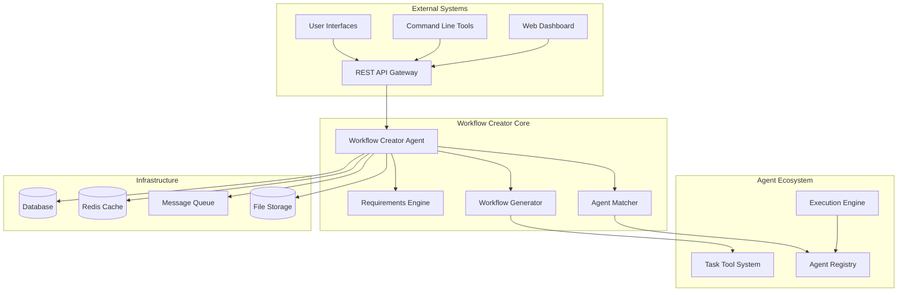

# Integration Guide

## Overview

This guide covers the integration of the Workflow Creator Agent with existing systems, including the agent ecosystem, Task tool infrastructure, and external services. It provides practical steps for deployment and configuration.

## System Integration Architecture



## Task Tool Integration

### Standard Integration Pattern

The workflow creator integrates seamlessly with the existing Task tool infrastructure:

```python
class TaskToolIntegration:
    """Integration layer for Task tool system"""
    
    def __init__(self):
        self.task_formatter = TaskFormatter()
        self.context_manager = ContextManager()
        self.execution_tracker = ExecutionTracker()
    
    def format_task_invocation(self, agent_name: str, prompt: str, context: Dict = None) -> str:
        """Format Task tool invocation with proper context"""
        formatted_prompt = self._inject_context(prompt, context) if context else prompt
        
        return f"""Use Task tool with subagent_type="{agent_name}"
Prompt: "{formatted_prompt}" """
    
    def _inject_context(self, prompt: str, context: Dict) -> str:
        """Inject context into prompt following established patterns"""
        context_summary = self.context_manager.summarize_context(context)
        
        return f"""{prompt}

Context from previous phases:
{context_summary}"""
```

### Task Execution Monitoring

```python
class TaskExecutionMonitor:
    """Monitor Task tool executions within workflows"""
    
    async def monitor_task_execution(self, task_id: str, agent_name: str) -> TaskResult:
        """Monitor individual task execution"""
        start_time = time.time()
        
        try:
            # Execute task through Task tool
            result = await self.task_tool.execute(
                agent_type=agent_name,
                task_id=task_id
            )
            
            execution_time = time.time() - start_time
            
            # Record metrics
            await self._record_execution_metrics(
                agent_name, execution_time, True
            )
            
            return TaskResult(
                success=True,
                output=result.output,
                execution_time=execution_time,
                agent_used=agent_name
            )
            
        except Exception as e:
            execution_time = time.time() - start_time
            
            await self._record_execution_metrics(
                agent_name, execution_time, False
            )
            
            return TaskResult(
                success=False,
                error=str(e),
                execution_time=execution_time,
                agent_used=agent_name
            )
```

## Agent Ecosystem Integration

### Agent Discovery Service

```python
class AgentEcosystemIntegration:
    """Integration with the broader agent ecosystem"""
    
    def __init__(self, agents_directory: str = "./agents"):
        self.agents_directory = Path(agents_directory)
        self.agent_registry = AgentRegistry()
        self.capability_index = CapabilityIndex()
        self.compatibility_checker = CompatibilityChecker()
    
    async def initialize(self):
        """Initialize integration with agent ecosystem"""
        # Discover all available agents
        agents = await self._discover_agents()
        
        # Register agents in capability index
        for agent in agents:
            await self.capability_index.register(agent)
        
        # Build compatibility matrix
        await self._build_compatibility_matrix(agents)
        
        # Register workflow creator itself
        await self._register_workflow_creator()
    
    async def _discover_agents(self) -> List[AgentInfo]:
        """Discover all agents in the ecosystem"""
        agents = []
        
        for agent_file in self.agents_directory.glob("*.md"):
            try:
                agent_info = await self._parse_agent_file(agent_file)
                if agent_info:
                    agents.append(agent_info)
            except Exception as e:
                logger.warning(f"Failed to parse agent file {agent_file}: {e}")
        
        return agents
    
    async def _parse_agent_file(self, agent_file: Path) -> Optional[AgentInfo]:
        """Parse individual agent file"""
        content = agent_file.read_text(encoding='utf-8')
        
        # Extract frontmatter
        frontmatter_match = re.match(r'^---\n(.*?)\n---\n(.*)$', content, re.DOTALL)
        if not frontmatter_match:
            return None
        
        frontmatter_yaml = frontmatter_match.group(1)
        agent_content = frontmatter_match.group(2)
        
        try:
            frontmatter = yaml.safe_load(frontmatter_yaml)
        except yaml.YAMLError:
            return None
        
        return AgentInfo(
            name=frontmatter.get('name'),
            description=frontmatter.get('description', ''),
            model=frontmatter.get('model', 'sonnet'),
            capabilities=self._extract_capabilities(agent_content),
            focus_areas=self._extract_focus_areas(agent_content),
            file_path=str(agent_file)
        )
```

### Agent Compatibility Matrix

```python
class CompatibilityChecker:
    """Check compatibility between agents for workflow coordination"""
    
    def __init__(self):
        self.compatibility_rules = CompatibilityRules()
        self.conflict_detector = ConflictDetector()
    
    async def check_compatibility(self, agent_a: AgentInfo, agent_b: AgentInfo) -> CompatibilityResult:
        """Check if two agents can work together effectively"""
        
        # Check for capability overlaps
        capability_overlap = self._check_capability_overlap(agent_a, agent_b)
        
        # Check for conflicting approaches
        conflicts = await self.conflict_detector.detect_conflicts(agent_a, agent_b)
        
        # Check output format compatibility
        output_compatibility = self._check_output_compatibility(agent_a, agent_b)
        
        # Calculate overall compatibility score
        compatibility_score = self._calculate_compatibility_score(
            capability_overlap, conflicts, output_compatibility
        )
        
        return CompatibilityResult(
            compatible=compatibility_score > 0.7,
            score=compatibility_score,
            capability_overlap=capability_overlap,
            conflicts=conflicts,
            output_compatibility=output_compatibility
        )
```

## Database Integration

### Schema Design

```sql
-- Workflow Creator Database Schema

-- Workflows table
CREATE TABLE workflows (
    id UUID PRIMARY KEY DEFAULT gen_random_uuid(),
    title VARCHAR(255) NOT NULL,
    description TEXT,
    pattern_type VARCHAR(50) NOT NULL,
    status VARCHAR(50) DEFAULT 'created',
    created_at TIMESTAMP DEFAULT CURRENT_TIMESTAMP,
    updated_at TIMESTAMP DEFAULT CURRENT_TIMESTAMP,
    created_by VARCHAR(255),
    requirements_hash VARCHAR(64),
    estimated_duration INTEGER, -- in seconds
    actual_duration INTEGER,
    complexity_score DECIMAL(3,2)
);

-- Workflow phases table
CREATE TABLE workflow_phases (
    id UUID PRIMARY KEY DEFAULT gen_random_uuid(),
    workflow_id UUID REFERENCES workflows(id) ON DELETE CASCADE,
    phase_number INTEGER NOT NULL,
    phase_name VARCHAR(255) NOT NULL,
    agent_name VARCHAR(100) NOT NULL,
    status VARCHAR(50) DEFAULT 'pending',
    started_at TIMESTAMP,
    completed_at TIMESTAMP,
    input_context JSONB,
    output_context JSONB,
    error_message TEXT,
    retry_count INTEGER DEFAULT 0
);

-- Agent assignments table
CREATE TABLE agent_assignments (
    id UUID PRIMARY KEY DEFAULT gen_random_uuid(),
    workflow_id UUID REFERENCES workflows(id) ON DELETE CASCADE,
    phase_id UUID REFERENCES workflow_phases(id) ON DELETE CASCADE,
    agent_name VARCHAR(100) NOT NULL,
    assignment_type VARCHAR(20) DEFAULT 'primary', -- primary, fallback
    confidence_score DECIMAL(3,2),
    selection_reasoning TEXT
);

-- Execution metrics table
CREATE TABLE execution_metrics (
    id UUID PRIMARY KEY DEFAULT gen_random_uuid(),
    workflow_id UUID REFERENCES workflows(id) ON DELETE CASCADE,
    phase_id UUID REFERENCES workflow_phases(id),
    metric_name VARCHAR(100) NOT NULL,
    metric_value DECIMAL(10,4),
    recorded_at TIMESTAMP DEFAULT CURRENT_TIMESTAMP
);
```

### Database Access Layer

```python
class WorkflowDatabase:
    """Database access layer for workflow creator"""
    
    def __init__(self, connection_string: str):
        self.engine = create_async_engine(connection_string)
        self.session_factory = async_sessionmaker(self.engine)
    
    async def save_workflow(self, workflow: WorkflowDocument) -> str:
        """Save workflow to database"""
        async with self.session_factory() as session:
            # Create workflow record
            workflow_record = Workflow(
                title=workflow.title,
                description=workflow.description,
                pattern_type=workflow.pattern.type.value,
                requirements_hash=workflow.requirements_hash,
                estimated_duration=workflow.estimated_duration,
                complexity_score=workflow.complexity_score
            )
            
            session.add(workflow_record)
            await session.flush()  # Get the ID
            
            # Create phase records
            for i, phase in enumerate(workflow.phases):
                phase_record = WorkflowPhase(
                    workflow_id=workflow_record.id,
                    phase_number=i + 1,
                    phase_name=phase.name,
                    agent_name=phase.agent_assignment.primary_agent.name,
                    input_context=phase.input_context
                )
                session.add(phase_record)
            
            await session.commit()
            return str(workflow_record.id)
    
    async def get_workflow(self, workflow_id: str) -> Optional[WorkflowDocument]:
        """Retrieve workflow from database"""
        async with self.session_factory() as session:
            result = await session.execute(
                select(Workflow).where(Workflow.id == workflow_id)
            )
            workflow_record = result.scalar_one_or_none()
            
            if not workflow_record:
                return None
            
            # Load phases
            phases_result = await session.execute(
                select(WorkflowPhase)
                .where(WorkflowPhase.workflow_id == workflow_id)
                .order_by(WorkflowPhase.phase_number)
            )
            phase_records = phases_result.scalars().all()
            
            return self._build_workflow_document(workflow_record, phase_records)
```

## API Integration

### REST API Endpoints

```python
from fastapi import FastAPI, HTTPException, BackgroundTasks
from pydantic import BaseModel

app = FastAPI(title="Workflow Creator API", version="1.0.0")

class WorkflowRequest(BaseModel):
    requirements: str
    user_id: Optional[str] = None
    priority: int = 1
    tags: List[str] = []

class WorkflowResponse(BaseModel):
    workflow_id: str
    title: str
    estimated_duration: int
    pattern_type: str
    phases: List[Dict]
    status: str

@app.post("/workflows", response_model=WorkflowResponse)
async def create_workflow(
    request: WorkflowRequest,
    background_tasks: BackgroundTasks
) -> WorkflowResponse:
    """Create a new workflow from requirements"""
    try:
        # Create workflow
        workflow_creator = WorkflowCreatorAgent()
        workflow = await workflow_creator.create_workflow(request.requirements)
        
        # Save to database
        workflow_id = await workflow_db.save_workflow(workflow)
        
        # Schedule execution if requested
        if request.priority > 0:
            background_tasks.add_task(execute_workflow, workflow_id)
        
        return WorkflowResponse(
            workflow_id=workflow_id,
            title=workflow.title,
            estimated_duration=workflow.estimated_duration,
            pattern_type=workflow.pattern.type.value,
            phases=[phase.to_dict() for phase in workflow.phases],
            status="created"
        )
        
    except Exception as e:
        raise HTTPException(status_code=500, detail=str(e))

@app.get("/workflows/{workflow_id}")
async def get_workflow(workflow_id: str) -> WorkflowResponse:
    """Get workflow by ID"""
    workflow = await workflow_db.get_workflow(workflow_id)
    if not workflow:
        raise HTTPException(status_code=404, detail="Workflow not found")
    
    return WorkflowResponse.from_workflow(workflow)

@app.post("/workflows/{workflow_id}/execute")
async def execute_workflow(workflow_id: str, background_tasks: BackgroundTasks):
    """Execute a workflow"""
    workflow = await workflow_db.get_workflow(workflow_id)
    if not workflow:
        raise HTTPException(status_code=404, detail="Workflow not found")
    
    background_tasks.add_task(workflow_executor.execute, workflow)
    
    return {"message": "Workflow execution started", "workflow_id": workflow_id}
```

### GraphQL Integration

```python
import strawberry
from typing import List, Optional

@strawberry.type
class Workflow:
    id: str
    title: str
    description: str
    pattern_type: str
    status: str
    created_at: str
    phases: List['WorkflowPhase']

@strawberry.type
class WorkflowPhase:
    id: str
    phase_number: int
    phase_name: str
    agent_name: str
    status: str
    input_context: Optional[str]
    output_context: Optional[str]

@strawberry.type
class Query:
    @strawberry.field
    async def workflow(self, id: str) -> Optional[Workflow]:
        """Get workflow by ID"""
        return await workflow_service.get_workflow(id)
    
    @strawberry.field
    async def workflows(self, limit: int = 10, offset: int = 0) -> List[Workflow]:
        """List workflows with pagination"""
        return await workflow_service.list_workflows(limit, offset)

@strawberry.type
class Mutation:
    @strawberry.field
    async def create_workflow(self, requirements: str) -> Workflow:
        """Create new workflow from requirements"""
        workflow = await workflow_creator.create_workflow(requirements)
        workflow_id = await workflow_db.save_workflow(workflow)
        return await workflow_service.get_workflow(workflow_id)

schema = strawberry.Schema(query=Query, mutation=Mutation)
```

## Message Queue Integration

### Asynchronous Workflow Processing

```python
import asyncio
from celery import Celery

# Celery configuration
celery_app = Celery(
    'workflow_creator',
    broker='redis://localhost:6379/0',
    backend='redis://localhost:6379/0'
)

@celery_app.task
def create_workflow_async(requirements: str, user_id: str = None) -> str:
    """Asynchronously create workflow"""
    loop = asyncio.new_event_loop()
    asyncio.set_event_loop(loop)
    
    try:
        workflow_creator = WorkflowCreatorAgent()
        workflow = loop.run_until_complete(
            workflow_creator.create_workflow(requirements)
        )
        
        workflow_id = loop.run_until_complete(
            workflow_db.save_workflow(workflow)
        )
        
        return workflow_id
        
    finally:
        loop.close()

@celery_app.task
def execute_workflow_async(workflow_id: str):
    """Asynchronously execute workflow"""
    loop = asyncio.new_event_loop()
    asyncio.set_event_loop(loop)
    
    try:
        workflow_executor = WorkflowExecutor()
        loop.run_until_complete(
            workflow_executor.execute(workflow_id)
        )
        
    finally:
        loop.close()
```

### Event-Driven Architecture

```python
class WorkflowEventBus:
    """Event bus for workflow-related events"""
    
    def __init__(self):
        self.subscribers = defaultdict(list)
        self.event_queue = asyncio.Queue()
    
    def subscribe(self, event_type: str, handler: Callable):
        """Subscribe to workflow events"""
        self.subscribers[event_type].append(handler)
    
    async def publish(self, event: WorkflowEvent):
        """Publish workflow event"""
        await self.event_queue.put(event)
        
        # Notify subscribers
        for handler in self.subscribers[event.type]:
            try:
                await handler(event)
            except Exception as e:
                logger.error(f"Event handler failed: {e}")
    
    async def start_processing(self):
        """Start processing events"""
        while True:
            try:
                event = await self.event_queue.get()
                await self._process_event(event)
            except Exception as e:
                logger.error(f"Event processing failed: {e}")

# Event types
@dataclass
class WorkflowCreatedEvent:
    type: str = "workflow_created"
    workflow_id: str = ""
    user_id: str = ""
    timestamp: datetime = field(default_factory=datetime.utcnow)

@dataclass
class WorkflowExecutionStartedEvent:
    type: str = "workflow_execution_started"
    workflow_id: str = ""
    timestamp: datetime = field(default_factory=datetime.utcnow)
```

## Monitoring Integration

### Prometheus Metrics

```python
from prometheus_client import Counter, Histogram, Gauge, start_http_server

# Metrics definitions
workflows_created_total = Counter(
    'workflows_created_total',
    'Total number of workflows created',
    ['pattern_type', 'user_id']
)

workflow_creation_duration = Histogram(
    'workflow_creation_duration_seconds',
    'Time spent creating workflows',
    ['pattern_type']
)

active_workflows = Gauge(
    'active_workflows',
    'Number of currently active workflows'
)

agent_utilization = Counter(
    'agent_utilization_total',
    'Total agent usage across workflows',
    ['agent_name', 'workflow_pattern']
)

class MetricsCollector:
    """Collect and export metrics"""
    
    def __init__(self):
        # Start Prometheus metrics server
        start_http_server(8000)
    
    def record_workflow_created(self, workflow: WorkflowDocument, user_id: str = None):
        """Record workflow creation metrics"""
        workflows_created_total.labels(
            pattern_type=workflow.pattern.type.value,
            user_id=user_id or 'anonymous'
        ).inc()
    
    def record_creation_duration(self, pattern_type: str, duration: float):
        """Record workflow creation duration"""
        workflow_creation_duration.labels(pattern_type=pattern_type).observe(duration)
    
    def record_agent_usage(self, agent_name: str, workflow_pattern: str):
        """Record agent usage"""
        agent_utilization.labels(
            agent_name=agent_name,
            workflow_pattern=workflow_pattern
        ).inc()
```

### Logging Integration

```python
import structlog
from pythonjsonlogger import jsonlogger

# Configure structured logging
structlog.configure(
    processors=[
        structlog.stdlib.filter_by_level,
        structlog.stdlib.add_logger_name,
        structlog.stdlib.add_log_level,
        structlog.stdlib.PositionalArgumentsFormatter(),
        structlog.processors.TimeStamper(fmt="iso"),
        structlog.processors.StackInfoRenderer(),
        structlog.processors.format_exc_info,
        structlog.processors.UnicodeDecoder(),
        structlog.processors.JSONRenderer()
    ],
    context_class=dict,
    logger_factory=structlog.stdlib.LoggerFactory(),
    wrapper_class=structlog.stdlib.BoundLogger,
    cache_logger_on_first_use=True,
)

logger = structlog.get_logger()

class WorkflowLogger:
    """Structured logging for workflow operations"""
    
    @staticmethod
    def log_workflow_created(workflow_id: str, pattern_type: str, user_id: str = None):
        """Log workflow creation"""
        logger.info(
            "workflow_created",
            workflow_id=workflow_id,
            pattern_type=pattern_type,
            user_id=user_id
        )
    
    @staticmethod
    def log_agent_selected(workflow_id: str, phase_name: str, agent_name: str, confidence: float):
        """Log agent selection"""
        logger.info(
            "agent_selected",
            workflow_id=workflow_id,
            phase_name=phase_name,
            agent_name=agent_name,
            confidence=confidence
        )
    
    @staticmethod
    def log_workflow_error(workflow_id: str, error: str, phase_name: str = None):
        """Log workflow errors"""
        logger.error(
            "workflow_error",
            workflow_id=workflow_id,
            error=error,
            phase_name=phase_name
        )
```

## Configuration Management

### Environment Configuration

```python
from pydantic import BaseSettings
from typing import Optional

class WorkflowCreatorSettings(BaseSettings):
    """Configuration settings for workflow creator"""
    
    # Database settings
    database_url: str = "postgresql://localhost/workflow_creator"
    
    # Redis settings
    redis_url: str = "redis://localhost:6379/0"
    
    # Agent discovery settings
    agents_directory: str = "./agents"
    agent_cache_ttl: int = 3600
    
    # Workflow settings
    max_workflow_phases: int = 10
    default_timeout: int = 300
    enable_validation: bool = True
    
    # Performance settings
    enable_caching: bool = True
    cache_size: int = 1000
    batch_size: int = 5
    
    # Monitoring settings
    metrics_port: int = 8000
    log_level: str = "INFO"
    
    # Security settings
    api_key: Optional[str] = None
    enable_auth: bool = False
    
    class Config:
        env_file = ".env"
        env_prefix = "WORKFLOW_CREATOR_"

settings = WorkflowCreatorSettings()
```

## Deployment Guide

### Docker Deployment

```dockerfile
# Multi-stage build for workflow creator
FROM python:3.11-slim as builder

WORKDIR /app

# Install build dependencies
RUN apt-get update && apt-get install -y \
    gcc \
    g++ \
    && rm -rf /var/lib/apt/lists/*

# Copy requirements and install Python dependencies
COPY requirements.txt .
RUN pip install --no-cache-dir -r requirements.txt

# Production stage
FROM python:3.11-slim

WORKDIR /app

# Copy installed packages from builder
COPY --from=builder /usr/local/lib/python3.11/site-packages /usr/local/lib/python3.11/site-packages
COPY --from=builder /usr/local/bin /usr/local/bin

# Copy application code
COPY src/ ./src/
COPY agents/ ./agents/
COPY config/ ./config/

# Set environment variables
ENV PYTHONPATH=/app/src
ENV AGENTS_DIRECTORY=/app/agents

# Create non-root user
RUN useradd --create-home --shell /bin/bash workflow
USER workflow

# Health check
HEALTHCHECK --interval=30s --timeout=10s --start-period=5s --retries=3 \
    CMD python -c "import requests; requests.get('http://localhost:8080/health')"

# Expose ports
EXPOSE 8080 8000

# Start application
CMD ["python", "-m", "src.workflow_creator.main"]
```

### Kubernetes Deployment

```yaml
apiVersion: apps/v1
kind: Deployment
metadata:
  name: workflow-creator
  labels:
    app: workflow-creator
spec:
  replicas: 3
  selector:
    matchLabels:
      app: workflow-creator
  template:
    metadata:
      labels:
        app: workflow-creator
    spec:
      containers:
      - name: workflow-creator
        image: workflow-creator:latest
        ports:
        - containerPort: 8080
          name: http
        - containerPort: 8000
          name: metrics
        env:
        - name: DATABASE_URL
          valueFrom:
            secretKeyRef:
              name: workflow-creator-secrets
              key: database-url
        - name: REDIS_URL
          valueFrom:
            configMapKeyRef:
              name: workflow-creator-config
              key: redis-url
        resources:
          requests:
            memory: "512Mi"
            cpu: "250m"
          limits:
            memory: "1Gi"
            cpu: "500m"
        livenessProbe:
          httpGet:
            path: /health
            port: 8080
          initialDelaySeconds: 30
          periodSeconds: 10
        readinessProbe:
          httpGet:
            path: /ready
            port: 8080
          initialDelaySeconds: 5
          periodSeconds: 5
---
apiVersion: v1
kind: Service
metadata:
  name: workflow-creator-service
spec:
  selector:
    app: workflow-creator
  ports:
  - name: http
    port: 80
    targetPort: 8080
  - name: metrics
    port: 8000
    targetPort: 8000
```

## Testing Integration

### Integration Test Suite

```python
import pytest
import asyncio
from httpx import AsyncClient

@pytest.fixture
async def test_client():
    """Create test client for integration tests"""
    async with AsyncClient(app=app, base_url="http://test") as client:
        yield client

@pytest.fixture
async def sample_workflow():
    """Create sample workflow for testing"""
    workflow_creator = WorkflowCreatorAgent()
    return await workflow_creator.create_workflow(
        "Create a web application with user authentication and payment processing"
    )

class TestWorkflowCreatorIntegration:
    """Integration tests for workflow creator"""
    
    async def test_create_workflow_api(self, test_client):
        """Test workflow creation via API"""
        response = await test_client.post("/workflows", json={
            "requirements": "Build a REST API with authentication",
            "user_id": "test_user"
        })
        
        assert response.status_code == 200
        data = response.json()
        assert "workflow_id" in data
        assert data["pattern_type"] in ["sequential", "parallel", "conditional", "hybrid"]
    
    async def test_workflow_execution(self, test_client, sample_workflow):
        """Test workflow execution"""
        # Save workflow
        workflow_id = await workflow_db.save_workflow(sample_workflow)
        
        # Execute workflow
        response = await test_client.post(f"/workflows/{workflow_id}/execute")
        assert response.status_code == 200
        
        # Check execution status
        await asyncio.sleep(1)  # Allow some processing time
        response = await test_client.get(f"/workflows/{workflow_id}")
        data = response.json()
        assert data["status"] in ["executing", "completed", "failed"]
    
    async def test_agent_integration(self):
        """Test integration with agent ecosystem"""
        agent_discovery = AgentDiscoveryService()
        agents = await agent_discovery.discover_agents()
        
        assert len(agents) > 0
        assert any(agent.name == "backend-architect" for agent in agents)
        assert any(agent.name == "frontend-developer" for agent in agents)
```

## Troubleshooting Guide

### Common Integration Issues

1. **Agent Discovery Failures**
   ```python
   # Check agent directory permissions
   import os
   agents_dir = "./agents"
   if not os.access(agents_dir, os.R_OK):
       print(f"Cannot read agents directory: {agents_dir}")
   
   # Validate agent file formats
   for agent_file in Path(agents_dir).glob("*.md"):
       try:
           content = agent_file.read_text()
           if not content.startswith("---"):
               print(f"Invalid frontmatter in {agent_file}")
       except Exception as e:
           print(f"Error reading {agent_file}: {e}")
   ```

2. **Database Connection Issues**
   ```python
   # Test database connectivity
   async def test_db_connection():
       try:
           async with workflow_db.session_factory() as session:
               result = await session.execute(text("SELECT 1"))
               print("Database connection successful")
       except Exception as e:
           print(f"Database connection failed: {e}")
   ```

3. **Task Tool Integration Problems**
   ```python
   # Validate Task tool format
   def validate_task_format(agent_name: str, prompt: str) -> bool:
       expected_format = f'Use Task tool with subagent_type="{agent_name}"'
       return expected_format in prompt
   ```

## Performance Optimization

### Caching Strategy

```python
class IntegrationCache:
    """Caching layer for integration components"""
    
    def __init__(self):
        self.agent_cache = TTLCache(maxsize=100, ttl=3600)
        self.workflow_cache = TTLCache(maxsize=50, ttl=1800)
        self.redis_client = redis.Redis.from_url(settings.redis_url)
    
    async def cache_agent_discovery(self, agents: List[AgentInfo]):
        """Cache agent discovery results"""
        cache_key = "agent_discovery:all"
        serialized = [agent.dict() for agent in agents]
        await self.redis_client.setex(
            cache_key, 
            3600, 
            json.dumps(serialized)
        )
    
    async def get_cached_agents(self) -> Optional[List[AgentInfo]]:
        """Get cached agent discovery results"""
        cache_key = "agent_discovery:all"
        cached = await self.redis_client.get(cache_key)
        
        if cached:
            serialized = json.loads(cached)
            return [AgentInfo(**data) for data in serialized]
        
        return None
```

This comprehensive integration guide provides all the necessary components for successfully deploying and integrating the Workflow Creator Agent with existing systems and infrastructure.