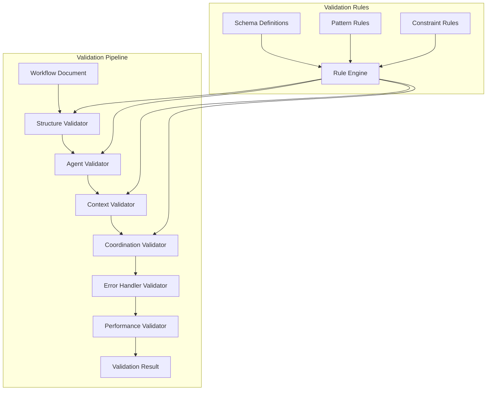

# Validation Framework

## Overview

The validation framework ensures that generated workflows are complete, correct, and executable. This document details the comprehensive validation system that checks workflow structure, agent assignments, context flow, and coordination patterns.

## Validation Architecture



## Core Validation Framework

### Main Validator Class

```python
class WorkflowValidator:
    """Comprehensive workflow validation system"""
    
    def __init__(self):
        self.structure_validator = StructureValidator()
        self.agent_validator = AgentValidator()
        self.context_validator = ContextValidator()
        self.coordination_validator = CoordinationValidator()
        self.error_handler_validator = ErrorHandlerValidator()
        self.performance_validator = PerformanceValidator()
        self.rule_engine = ValidationRuleEngine()
    
    async def validate(self, workflow: WorkflowDocument) -> ValidationResult:
        """Perform comprehensive workflow validation"""
        validation_tasks = [
            self.structure_validator.validate(workflow),
            self.agent_validator.validate(workflow),
            self.context_validator.validate(workflow),
            self.coordination_validator.validate(workflow),
            self.error_handler_validator.validate(workflow),
            self.performance_validator.validate(workflow)
        ]
        
        # Run all validations concurrently
        results = await asyncio.gather(*validation_tasks, return_exceptions=True)
        
        # Process results
        validation_results = []
        for result in results:
            if isinstance(result, Exception):
                validation_results.append(ValidationComponentResult(
                    component="unknown",
                    valid=False,
                    errors=[f"Validation failed: {str(result)}"]
                ))
            else:
                validation_results.append(result)
        
        # Combine results
        overall_valid = all(result.valid for result in validation_results)
        all_errors = [error for result in validation_results for error in result.errors]
        all_warnings = [warning for result in validation_results for warning in result.warnings]
        
        return ValidationResult(
            valid=overall_valid,
            score=self._calculate_validation_score(validation_results),
            errors=all_errors,
            warnings=all_warnings,
            component_results=validation_results,
            recommendations=self._generate_recommendations(validation_results)
        )
```

## Structure Validation

### Workflow Structure Validator

```python
class StructureValidator:
    """Validates workflow document structure and format"""
    
    def __init__(self):
        self.required_sections = [
            "extended_thinking",
            "phases",
            "coordination_notes"
        ]
        self.structure_rules = StructureRules()
    
    async def validate(self, workflow: WorkflowDocument) -> ValidationComponentResult:
        """Validate workflow structure"""
        errors = []
        warnings = []
        
        # Check required sections
        structure_checks = await self._check_required_sections(workflow)
        errors.extend(structure_checks.errors)
        warnings.extend(structure_checks.warnings)
        
        # Validate phase structure
        phase_checks = await self._validate_phases(workflow.phases)
        errors.extend(phase_checks.errors)
        warnings.extend(phase_checks.warnings)
        
        # Check Task tool format
        task_tool_checks = await self._validate_task_tool_format(workflow)
        errors.extend(task_tool_checks.errors)
        warnings.extend(task_tool_checks.warnings)
        
        # Validate markdown format
        markdown_checks = await self._validate_markdown_format(workflow)
        errors.extend(markdown_checks.errors)
        warnings.extend(markdown_checks.warnings)
        
        return ValidationComponentResult(
            component="structure",
            valid=len(errors) == 0,
            errors=errors,
            warnings=warnings,
            details=self._generate_structure_details(workflow)
        )
    
    async def _check_required_sections(self, workflow: WorkflowDocument) -> ValidationCheck:
        """Check for required workflow sections"""
        errors = []
        warnings = []
        
        # Check for extended thinking section
        if not self._has_extended_thinking(workflow):
            errors.append("Missing extended thinking section")
        
        # Check for phases
        if not workflow.phases or len(workflow.phases) == 0:
            errors.append("Workflow must have at least one phase")
        
        # Check for coordination notes
        if not workflow.coordination_notes:
            warnings.append("Missing coordination notes - recommended for complex workflows")
        
        return ValidationCheck(errors=errors, warnings=warnings)
    
    async def _validate_phases(self, phases: List[WorkflowPhase]) -> ValidationCheck:
        """Validate individual phases"""
        errors = []
        warnings = []
        
        for i, phase in enumerate(phases):
            phase_num = i + 1
            
            # Check phase name
            if not phase.name or len(phase.name.strip()) == 0:
                errors.append(f"Phase {phase_num}: Missing phase name")
            
            # Check agent assignment
            if not phase.agent_assignment:
                errors.append(f"Phase {phase_num}: Missing agent assignment")
            elif not phase.agent_assignment.primary_agent:
                errors.append(f"Phase {phase_num}: Missing primary agent")
            
            # Check prompt
            if not phase.prompt or len(phase.prompt.strip()) == 0:
                errors.append(f"Phase {phase_num}: Missing or empty prompt")
            
            # Check expected output
            if not phase.expected_output:
                warnings.append(f"Phase {phase_num}: Missing expected output specification")
        
        return ValidationCheck(errors=errors, warnings=warnings)
    
    async def _validate_task_tool_format(self, workflow: WorkflowDocument) -> ValidationCheck:
        """Validate Task tool invocation format"""
        errors = []
        warnings = []
        
        task_tool_pattern = re.compile(r'Use Task tool with subagent_type="([^"]+)"')
        
        for i, phase in enumerate(workflow.phases):
            phase_num = i + 1
            
            if not task_tool_pattern.search(phase.prompt):
                errors.append(f"Phase {phase_num}: Missing proper Task tool invocation format")
            else:
                # Extract agent name from Task tool invocation
                match = task_tool_pattern.search(phase.prompt)
                task_tool_agent = match.group(1)
                
                # Check consistency with agent assignment
                if (phase.agent_assignment and 
                    phase.agent_assignment.primary_agent and
                    task_tool_agent != phase.agent_assignment.primary_agent.name):
                    warnings.append(
                        f"Phase {phase_num}: Task tool agent name doesn't match assignment"
                    )
        
        return ValidationCheck(errors=errors, warnings=warnings)
```

## Agent Validation

### Agent Assignment Validator

```python
class AgentValidator:
    """Validates agent assignments and availability"""
    
    def __init__(self):
        self.agent_discovery = AgentDiscoveryService()
        self.capability_matcher = CapabilityMatcher()
        self.confidence_threshold = 0.7
    
    async def validate(self, workflow: WorkflowDocument) -> ValidationComponentResult:
        """Validate agent assignments"""
        errors = []
        warnings = []
        
        # Discover available agents
        available_agents = await self.agent_discovery.discover_agents()
        agent_names = {agent.name for agent in available_agents}
        
        # Validate each phase's agent assignment
        for i, phase in enumerate(workflow.phases):
            phase_num = i + 1
            
            if not phase.agent_assignment:
                errors.append(f"Phase {phase_num}: Missing agent assignment")
                continue
            
            assignment = phase.agent_assignment
            
            # Check primary agent exists
            if assignment.primary_agent.name not in agent_names:
                errors.append(
                    f"Phase {phase_num}: Primary agent '{assignment.primary_agent.name}' not found"
                )
            
            # Check confidence score
            if assignment.confidence < self.confidence_threshold:
                warnings.append(
                    f"Phase {phase_num}: Low confidence score ({assignment.confidence:.2f}) "
                    f"for agent '{assignment.primary_agent.name}'"
                )
            
            # Validate capability match
            capability_check = await self._validate_capability_match(phase, assignment)
            errors.extend(capability_check.errors)
            warnings.extend(capability_check.warnings)
            
            # Check fallback agents
            fallback_check = await self._validate_fallback_agents(assignment, agent_names)
            errors.extend(fallback_check.errors)
            warnings.extend(fallback_check.warnings)
        
        return ValidationComponentResult(
            component="agent",
            valid=len(errors) == 0,
            errors=errors,
            warnings=warnings,
            details=self._generate_agent_details(workflow, available_agents)
        )
    
    async def _validate_capability_match(
        self, 
        phase: WorkflowPhase, 
        assignment: AgentAssignment
    ) -> ValidationCheck:
        """Validate that agent capabilities match phase requirements"""
        errors = []
        warnings = []
        
        # Extract required capabilities from phase
        required_capabilities = await self._extract_phase_capabilities(phase)
        
        # Check agent capabilities
        agent_capabilities = set(assignment.primary_agent.capabilities)
        
        # Calculate coverage
        if required_capabilities:
            coverage = len(required_capabilities & agent_capabilities) / len(required_capabilities)
            
            if coverage < 0.5:
                errors.append(
                    f"Agent '{assignment.primary_agent.name}' has low capability coverage "
                    f"({coverage:.1%}) for phase requirements"
                )
            elif coverage < 0.8:
                warnings.append(
                    f"Agent '{assignment.primary_agent.name}' has moderate capability coverage "
                    f"({coverage:.1%}) for phase requirements"
                )
        
        return ValidationCheck(errors=errors, warnings=warnings)
    
    async def _validate_fallback_agents(
        self, 
        assignment: AgentAssignment, 
        available_agents: Set[str]
    ) -> ValidationCheck:
        """Validate fallback agent assignments"""
        errors = []
        warnings = []
        
        if not assignment.fallback_agents:
            warnings.append("No fallback agents specified - recommended for resilience")
        else:
            for fallback in assignment.fallback_agents:
                if fallback.name not in available_agents:
                    errors.append(f"Fallback agent '{fallback.name}' not found")
        
        return ValidationCheck(errors=errors, warnings=warnings)
```

## Context Validation

### Context Flow Validator

```python
class ContextValidator:
    """Validates context flow between workflow phases"""
    
    def __init__(self):
        self.context_schema_validator = ContextSchemaValidator()
        self.context_size_analyzer = ContextSizeAnalyzer()
    
    async def validate(self, workflow: WorkflowDocument) -> ValidationComponentResult:
        """Validate context management"""
        errors = []
        warnings = []
        
        # Validate context flow continuity
        flow_check = await self._validate_context_flow(workflow.phases)
        errors.extend(flow_check.errors)
        warnings.extend(flow_check.warnings)
        
        # Validate context schemas
        schema_check = await self._validate_context_schemas(workflow)
        errors.extend(schema_check.errors)
        warnings.extend(schema_check.warnings)
        
        # Check context size constraints
        size_check = await self._validate_context_sizes(workflow)
        errors.extend(size_check.errors)
        warnings.extend(size_check.warnings)
        
        # Validate context references
        reference_check = await self._validate_context_references(workflow)
        errors.extend(reference_check.errors)
        warnings.extend(reference_check.warnings)
        
        return ValidationComponentResult(
            component="context",
            valid=len(errors) == 0,
            errors=errors,
            warnings=warnings,
            details=self._generate_context_details(workflow)
        )
    
    async def _validate_context_flow(self, phases: List[WorkflowPhase]) -> ValidationCheck:
        """Validate context flow between phases"""
        errors = []
        warnings = []
        
        for i in range(1, len(phases)):  # Start from second phase
            current_phase = phases[i]
            previous_phases = phases[:i]
            
            # Check if phase references previous context
            context_references = self._extract_context_references(current_phase.prompt)
            
            if not context_references and i > 0:
                warnings.append(
                    f"Phase {i+1} doesn't reference context from previous phases"
                )
            
            # Validate context references exist
            for ref in context_references:
                if not self._context_reference_exists(ref, previous_phases):
                    errors.append(
                        f"Phase {i+1}: Context reference '{ref}' not found in previous phases"
                    )
        
        return ValidationCheck(errors=errors, warnings=warnings)
    
    def _extract_context_references(self, prompt: str) -> List[str]:
        """Extract context references from prompt"""
        # Pattern to match context references like [Phase 1 results] or [API contracts]
        pattern = r'\[([^\]]+)\]'
        return re.findall(pattern, prompt)
    
    async def _validate_context_schemas(self, workflow: WorkflowDocument) -> ValidationCheck:
        """Validate context data schemas"""
        errors = []
        warnings = []
        
        for i, phase in enumerate(workflow.phases):
            phase_num = i + 1
            
            # Validate input context schema
            if phase.input_context:
                schema_result = await self.context_schema_validator.validate(
                    phase.input_context, 
                    f"phase_{i}_input"
                )
                if not schema_result.valid:
                    errors.extend([
                        f"Phase {phase_num} input context: {error}" 
                        for error in schema_result.errors
                    ])
            
            # Validate expected output context schema
            if phase.expected_output_context:
                schema_result = await self.context_schema_validator.validate(
                    phase.expected_output_context, 
                    f"phase_{i}_output"
                )
                if not schema_result.valid:
                    errors.extend([
                        f"Phase {phase_num} output context: {error}" 
                        for error in schema_result.errors
                    ])
        
        return ValidationCheck(errors=errors, warnings=warnings)
```

## Coordination Validation

### Workflow Coordination Validator

```python
class CoordinationValidator:
    """Validates workflow coordination patterns and logic"""
    
    def __init__(self):
        self.pattern_validators = {
            PatternType.SEQUENTIAL: SequentialPatternValidator(),
            PatternType.PARALLEL: ParallelPatternValidator(),
            PatternType.CONDITIONAL: ConditionalPatternValidator(),
            PatternType.HYBRID: HybridPatternValidator()
        }
    
    async def validate(self, workflow: WorkflowDocument) -> ValidationComponentResult:
        """Validate workflow coordination"""
        errors = []
        warnings = []
        
        # Validate pattern consistency
        pattern_check = await self._validate_pattern_consistency(workflow)
        errors.extend(pattern_check.errors)
        warnings.extend(pattern_check.warnings)
        
        # Validate specific pattern requirements
        if workflow.pattern.type in self.pattern_validators:
            validator = self.pattern_validators[workflow.pattern.type]
            pattern_specific_check = await validator.validate(workflow)
            errors.extend(pattern_specific_check.errors)
            warnings.extend(pattern_specific_check.warnings)
        
        # Validate dependencies
        dependency_check = await self._validate_dependencies(workflow)
        errors.extend(dependency_check.errors)
        warnings.extend(dependency_check.warnings)
        
        # Validate synchronization points
        sync_check = await self._validate_synchronization_points(workflow)
        errors.extend(sync_check.errors)
        warnings.extend(sync_check.warnings)
        
        return ValidationComponentResult(
            component="coordination",
            valid=len(errors) == 0,
            errors=errors,
            warnings=warnings,
            details=self._generate_coordination_details(workflow)
        )
    
    async def _validate_pattern_consistency(self, workflow: WorkflowDocument) -> ValidationCheck:
        """Validate that workflow structure matches declared pattern"""
        errors = []
        warnings = []
        
        declared_pattern = workflow.pattern.type
        inferred_pattern = self._infer_pattern_from_structure(workflow)
        
        if declared_pattern != inferred_pattern:
            warnings.append(
                f"Declared pattern ({declared_pattern.value}) doesn't match "
                f"inferred pattern ({inferred_pattern.value})"
            )
        
        return ValidationCheck(errors=errors, warnings=warnings)
    
    def _infer_pattern_from_structure(self, workflow: WorkflowDocument) -> PatternType:
        """Infer workflow pattern from structure"""
        phases = workflow.phases
        
        # Check for parallel branches
        has_parallel = any("Branch" in phase.name for phase in phases)
        
        # Check for conditional logic
        has_conditional = any(
            "Condition" in phase.name or "Decision" in phase.name 
            for phase in phases
        )
        
        # Check for hybrid patterns
        has_multiple_patterns = has_parallel and has_conditional
        
        if has_multiple_patterns:
            return PatternType.HYBRID
        elif has_conditional:
            return PatternType.CONDITIONAL
        elif has_parallel:
            return PatternType.PARALLEL
        else:
            return PatternType.SEQUENTIAL
```

## Error Handling Validation

### Error Handler Validator

```python
class ErrorHandlerValidator:
    """Validates error handling and recovery mechanisms"""
    
    async def validate(self, workflow: WorkflowDocument) -> ValidationComponentResult:
        """Validate error handling capabilities"""
        errors = []
        warnings = []
        
        # Check for error handling sections
        error_handling_check = await self._check_error_handling_sections(workflow)
        errors.extend(error_handling_check.errors)
        warnings.extend(error_handling_check.warnings)
        
        # Validate rollback procedures
        rollback_check = await self._validate_rollback_procedures(workflow)
        errors.extend(rollback_check.errors)
        warnings.extend(rollback_check.warnings)
        
        # Check recovery strategies
        recovery_check = await self._validate_recovery_strategies(workflow)
        errors.extend(recovery_check.errors)
        warnings.extend(recovery_check.warnings)
        
        # Validate fallback mechanisms
        fallback_check = await self._validate_fallback_mechanisms(workflow)
        errors.extend(fallback_check.errors)
        warnings.extend(fallback_check.warnings)
        
        return ValidationComponentResult(
            component="error_handling",
            valid=len(errors) == 0,
            errors=errors,
            warnings=warnings,
            details=self._generate_error_handling_details(workflow)
        )
    
    async def _check_error_handling_sections(self, workflow: WorkflowDocument) -> ValidationCheck:
        """Check for error handling documentation"""
        errors = []
        warnings = []
        
        # Check coordination notes for error handling
        if workflow.coordination_notes:
            error_keywords = ["error", "failure", "rollback", "recovery", "fallback"]
            has_error_handling = any(
                keyword in workflow.coordination_notes.lower() 
                for keyword in error_keywords
            )
            
            if not has_error_handling:
                warnings.append("No error handling mentioned in coordination notes")
        
        # Check individual phases for error handling
        phases_with_error_handling = 0
        for phase in workflow.phases:
            if self._phase_has_error_handling(phase):
                phases_with_error_handling += 1
        
        if phases_with_error_handling == 0:
            warnings.append("No phases specify error handling procedures")
        elif phases_with_error_handling < len(workflow.phases) / 2:
            warnings.append("Less than half of phases specify error handling")
        
        return ValidationCheck(errors=errors, warnings=warnings)
    
    def _phase_has_error_handling(self, phase: WorkflowPhase) -> bool:
        """Check if phase has error handling specifications"""
        error_indicators = [
            "error", "failure", "exception", "rollback", 
            "retry", "fallback", "recovery"
        ]
        
        text_to_check = f"{phase.prompt} {phase.expected_output or ''}"
        return any(indicator in text_to_check.lower() for indicator in error_indicators)
```

## Performance Validation

### Performance Validator

```python
class PerformanceValidator:
    """Validates workflow performance characteristics"""
    
    def __init__(self):
        self.performance_thresholds = {
            'max_execution_time': 3600,  # 1 hour
            'max_phases': 10,
            'max_context_size': 10 * 1024 * 1024,  # 10MB
            'min_parallelization_efficiency': 0.6
        }
    
    async def validate(self, workflow: WorkflowDocument) -> ValidationComponentResult:
        """Validate performance characteristics"""
        errors = []
        warnings = []
        
        # Check execution time estimates
        time_check = await self._validate_execution_time(workflow)
        errors.extend(time_check.errors)
        warnings.extend(time_check.warnings)
        
        # Validate resource usage
        resource_check = await self._validate_resource_usage(workflow)
        errors.extend(resource_check.errors)
        warnings.extend(resource_check.warnings)
        
        # Check parallelization efficiency
        parallel_check = await self._validate_parallelization(workflow)
        errors.extend(parallel_check.errors)
        warnings.extend(parallel_check.warnings)
        
        # Validate scalability
        scalability_check = await self._validate_scalability(workflow)
        errors.extend(scalability_check.errors)
        warnings.extend(scalability_check.warnings)
        
        return ValidationComponentResult(
            component="performance",
            valid=len(errors) == 0,
            errors=errors,
            warnings=warnings,
            details=self._generate_performance_details(workflow)
        )
    
    async def _validate_execution_time(self, workflow: WorkflowDocument) -> ValidationCheck:
        """Validate estimated execution time"""
        errors = []
        warnings = []
        
        if workflow.estimated_duration:
            if workflow.estimated_duration > self.performance_thresholds['max_execution_time']:
                warnings.append(
                    f"Estimated execution time ({workflow.estimated_duration}s) "
                    f"exceeds recommended maximum ({self.performance_thresholds['max_execution_time']}s)"
                )
        else:
            warnings.append("No execution time estimate provided")
        
        return ValidationCheck(errors=errors, warnings=warnings)
```

## Validation Rules Engine

### Rule Engine Implementation

```python
class ValidationRuleEngine:
    """Configurable rule engine for workflow validation"""
    
    def __init__(self):
        self.rules = self._load_validation_rules()
        self.custom_validators = {}
    
    def _load_validation_rules(self) -> Dict[str, ValidationRule]:
        """Load validation rules from configuration"""
        return {
            'required_sections': ValidationRule(
                name='required_sections',
                description='Workflow must have required sections',
                severity='error',
                validator=self._validate_required_sections
            ),
            'agent_availability': ValidationRule(
                name='agent_availability',
                description='All referenced agents must be available',
                severity='error',
                validator=self._validate_agent_availability
            ),
            'context_continuity': ValidationRule(
                name='context_continuity',
                description='Context must flow between phases',
                severity='warning',
                validator=self._validate_context_continuity
            ),
            'performance_thresholds': ValidationRule(
                name='performance_thresholds',
                description='Workflow must meet performance requirements',
                severity='warning',
                validator=self._validate_performance_thresholds
            )
        }
    
    async def apply_rules(self, workflow: WorkflowDocument) -> List[RuleViolation]:
        """Apply all validation rules to workflow"""
        violations = []
        
        for rule_name, rule in self.rules.items():
            try:
                rule_result = await rule.validator(workflow)
                if not rule_result.passed:
                    violations.append(RuleViolation(
                        rule_name=rule_name,
                        severity=rule.severity,
                        message=rule_result.message,
                        details=rule_result.details
                    ))
            except Exception as e:
                violations.append(RuleViolation(
                    rule_name=rule_name,
                    severity='error',
                    message=f"Rule validation failed: {str(e)}",
                    details={}
                ))
        
        return violations
```

## Validation Result Processing

### Result Aggregation and Reporting

```python
class ValidationResultProcessor:
    """Process and format validation results"""
    
    def __init__(self):
        self.report_formatter = ValidationReportFormatter()
        self.recommendation_engine = RecommendationEngine()
    
    async def process_results(self, validation_result: ValidationResult) -> ProcessedValidationResult:
        """Process validation results and generate recommendations"""
        
        # Categorize issues by severity
        critical_errors = [e for e in validation_result.errors if self._is_critical(e)]
        minor_errors = [e for e in validation_result.errors if not self._is_critical(e)]
        
        # Generate recommendations
        recommendations = await self.recommendation_engine.generate_recommendations(
            validation_result
        )
        
        # Create summary
        summary = ValidationSummary(
            overall_score=validation_result.score,
            total_issues=len(validation_result.errors) + len(validation_result.warnings),
            critical_issues=len(critical_errors),
            component_scores={
                result.component: self._calculate_component_score(result)
                for result in validation_result.component_results
            }
        )
        
        # Format report
        report = await self.report_formatter.format_report(
            validation_result, recommendations, summary
        )
        
        return ProcessedValidationResult(
            validation_result=validation_result,
            summary=summary,
            recommendations=recommendations,
            report=report,
            actionable_items=self._extract_actionable_items(recommendations)
        )
    
    def _is_critical(self, error: str) -> bool:
        """Determine if error is critical"""
        critical_keywords = [
            "missing agent", "invalid format", "broken dependency",
            "context missing", "pattern mismatch"
        ]
        return any(keyword in error.lower() for keyword in critical_keywords)
```

## Custom Validation Extensions

### Plugin System for Custom Validators

```python
class ValidationPlugin:
    """Base class for custom validation plugins"""
    
    def __init__(self, name: str, description: str):
        self.name = name
        self.description = description
    
    async def validate(self, workflow: WorkflowDocument) -> ValidationComponentResult:
        """Override this method to implement custom validation"""
        raise NotImplementedError
    
    def get_configuration_schema(self) -> Dict:
        """Return configuration schema for this plugin"""
        return {}

class CustomValidationRegistry:
    """Registry for custom validation plugins"""
    
    def __init__(self):
        self.plugins = {}
    
    def register_plugin(self, plugin: ValidationPlugin):
        """Register a custom validation plugin"""
        self.plugins[plugin.name] = plugin
    
    async def run_custom_validations(self, workflow: WorkflowDocument) -> List[ValidationComponentResult]:
        """Run all registered custom validations"""
        results = []
        
        for plugin_name, plugin in self.plugins.items():
            try:
                result = await plugin.validate(workflow)
                results.append(result)
            except Exception as e:
                results.append(ValidationComponentResult(
                    component=plugin_name,
                    valid=False,
                    errors=[f"Custom validation failed: {str(e)}"],
                    warnings=[],
                    details={}
                ))
        
        return results
```

## Testing Framework

### Validation Test Suite

```python
class TestWorkflowValidation(unittest.TestCase):
    """Test suite for workflow validation"""
    
    def setUp(self):
        self.validator = WorkflowValidator()
        self.sample_workflow = self._create_sample_workflow()
    
    async def test_valid_workflow_passes_validation(self):
        """Test that a valid workflow passes all validations"""
        result = await self.validator.validate(self.sample_workflow)
        
        self.assertTrue(result.valid)
        self.assertEqual(len(result.errors), 0)
        self.assertGreaterEqual(result.score, 0.8)
    
    async def test_missing_agent_fails_validation(self):
        """Test that missing agent causes validation failure"""
        # Create workflow with non-existent agent
        invalid_workflow = self._create_workflow_with_missing_agent()
        
        result = await self.validator.validate(invalid_workflow)
        
        self.assertFalse(result.valid)
        self.assertTrue(any("not found" in error for error in result.errors))
    
    async def test_broken_context_flow_generates_warning(self):
        """Test that broken context flow generates warnings"""
        # Create workflow with broken context flow
        workflow_with_broken_context = self._create_workflow_with_broken_context()
        
        result = await self.validator.validate(workflow_with_broken_context)
        
        self.assertTrue(any("context" in warning.lower() for warning in result.warnings))
    
    def _create_sample_workflow(self) -> WorkflowDocument:
        """Create a valid sample workflow for testing"""
        return WorkflowDocument(
            title="Sample Workflow",
            description="A valid workflow for testing",
            pattern=WorkflowPattern(type=PatternType.SEQUENTIAL),
            phases=[
                WorkflowPhase(
                    name="Phase 1: Analysis",
                    agent_assignment=AgentAssignment(
                        primary_agent=AgentInfo(name="backend-architect"),
                        confidence=0.9
                    ),
                    prompt='Use Task tool with subagent_type="backend-architect"\nPrompt: "Analyze requirements"',
                    expected_output="Analysis results"
                )
            ],
            coordination_notes="Sequential execution with error handling"
        )
```

## Configuration and Customization

### Validation Configuration

```yaml
# validation_config.yaml
validation:
  structure:
    require_extended_thinking: true
    require_coordination_notes: true
    max_phases: 10