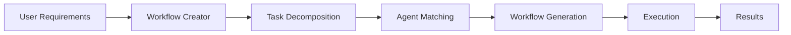
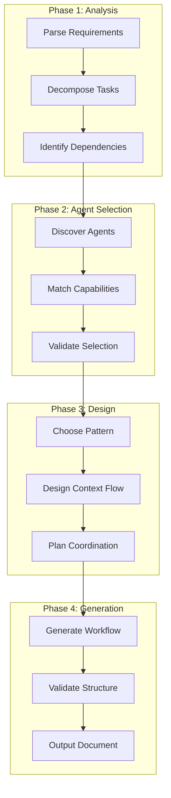

# Workflow Creator Documentation

Welcome to the **Workflow Creator Agent** documentation. This comprehensive guide covers the design, implementation, and usage of our intelligent multi-agent orchestration system.

## Overview

The Workflow Creator Agent is a sophisticated orchestration system that analyzes complex user requirements and generates structured multi-agent workflows. It serves as an intelligent coordination layer between user needs and our extensive agent ecosystem, providing:

- **Dynamic Agent Selection**: Automatically matches tasks to the most suitable agents
- **Sophisticated Workflow Patterns**: Supports sequential, parallel, conditional, and hybrid coordination
- **Robust Context Management**: Ensures information continuity across workflow phases
- **Comprehensive Error Handling**: Includes rollback procedures and recovery strategies

## Quick Start

### Basic Usage

1. **Provide Requirements**: Describe your complex task or project
2. **Receive Workflow**: Get a structured multi-agent workflow
3. **Execute Workflow**: Run the workflow with proper coordination
4. **Monitor Progress**: Track execution and handle any issues

## Documentation Structure

### 📊 [Analysis](./analysis/agent-format.md)
Deep dive into the agent ecosystem and workflow patterns:
- [Agent Format Analysis](./analysis/agent-format.md) - Understanding agent structure
- [Workflow Patterns](./analysis/workflow-patterns.md) - Coordination pattern analysis
- [Claude Documentation](./analysis/claude-documentation.md) - Key findings and insights

### 🏗️ [Design](./design/architecture.md)
Architectural decisions and design principles:
- [Architecture Overview](./design/architecture.md) - System architecture
- [Agent Selection](./design/agent-selection.md) - Dynamic matching algorithms
- [Context Management](./design/context-management.md) - Information flow design

### 💻 [Implementation](./implementation/workflow-creator-agent.md)
Technical implementation details:
- [Workflow Creator Agent](./implementation/workflow-creator-agent.md) - Core agent implementation
- [Integration Guide](./implementation/integration.md) - System integration
- [Validation Framework](./implementation/validation.md) - Quality assurance

### 🔄 [Patterns](./patterns/sequential-workflows.md)
Workflow coordination patterns:
- [Sequential Workflows](./patterns/sequential-workflows.md) - Linear task progression
- [Parallel Workflows](./patterns/parallel-workflows.md) - Concurrent execution
- [Conditional Workflows](./patterns/conditional-workflows.md) - Decision-based branching
- [Hybrid Workflows](./patterns/hybrid-workflows.md) - Complex combinations

### ✅ [Best Practices](./best-practices/workflow-design.md)
Guidelines for effective workflow creation:
- [Workflow Design](./best-practices/workflow-design.md) - Design principles
- [Error Handling](./best-practices/error-handling.md) - Robust error management
- [Performance](./best-practices/performance.md) - Optimization strategies
- [Anti-patterns](./best-practices/anti-patterns.md) - Common pitfalls to avoid

### 📝 [Templates](./templates/quick-start.md)
Ready-to-use workflow templates:
- [Quick Start Guide](./templates/quick-start.md) - Getting started quickly
- [Workflow Templates](./templates/workflow-templates.md) - Reusable patterns

### 🚀 [Examples](./examples/e-commerce-workflow.md)
Real-world workflow examples:
- [E-commerce Workflow](./examples/e-commerce-workflow.md) - Shopping cart implementation
- [Data Pipeline Workflow](./examples/data-pipeline-workflow.md) - ETL modernization
- [Incident Response Workflow](./examples/incident-response-workflow.md) - Emergency handling

## Key Features

### 1. Requirements Analysis
- Natural language processing for complex requirements
- Automatic task decomposition
- Dependency identification
- Success criteria extraction

### 2. Dynamic Agent Matching
- Semantic analysis of agent capabilities
- Confidence scoring for matches
- Fallback strategies
- Capability gap identification

### 3. Workflow Generation
- Multiple coordination patterns
- Context flow design
- Error handling integration
- Validation framework

### 4. Execution Management
- Phase-level coordination
- Context persistence
- Progress monitoring
- Rollback procedures

## Workflow Creation Process

## Getting Started

To start using the Workflow Creator Agent:

1. **Understand Your Requirements**: Clearly define what you want to accomplish
2. **Review Available Agents**: Familiarize yourself with the agent ecosystem
3. **Choose a Pattern**: Select the appropriate workflow pattern
4. **Generate Workflow**: Use the workflow creator to generate your workflow
5. **Validate and Execute**: Review the generated workflow and execute

## Support and Resources

- **GitHub Repository**: [workflow-creator](https://github.com/your-org/workflow-creator)
- **Implementation Guide**: [Workflow Creator Agent](./implementation/workflow-creator-agent.md)
- **Integration Documentation**: [Integration Guide](./implementation/integration.md)
- **Community Forum**: [Discussions](https://github.com/your-org/workflow-creator/discussions)
- **Issue Tracker**: [Report Issues](https://github.com/your-org/workflow-creator/issues)

## Contributing

We welcome contributions! Please see our [Best Practices Guide](./best-practices/workflow-design.md) for details on:
- Workflow Design Principles
- Error Handling Strategies
- Performance Optimization
- Common Anti-patterns to Avoid

## License

This project is licensed under the MIT License. For more information about the project structure and implementation details, see our [Architecture Overview](./design/architecture.md).

---

Ready to create your first workflow? Start with our [Quick Start Guide](./templates/quick-start.md) or explore [Examples](./examples/e-commerce-workflow.md) to see the Workflow Creator in action!