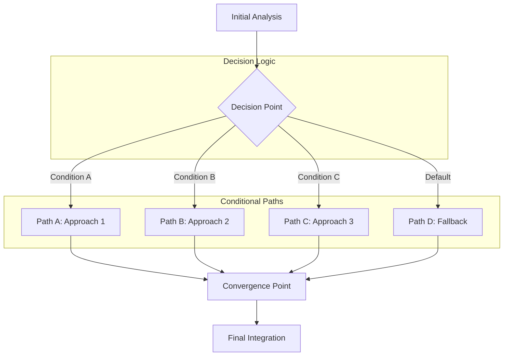

# Conditional Workflows

## Overview

Conditional workflows implement decision-based branching that adapts execution paths based on runtime conditions, analysis results, or environmental factors. This pattern enables dynamic workflow behavior that can handle multiple scenarios and make intelligent routing decisions.

## Pattern Characteristics

### Core Properties

- **Dynamic Path Selection**: Runtime decision making based on conditions
- **Flexible Execution**: Adapts to different scenarios and requirements
- **Decision Logic**: Clear criteria for path selection
- **Convergence Points**: Multiple paths can merge back together
- **Fallback Support**: Default paths for unexpected conditions

### Visual Representation



## When to Use Conditional Workflows

### Ideal Use Cases

1. **Technology Selection Scenarios**
   - Cloud provider selection (AWS vs Azure vs GCP)
   - Framework choice based on requirements
   - Deployment strategy selection (blue-green vs canary vs rolling)

2. **Adaptive Processing**
   - Data processing based on data characteristics
   - Security measures based on threat level
   - Performance optimization based on load patterns

3. **Multi-Strategy Approaches**
   - Problem-solving with alternative methods
   - Risk mitigation with different approaches
   - User experience customization based on context

### Pattern Selection Criteria

Choose conditional workflows when:
- Multiple valid approaches exist for the same goal
- Runtime decisions are needed based on analysis
- Different scenarios require different handling
- Flexibility and adaptability are important
- Fallback strategies are necessary

## Conditional Workflow Template

### Basic Template Structure

```markdown
[Extended thinking: Conditional workflow for {purpose}. Decision-based branching with multiple execution paths and convergence strategy.]

## Phase 1: Analysis & Decision Point
- Use Task tool with subagent_type="{analysis-agent}"
- Prompt: "Analyze requirements and determine optimal execution path for: {requirements}. Evaluate conditions: {decision criteria}."
- Output: Analysis results, decision criteria evaluation, recommended path
- Decision Logic: {Specific conditions for branching}

## Phase 2: Conditional Execution

### Path A: {Condition A Description} (Condition: {specific condition})
- Use Task tool with subagent_type="{specialist-agent-a}"
- Prompt: "Execute Path A approach for condition: {condition A}. Use analysis: [decision criteria, requirements]. Focus on: {Path A specifics}."
- Output: {Path A deliverables}
- Applicability: {When this path is optimal}

### Path B: {Condition B Description} (Condition: {specific condition})
- Use Task tool with subagent_type="{specialist-agent-b}"
- Prompt: "Execute Path B approach for condition: {condition B}. Use analysis: [decision criteria, requirements]. Focus on: {Path B specifics}."
- Output: {Path B deliverables}
- Applicability: {When this path is optimal}

### Default Path: {Fallback Description} (Condition: {default/fallback})
- Use Task tool with subagent_type="{generalist-agent}"
- Prompt: "Execute fallback approach when specific conditions aren't met. Use analysis: [decision criteria, requirements]. Provide general solution."
- Output: {Fallback deliverables}
- Applicability: {When other paths don't apply}

## Phase 3: Convergence & Integration
- Use Task tool with subagent_type="{integration-agent}"
- Prompt: "Integrate results from chosen path: [selected path results]. Finalize implementation and ensure consistency with original requirements: [analysis results]."
- Output: {Final integrated deliverables}
- Final context: {Comprehensive results with path selection rationale}

## Coordination Notes
- {Decision criteria and evaluation methodology}
- {Path selection logic and validation}
- {Convergence strategy and integration approach}
- {Fallback activation conditions}
- {Quality assurance across all paths}
```

## Real-World Examples

### Example 1: Cloud Infrastructure Deployment

```markdown
[Extended thinking: Conditional workflow for cloud infrastructure deployment. Path selection based on requirements analysis, budget constraints, and technical preferences.]

## Phase 1: Requirements Analysis & Cloud Provider Selection
- Use Task tool with subagent_type="cloud-architect"
- Prompt: "Analyze infrastructure requirements including performance needs, budget constraints, compliance requirements, and technical preferences. Evaluate cloud providers (AWS, Azure, GCP) and recommend optimal choice based on: cost optimization, performance requirements, compliance needs, existing technology stack."
- Output: Requirements analysis, cloud provider comparison, recommendation with rationale, decision matrix
- Decision Logic: Budget < $10k/month AND compliance = standard → AWS; Microsoft ecosystem OR enterprise compliance → Azure; ML/AI focus OR cost optimization → GCP; Complex requirements → Hybrid approach

## Phase 2: Conditional Cloud Implementation

### Path A: AWS Implementation (Condition: Cost-optimized, standard compliance, < $10k/month)
- Use Task tool with subagent_type="aws-specialist"
- Prompt: "Implement AWS infrastructure using requirements: [requirements analysis, budget constraints]. Design cost-optimized architecture with EC2, RDS, S3, and CloudFront. Focus on AWS-native services and cost optimization strategies."
- Output: AWS infrastructure code, cost optimization configuration, monitoring setup, deployment scripts
- Applicability: Budget-conscious projects with standard compliance needs

### Path B: Azure Implementation (Condition: Microsoft ecosystem OR enterprise compliance)
- Use Task tool with subagent_type="azure-specialist"
- Prompt: "Implement Azure infrastructure using requirements: [requirements analysis, compliance needs]. Design enterprise-grade architecture with Azure VMs, SQL Database, Blob Storage, and CDN. Focus on Active Directory integration and compliance features."
- Output: Azure infrastructure code, compliance configuration, enterprise integration, deployment templates
- Applicability: Enterprise environments with Microsoft technology stack

### Path C: GCP Implementation (Condition: ML/AI workloads OR maximum cost optimization)
- Use Task tool with subagent_type="gcp-specialist"
- Prompt: "Implement GCP infrastructure using requirements: [requirements analysis, ML/AI needs]. Design ML-optimized architecture with Compute Engine, Cloud SQL, Cloud Storage, and AI Platform. Focus on machine learning capabilities and cost efficiency."
- Output: GCP infrastructure code, ML pipeline setup, cost optimization configuration, deployment scripts
- Applicability: AI/ML-focused projects or maximum cost optimization needs

### Default Path: Multi-Cloud Hybrid (Condition: Complex requirements OR no clear winner)
- Use Task tool with subagent_type="multi-cloud-architect"
- Prompt: "Design hybrid multi-cloud solution using requirements: [complex requirements analysis]. Create architecture spanning multiple providers for optimal feature utilization, risk distribution, and vendor lock-in avoidance."
- Output: Multi-cloud architecture, vendor-agnostic deployment, orchestration setup, management tools
- Applicability: Complex enterprise requirements or vendor diversification needs

## Phase 3: Deployment Integration & Optimization
- Use Task tool with subagent_type="devops-engineer"
- Prompt: "Deploy and optimize chosen cloud infrastructure: [selected implementation]. Set up monitoring, logging, backup strategies, and performance optimization. Ensure security best practices and cost monitoring."
- Output: Deployed infrastructure, monitoring dashboards, optimization recommendations, operational runbooks
- Final context: Production-ready cloud infrastructure with comprehensive operational setup

## Coordination Notes
- Decision matrix considers cost, compliance, technical fit, and strategic alignment
- Each path optimizes for specific cloud provider strengths and pricing models
- Convergence phase ensures consistent monitoring and operational practices
- Fallback to hybrid approach provides maximum flexibility for complex scenarios
- Cost monitoring and optimization continuous across all deployment paths
```

## Best Practices

### Design Guidelines

1. **Clear Decision Criteria**
   - Define explicit, measurable conditions
   - Avoid ambiguous or overlapping conditions
   - Include confidence scoring for decisions

2. **Comprehensive Path Coverage**
   - Ensure all possible scenarios have appropriate paths
   - Implement robust fallback strategies
   - Test edge cases and boundary conditions

3. **Efficient Condition Evaluation**
   - Order conditions by evaluation cost and selectivity
   - Cache expensive condition evaluations
   - Use short-circuit evaluation when possible

4. **Graceful Integration**
   - Design consistent output formats across paths
   - Implement validation for path results
   - Handle conflicts between different path outcomes

### Common Pitfalls

1. **Overlapping Conditions**
   - Multiple conditions satisfied simultaneously
   - Unclear precedence rules
   - Inconsistent decision logic

2. **Missing Edge Cases**
   - Conditions that don't cover all scenarios
   - Inadequate fallback strategies
   - Poor handling of boundary conditions

3. **Expensive Decision Making**
   - Complex conditions that slow execution
   - Redundant condition evaluations
   - Poor caching strategies

## Conclusion

Conditional workflows provide powerful flexibility for handling diverse scenarios and requirements. They enable intelligent path selection based on runtime analysis while maintaining clear decision logic and comprehensive coverage of possible execution paths.

Key advantages:
- **Adaptive execution based on conditions**
- **Flexible handling of multiple scenarios**
- **Clear decision logic and traceability**
- **Robust fallback mechanisms**

Use conditional workflows when you need to handle multiple valid approaches to the same problem, make runtime decisions based on analysis, or provide adaptive behavior based on changing conditions.