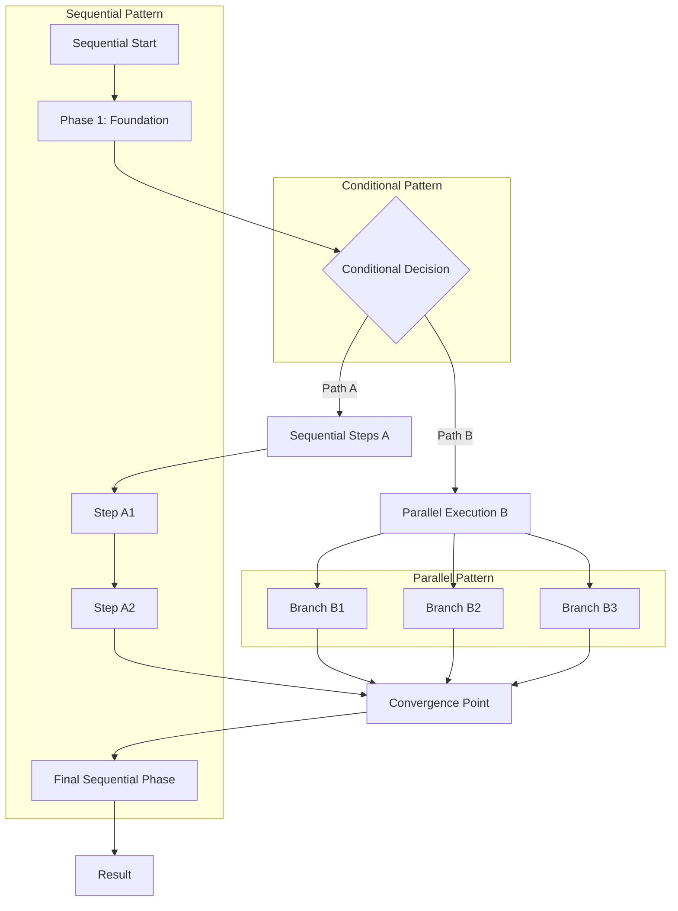

# Hybrid Workflows

## Overview

Hybrid workflows combine multiple coordination patterns (sequential, parallel, and conditional) within a single workflow to handle complex scenarios that require sophisticated orchestration. This pattern provides maximum flexibility and optimization by using the most appropriate coordination strategy for each phase.

## Pattern Characteristics

### Core Properties

- **Multi-Pattern Integration**: Combines sequential, parallel, and conditional patterns
- **Adaptive Coordination**: Uses optimal pattern for each workflow phase
- **Complex Orchestration**: Handles sophisticated multi-agent scenarios
- **Maximum Flexibility**: Adapts to diverse requirements within single workflow
- **Optimized Execution**: Leverages strengths of different coordination patterns

### Visual Representation



## When to Use Hybrid Workflows

### Ideal Use Cases

1. **Complex Application Development**
   - Full-stack development with multiple technologies
   - Enterprise applications with diverse requirements
   - Multi-platform solutions with shared components

2. **Comprehensive System Implementation**
   - End-to-end business process automation
   - Complete infrastructure deployment with multiple services
   - Integrated solution delivery with multiple stakeholders

3. **Adaptive Project Execution**
   - Projects with evolving requirements
   - Multi-phase implementations with different coordination needs
   - Complex problem-solving requiring multiple approaches

### Pattern Selection Criteria

Choose hybrid workflows when:
- Requirements are too complex for single coordination pattern
- Different phases benefit from different coordination strategies
- Maximum optimization and flexibility are needed
- Multiple stakeholders require different execution approaches
- Project complexity justifies sophisticated orchestration

## Hybrid Workflow Template

### Basic Template Structure

```markdown
[Extended thinking: Hybrid workflow combining sequential, parallel, and conditional patterns for {complex purpose}. Each phase uses optimal coordination strategy.]

## Phase 1: Sequential Foundation
- Use Task tool with subagent_type="{foundation-agent}"
- Prompt: "Establish foundational requirements and architecture for: {requirements}. Create baseline that supports multiple execution paths."
- Output: {Foundation deliverables}
- Context for next phase: {Baseline context for decision making}

## Phase 2: Conditional Path Selection
### Decision Point: {Decision criteria}

#### Path 2A: {Condition A Description} (Condition: {specific condition})
- Use Task tool with subagent_type="{specialist-agent-a}"
- Prompt: "Execute specialized approach A using foundation: [Phase 1 results]. Focus on: {Path A specifics}."
- Output: {Path A deliverables}

#### Path 2B: {Condition B Description} (Condition: {specific condition})
- Use Task tool with subagent_type="{specialist-agent-b}"
- Prompt: "Execute specialized approach B using foundation: [Phase 1 results]. Focus on: {Path B specifics}."
- Output: {Path B deliverables}

## Phase 3: Parallel Enhancement
### Branch 3A: {Enhancement Type A}
- Use Task tool with subagent_type="{enhancement-agent-a}"
- Prompt: "Add {enhancement A} to chosen path results: [Phase 2 results]. Execute independently of other enhancements."
- Output: {Enhancement A deliverables}

### Branch 3B: {Enhancement Type B}
- Use Task tool with subagent_type="{enhancement-agent-b}"
- Prompt: "Add {enhancement B} to chosen path results: [Phase 2 results]. Execute independently of other enhancements."
- Output: {Enhancement B deliverables}

### Branch 3C: {Enhancement Type C}
- Use Task tool with subagent_type="{enhancement-agent-c}"
- Prompt: "Add {enhancement C} to chosen path results: [Phase 2 results]. Execute independently of other enhancements."
- Output: {Enhancement C deliverables}

## Phase 4: Sequential Integration & Finalization
- Use Task tool with subagent_type="{integration-agent}"
- Prompt: "Integrate all components: Foundation [Phase 1], Chosen Path [Phase 2], Enhancements [Phase 3A, 3B, 3C]. Create final unified solution."
- Output: {Final integrated deliverables}
- Final context: {Complete solution with all components integrated}

## Coordination Notes
- {Multi-pattern coordination requirements}
- {Context flow management across different patterns}
- {Synchronization points between pattern transitions}
- {Error handling strategies for complex orchestration}
- {Performance optimization across pattern boundaries}
```

## Real-World Examples

### Example 1: Enterprise E-commerce Platform

```markdown
[Extended thinking: Hybrid workflow for enterprise e-commerce platform development. Sequential foundation, conditional technology selection, parallel feature development, and sequential integration.]

## Phase 1: Sequential Architecture Foundation
- Use Task tool with subagent_type="enterprise-architect"
- Prompt: "Design comprehensive e-commerce platform architecture including: microservices design, database architecture, API gateway, security framework, and scalability requirements. Consider enterprise requirements: high availability, security compliance, multi-tenant support."
- Output: Enterprise architecture design, microservices blueprint, database schema, security framework, scalability plan
- Context for next phase: Architecture decisions, technology constraints, scalability requirements, compliance needs

## Phase 2: Conditional Technology Stack Selection
### Decision Point: Technology ecosystem and team expertise

#### Path 2A: Java/Spring Ecosystem (Condition: Enterprise Java environment, existing Java expertise)
- Use Task tool with subagent_type="java-architect"
- Prompt: "Implement Java/Spring-based microservices using architecture: [enterprise architecture design]. Design Spring Boot services, Spring Security integration, and JPA data layer. Focus on enterprise Java best practices."
- Output: Java/Spring microservices design, Spring configuration, enterprise integration patterns
- Applicability: Organizations with Java expertise and enterprise Java infrastructure

#### Path 2B: .NET Core Ecosystem (Condition: Microsoft environment, .NET expertise)
- Use Task tool with subagent_type="dotnet-architect"
- Prompt: "Implement .NET Core microservices using architecture: [enterprise architecture design]. Design ASP.NET Core APIs, Entity Framework integration, and Azure service integration. Focus on Microsoft ecosystem optimization."
- Output: .NET Core microservices design, Azure integration, Microsoft stack optimization
- Applicability: Microsoft-centric organizations with .NET expertise

#### Path 2C: Node.js Ecosystem (Condition: JavaScript expertise, rapid development needs)
- Use Task tool with subagent_type="nodejs-architect"
- Prompt: "Implement Node.js microservices using architecture: [enterprise architecture design]. Design Express.js APIs, MongoDB integration, and cloud-native deployment. Focus on rapid development and scalability."
- Output: Node.js microservices design, NoSQL integration, cloud-native architecture
- Applicability: Organizations prioritizing rapid development and JavaScript expertise

## Phase 3: Parallel Feature Development
### Branch 3A: User Management & Authentication
- Use Task tool with subagent_type="authentication-specialist"
- Prompt: "Implement comprehensive user management system using chosen technology stack: [Phase 2 results]. Include user registration, authentication, authorization, profile management, and multi-factor authentication. Integrate with enterprise identity systems."
- Output: User management system, authentication services, identity integration, security controls

### Branch 3B: Product Catalog & Inventory
- Use Task tool with subagent_type="catalog-specialist"
- Prompt: "Implement product catalog and inventory management using chosen technology stack: [Phase 2 results]. Include product information management, inventory tracking, pricing engine, and search functionality."
- Output: Product catalog system, inventory management, pricing engine, search implementation

### Branch 3C: Order Processing & Payment
- Use Task tool with subagent_type="payment-specialist"
- Prompt: "Implement order processing and payment system using chosen technology stack: [Phase 2 results]. Include shopping cart, order management, payment processing, and transaction handling with PCI compliance."
- Output: Order processing system, payment integration, transaction management, compliance controls

### Branch 3D: Analytics & Reporting
- Use Task tool with subagent_type="analytics-specialist"
- Prompt: "Implement analytics and reporting system using chosen technology stack: [Phase 2 results]. Include business intelligence, customer analytics, sales reporting, and performance monitoring."
- Output: Analytics platform, reporting dashboards, business intelligence, monitoring systems

## Phase 4: Sequential Integration & Deployment
- Use Task tool with subagent_type="integration-engineer"
- Prompt: "Integrate all e-commerce components: [User management, Product catalog, Order processing, Analytics] using architecture foundation: [enterprise architecture]. Implement API gateway, service mesh, monitoring, and deployment pipeline. Ensure enterprise-grade reliability and security."
- Output: Integrated e-commerce platform, deployment pipeline, monitoring setup, operational documentation
- Final context: Production-ready enterprise e-commerce platform with comprehensive feature set

## Coordination Notes
- Architecture foundation ensures consistency across all technology stack implementations
- Technology stack selection affects all subsequent parallel development branches
- Parallel feature development maximizes team productivity while maintaining integration points
- Sequential integration ensures proper system-wide testing and deployment coordination
- Enterprise requirements (security, compliance, scalability) maintained throughout all phases
```

### Example 2: Digital Transformation Initiative

```markdown
[Extended thinking: Hybrid workflow for comprehensive digital transformation. Sequential assessment, conditional modernization approach, parallel implementation tracks, and sequential change management.]

## Phase 1: Sequential Current State Assessment
- Use Task tool with subagent_type="transformation-analyst"
- Prompt: "Conduct comprehensive current state assessment including: legacy system analysis, business process evaluation, technology debt assessment, organizational readiness, and transformation opportunity identification. Create baseline for transformation planning."
- Output: Current state analysis, transformation readiness assessment, opportunity identification, baseline metrics
- Context for next phase: Current state baseline, transformation opportunities, organizational constraints, success criteria

## Phase 2: Conditional Transformation Strategy Selection
### Decision Point: Transformation scope, risk tolerance, and organizational capacity

#### Path 2A: Big Bang Transformation (Condition: High risk tolerance, significant resources, urgent business need)
- Use Task tool with subagent_type="transformation-strategist"
- Prompt: "Design comprehensive big bang transformation strategy using assessment: [current state analysis]. Plan complete system replacement, organizational restructuring, and accelerated change management. Focus on rapid, complete transformation."
- Output: Big bang transformation plan, comprehensive change strategy, accelerated timeline, risk mitigation
- Applicability: Organizations with high change capacity and urgent transformation needs

#### Path 2B: Phased Transformation (Condition: Moderate risk tolerance, balanced approach)
- Use Task tool with subagent_type="transformation-strategist"
- Prompt: "Design phased transformation strategy using assessment: [current state analysis]. Plan incremental system modernization, gradual process improvement, and managed change rollout. Balance risk and progress."
- Output: Phased transformation roadmap, incremental change plan, balanced timeline, staged benefits
- Applicability: Organizations seeking balanced approach to transformation

#### Path 2C: Pilot-Driven Transformation (Condition: Low risk tolerance, proof-of-concept approach)
- Use Task tool with subagent_type="transformation-strategist"
- Prompt: "Design pilot-driven transformation strategy using assessment: [current state analysis]. Plan small-scale pilots, proof-of-concept implementations, and gradual scaling. Minimize risk while demonstrating value."
- Output: Pilot transformation plan, proof-of-concept design, gradual scaling strategy, risk minimization
- Applicability: Risk-averse organizations requiring demonstrated success before full commitment

## Phase 3: Parallel Implementation Tracks
### Branch 3A: Technology Modernization
- Use Task tool with subagent_type="modernization-engineer"
- Prompt: "Execute technology modernization using transformation strategy: [Phase 2 results]. Implement cloud migration, system integration, data modernization, and infrastructure upgrades according to chosen approach."
- Output: Modernized technology stack, cloud infrastructure, integrated systems, upgraded platforms

### Branch 3B: Process Optimization
- Use Task tool with subagent_type="process-optimizer"
- Prompt: "Execute business process optimization using transformation strategy: [Phase 2 results]. Implement workflow automation, process reengineering, efficiency improvements, and digital process enablement."
- Output: Optimized business processes, workflow automation, efficiency gains, digital enablement

### Branch 3C: Data & Analytics Implementation
- Use Task tool with subagent_type="data-architect"
- Prompt: "Implement data and analytics capabilities using transformation strategy: [Phase 2 results]. Create data lake, implement analytics platform, enable business intelligence, and establish data governance."
- Output: Data platform, analytics capabilities, business intelligence, data governance framework

### Branch 3D: Digital Experience Development
- Use Task tool with subagent_type="experience-designer"
- Prompt: "Develop digital experience capabilities using transformation strategy: [Phase 2 results]. Create customer portals, mobile applications, self-service capabilities, and omnichannel experiences."
- Output: Digital experience platforms, customer portals, mobile apps, omnichannel capabilities

## Phase 4: Sequential Change Management & Adoption
- Use Task tool with subagent_type="change-manager"
- Prompt: "Execute comprehensive change management for transformation results: [Technology modernization, Process optimization, Data analytics, Digital experience]. Implement training programs, adoption strategies, communication plans, and success measurement."
- Output: Change management execution, training programs, adoption metrics, transformation success measurement
- Final context: Successfully executed digital transformation with comprehensive organizational adoption

## Coordination Notes
- Current state assessment provides foundation for all transformation decisions
- Strategy selection determines execution approach for all parallel implementation tracks
- Parallel implementation maximizes transformation velocity while maintaining coordination
- Sequential change management ensures successful adoption of all transformation components
- Continuous measurement and adjustment throughout all phases ensures transformation success
```

## Pattern Coordination Strategies

### Multi-Pattern Synchronization

```python
class HybridWorkflowCoordinator:
    """Coordinates multiple patterns within hybrid workflows"""
    
    def __init__(self):
        self.pattern_managers = {
            'sequential': SequentialPatternManager(),
            'parallel': ParallelPatternManager(),
            'conditional': ConditionalPatternManager()
        }
        self.transition_handlers = {}
        self.context_transformers = {}
    
    async def execute_hybrid_workflow(
        self, 
        workflow: HybridWorkflow
    ) -> HybridExecutionResult:
        """Execute hybrid workflow with multiple coordination patterns"""
        
        execution_results = []
        accumulated_context = {}
        
        for phase in workflow.phases:
            # Determine pattern for this phase
            pattern_type = phase.coordination_pattern
            pattern_manager = self.pattern_managers[pattern_type]
            
            # Transform context for pattern transition if needed
            if execution_results:  # Not first phase
                previous_pattern = execution_results[-1].pattern_type
                if previous_pattern != pattern_type:
                    accumulated_context = await self._transform_context_for_pattern(
                        accumulated_context, previous_pattern, pattern_type
                    )
            
            # Execute phase with appropriate pattern
            try:
                phase_result = await pattern_manager.execute_phase(
                    phase, accumulated_context
                )
                
                execution_results.append(phase_result)
                
                # Update accumulated context
                accumulated_context = await self._merge_phase_context(
                    accumulated_context, phase_result.output_context
                )
                
            except Exception as e:
                # Handle pattern-specific errors
                error_result = await self._handle_pattern_error(
                    e, phase, pattern_type, accumulated_context
                )
                
                if not error_result.recoverable:
                    raise HybridWorkflowError(
                        f"Unrecoverable error in {pattern_type} phase: {str(e)}"
                    )
                
                # Use error recovery result
                execution_results.append(error_result.recovery_result)
                accumulated_context = error_result.recovered_context
        
        return HybridExecutionResult(
            success=True,
            phase_results=execution_results,
            final_context=accumulated_context,
            patterns_used=[result.pattern_type for result in execution_results]
        )
```

### Context Transformation Between Patterns

```python
class ContextTransformer:
    """Transform context between different coordination patterns"""
    
    def __init__(self):
        self.transformation_rules = {
            ('sequential', 'parallel'): self._sequential_to_parallel,
            ('parallel', 'sequential'): self._parallel_to_sequential,
            ('sequential', 'conditional'): self._sequential_to_conditional,
            ('conditional', 'parallel'): self._conditional_to_parallel,
            ('parallel', 'conditional'): self._parallel_to_conditional,
            ('conditional', 'sequential'): self._conditional_to_sequential
        }
    
    async def transform_context(
        self, 
        context: Dict, 
        from_pattern: str, 
        to_pattern: str
    ) -> Dict:
        """Transform context between coordination patterns"""
        
        transformation_key = (from_pattern, to_pattern)
        
        if transformation_key in self.transformation_rules:
            transformer = self.transformation_rules[transformation_key]
            return await transformer(context)
        else:
            # Default transformation - pass through with pattern metadata
            return {
                **context,
                '_pattern_transition': {
                    'from': from_pattern,
                    'to': to_pattern,
                    'timestamp': datetime.utcnow()
                }
            }
    
    async def _sequential_to_parallel(self, context: Dict) -> Dict:
        """Transform sequential context for parallel execution"""
        # Extract shared baseline for parallel branches
        shared_context = {}
        
        # Identify context elements that should be shared across branches
        for key, value in context.items():
            if self._is_shareable_context(key, value):
                shared_context[key] = value
        
        return {
            'shared_baseline': shared_context,
            'branch_specific': {},
            'parallel_execution_metadata': {
                'source_pattern': 'sequential',
                'context_sharing_strategy': 'baseline_sharing'
            }
        }
    
    async def _parallel_to_sequential(self, context: Dict) -> Dict:
        """Transform parallel context for sequential execution"""
        # Aggregate parallel results into sequential context
        aggregated_context = {}
        
        # Merge results from all parallel branches
        if 'branch_results' in context:
            for branch_name, branch_result in context['branch_results'].items():
                # Add branch-specific results with prefixes
                for key, value in branch_result.items():
                    aggregated_key = f"{branch_name}_{key}"
                    aggregated_context[aggregated_key] = value
        
        # Preserve shared context
        if 'shared_baseline' in context:
            aggregated_context.update(context['shared_baseline'])
        
        return {
            **aggregated_context,
            'aggregation_metadata': {
                'source_pattern': 'parallel',
                'aggregation_strategy': 'branch_prefixing',
                'branch_count': len(context.get('branch_results', {}))
            }
        }
```

## Performance Optimization

### Hybrid Pattern Optimization

```python
class HybridWorkflowOptimizer:
    """Optimize hybrid workflow execution"""
    
    def __init__(self):
        self.pattern_analyzers = {
            'sequential': SequentialAnalyzer(),
            'parallel': ParallelAnalyzer(),
            'conditional': ConditionalAnalyzer()
        }
        self.optimization_strategies = {}
    
    async def optimize_hybrid_workflow(
        self, 
        workflow: HybridWorkflow
    ) -> OptimizedHybridWorkflow:
        """Optimize hybrid workflow for better performance"""
        
        # Analyze each phase for optimization opportunities
        optimization_plan = await self._analyze_optimization_opportunities(workflow)
        
        # Optimize pattern transitions
        optimized_transitions = await self._optimize_pattern_transitions(workflow)
        
        # Optimize resource allocation across patterns
        resource_optimization = await self._optimize_resource_allocation(workflow)
        
        # Create optimized workflow
        optimized_workflow = await self._apply_optimizations(
            workflow, optimization_plan, optimized_transitions, resource_optimization
        )
        
        return OptimizedHybridWorkflow(
            original_workflow=workflow,
            optimized_workflow=optimized_workflow,
            optimization_plan=optimization_plan,
            performance_improvement_estimate=await self._estimate_performance_improvement(
                workflow, optimized_workflow
            )
        )
    
    async def _analyze_optimization_opportunities(
        self, 
        workflow: HybridWorkflow
    ) -> OptimizationPlan:
        """Analyze workflow for optimization opportunities"""
        
        opportunities = []
        
        for i, phase in enumerate(workflow.phases):
            pattern_type = phase.coordination_pattern
            analyzer = self.pattern_analyzers[pattern_type]
            
            # Analyze phase-specific optimizations
            phase_opportunities = await analyzer.analyze_phase(phase)
            
            # Analyze cross-phase optimizations
            if i > 0:
                previous_phase = workflow.phases[i-1]
                transition_opportunities = await self._analyze_transition_optimization(
                    previous_phase, phase
                )
                phase_opportunities.extend(transition_opportunities)
            
            opportunities.extend(phase_opportunities)
        
        return OptimizationPlan(
            opportunities=opportunities,
            priority_ranking=self._rank_optimization_opportunities(opportunities),
            estimated_impact=self._estimate_optimization_impact(opportunities)
        )
```

## Best Practices

### Design Guidelines

1. **Pattern Selection Strategy**
   - Use sequential for dependent, ordered tasks
   - Use parallel for independent, concurrent tasks
   - Use conditional for decision-based branching
   - Combine patterns based on phase requirements

2. **Context Management**
   - Design clear context transformation strategies
   - Maintain context consistency across pattern transitions
   - Implement context validation at pattern boundaries

3. **Coordination Complexity**
   - Keep pattern transitions simple and well-defined
   - Minimize context transformation overhead
   - Implement robust error handling across patterns

4. **Performance Optimization**
   - Optimize each pattern individually
   - Minimize overhead at pattern transition points
   - Balance complexity with performance benefits

### Common Pitfalls

1. **Over-Engineering**
   - Using hybrid patterns when simpler patterns suffice
   - Adding unnecessary complexity for marginal benefits
   - Poor cost-benefit analysis of pattern combinations

2. **Context Management Issues**
   - Losing information during pattern transitions
   - Inconsistent context formats across patterns
   - Poor context validation strategies

3. **Coordination Overhead**
   - Excessive synchronization between patterns
   - Poor resource allocation across pattern boundaries
   - Inadequate error handling for complex scenarios

## Conclusion

Hybrid workflows provide the ultimate flexibility in multi-agent coordination by combining the strengths of different coordination patterns. They enable sophisticated orchestration for complex scenarios while optimizing execution through pattern-specific strategies.

Key advantages:
- **Maximum flexibility and adaptability**
- **Optimized execution through pattern selection**
- **Comprehensive coverage of complex scenarios**
- **Sophisticated multi-agent coordination**

Use hybrid workflows for complex projects that require different coordination strategies at different phases, when maximum optimization is needed, or when requirements are too sophisticated for single coordination patterns.