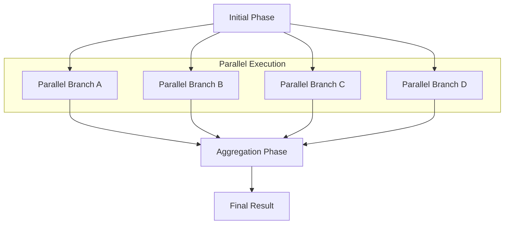

# Parallel Workflows

## Overview

Parallel workflows enable concurrent execution of independent tasks, maximizing resource utilization and reducing overall execution time. This pattern is ideal when multiple tasks can be performed simultaneously without dependencies, allowing for efficient multi-agent coordination.

## Pattern Characteristics

### Core Properties

- **Concurrent Execution**: Multiple tasks run simultaneously
- **Independence**: Tasks don't depend on each other's intermediate results
- **Resource Optimization**: Better utilization of available agents and compute resources
- **Result Aggregation**: Outputs are combined after parallel execution
- **Scalability**: Performance improves with additional resources

### Visual Representation



## When to Use Parallel Workflows

### Ideal Use Cases

1. **Independent Task Execution**
   - Multi-platform development (web, mobile, desktop simultaneously)
   - Parallel testing across different environments
   - Independent feature development by different teams

2. **Resource-Intensive Operations**
   - Data processing across multiple datasets
   - Parallel analysis of different aspects of a system
   - Concurrent quality assurance activities

3. **Time-Critical Projects**
   - Rapid prototyping with multiple approaches
   - Emergency response with parallel investigation tracks
   - Competitive analysis across multiple dimensions

### Pattern Selection Criteria

Choose parallel workflows when:
- Tasks are truly independent
- Resources are available for concurrent execution
- Time optimization is critical
- Results can be meaningfully aggregated
- Failure of one branch doesn't invalidate others

## Parallel Workflow Template

### Basic Template Structure

```markdown
[Extended thinking: Parallel workflow for {purpose}. Independent tasks executed simultaneously with result aggregation and conflict resolution.]

## Phase 1: Preparation & Distribution
- Use Task tool with subagent_type="{coordinator-agent}"
- Prompt: "Prepare shared context and distribute work across parallel branches: {task distribution}"
- Output: Shared context, task assignments, coordination parameters
- Context for parallel phases: {Common baseline information}

## Phase 2: Parallel Execution

### Branch A: {Task A Name}
- Use Task tool with subagent_type="{agent-a}"
- Prompt: "Execute {Task A} using shared context: [baseline information]. Focus on {specific aspect A}."
- Output: {Task A deliverables}
- Dependencies: {Minimal shared context only}

### Branch B: {Task B Name}
- Use Task tool with subagent_type="{agent-b}"
- Prompt: "Execute {Task B} using shared context: [baseline information]. Focus on {specific aspect B}."
- Output: {Task B deliverables}
- Dependencies: {Minimal shared context only}

### Branch C: {Task C Name}
- Use Task tool with subagent_type="{agent-c}"
- Prompt: "Execute {Task C} using shared context: [baseline information]. Focus on {specific aspect C}."
- Output: {Task C deliverables}
- Dependencies: {Minimal shared context only}

## Phase 3: Result Aggregation & Integration
- Use Task tool with subagent_type="{integration-agent}"
- Prompt: "Integrate results from parallel branches: [Branch A results], [Branch B results], [Branch C results]. Resolve conflicts and create unified output."
- Output: {Integrated deliverables}
- Final context: {Comprehensive results from all branches}

## Coordination Notes
- {Parallel execution synchronization requirements}
- {Resource allocation and management}
- {Conflict resolution strategies}
- {Quality assurance across branches}
- {Performance monitoring and optimization}
```

## Real-World Examples

### Example 1: Multi-Platform Application Development

```markdown
[Extended thinking: Parallel development workflow for multi-platform application. Web, mobile, and desktop platforms developed simultaneously with shared API backend.]

## Phase 1: Architecture & API Design
- Use Task tool with subagent_type="backend-architect"
- Prompt: "Design unified API architecture for multi-platform application supporting web, mobile, and desktop clients. Define data models, authentication, and service contracts."
- Output: API specifications, data models, authentication design, platform requirements
- Context for parallel phases: API contracts, data schemas, authentication protocols, platform-specific requirements

## Phase 2: Parallel Platform Development

### Branch A: Web Application
- Use Task tool with subagent_type="frontend-developer"
- Prompt: "Develop web application using API specifications: [API contracts, authentication protocols]. Create responsive UI, state management, and API integration for browser environment."
- Output: Web application, responsive UI components, browser-optimized features
- Dependencies: API contracts, shared authentication

### Branch B: Mobile Application
- Use Task tool with subagent_type="mobile-developer"
- Prompt: "Develop mobile application using API specifications: [API contracts, authentication protocols]. Create native mobile UI, offline capabilities, and mobile-specific features."
- Output: Mobile application, native UI components, mobile-optimized features
- Dependencies: API contracts, shared authentication

### Branch C: Desktop Application
- Use Task tool with subagent_type="desktop-developer"
- Prompt: "Develop desktop application using API specifications: [API contracts, authentication protocols]. Create desktop UI, system integration, and desktop-specific features."
- Output: Desktop application, system-integrated UI, desktop-optimized features
- Dependencies: API contracts, shared authentication

### Branch D: Backend API Implementation
- Use Task tool with subagent_type="backend-developer"
- Prompt: "Implement backend API using architecture design: [API specifications, data models]. Create RESTful endpoints, authentication system, and data persistence layer."
- Output: Backend API, database implementation, authentication system
- Dependencies: Architecture specifications only

## Phase 3: Integration & Cross-Platform Testing
- Use Task tool with subagent_type="integration-engineer"
- Prompt: "Integrate all platform implementations: [Web app, Mobile app, Desktop app, Backend API]. Perform cross-platform testing, ensure API compatibility, and resolve integration issues."
- Output: Integrated multi-platform system, compatibility reports, deployment packages
- Final context: Complete multi-platform application with verified cross-platform compatibility

## Coordination Notes
- API contracts must remain consistent across all platform implementations
- Authentication system shared across all platforms with platform-specific adaptations
- Parallel development requires regular synchronization on API changes
- Cross-platform testing validates integration before final deployment
- Resource allocation ensures adequate development capacity for each platform
```

### Example 2: Comprehensive Security Assessment

```markdown
[Extended thinking: Parallel security assessment workflow covering multiple security domains simultaneously for comprehensive coverage.]

## Phase 1: Security Scope & Baseline
- Use Task tool with subagent_type="security-architect"
- Prompt: "Define comprehensive security assessment scope covering application security, infrastructure security, data protection, and compliance. Establish baseline security requirements and assessment criteria."
- Output: Security assessment scope, baseline requirements, assessment criteria, risk framework
- Context for parallel phases: Security scope, assessment criteria, risk thresholds, compliance requirements

## Phase 2: Parallel Security Assessments

### Branch A: Application Security Assessment
- Use Task tool with subagent_type="application-security-auditor"
- Prompt: "Conduct application security assessment using scope: [security scope, assessment criteria]. Focus on code vulnerabilities, authentication flaws, input validation, and application-level threats."
- Output: Application security report, vulnerability findings, remediation recommendations
- Dependencies: Security scope and criteria only

### Branch B: Infrastructure Security Assessment
- Use Task tool with subagent_type="infrastructure-security-auditor"
- Prompt: "Conduct infrastructure security assessment using scope: [security scope, assessment criteria]. Focus on network security, server hardening, access controls, and infrastructure vulnerabilities."
- Output: Infrastructure security report, network analysis, hardening recommendations
- Dependencies: Security scope and criteria only

### Branch C: Data Protection Assessment
- Use Task tool with subagent_type="data-protection-auditor"
- Prompt: "Conduct data protection assessment using scope: [security scope, compliance requirements]. Focus on data encryption, privacy controls, data lifecycle management, and regulatory compliance."
- Output: Data protection report, privacy analysis, compliance gap assessment
- Dependencies: Security scope and compliance requirements only

### Branch D: Penetration Testing
- Use Task tool with subagent_type="penetration-tester"
- Prompt: "Conduct penetration testing using scope: [security scope, risk framework]. Perform ethical hacking, vulnerability exploitation, and security control validation."
- Output: Penetration testing report, exploit demonstrations, security control effectiveness
- Dependencies: Security scope and risk framework only

## Phase 3: Security Report Integration & Risk Analysis
- Use Task tool with subagent_type="security-analyst"
- Prompt: "Integrate security assessments: [Application security report, Infrastructure security report, Data protection report, Penetration testing report]. Create comprehensive risk analysis, prioritize findings, and develop remediation roadmap."
- Output: Comprehensive security report, risk matrix, prioritized remediation plan, executive summary
- Final context: Complete security assessment with integrated findings and actionable remediation strategy

## Coordination Notes
- All assessments use consistent risk scoring methodology
- Findings are cross-referenced to identify systemic security issues
- Parallel execution ensures comprehensive coverage without assessment bias
- Integration phase resolves conflicting findings and prioritizes remediation efforts
- Executive reporting provides clear risk communication to stakeholders
```

## Synchronization and Coordination

### Parallel Execution Manager

```python
class ParallelExecutionManager:
    """Manages parallel execution of workflow branches"""
    
    def __init__(self):
        self.branch_executors = {}
        self.synchronization_points = []
        self.result_aggregator = ResultAggregator()
        self.conflict_resolver = ConflictResolver()
    
    async def execute_parallel_branches(
        self, 
        branches: List[WorkflowBranch], 
        shared_context: Dict
    ) -> ParallelExecutionResult:
        """Execute multiple branches in parallel"""
        
        # Prepare execution tasks
        execution_tasks = []
        for branch in branches:
            task = asyncio.create_task(
                self._execute_branch(branch, shared_context)
            )
            execution_tasks.append((branch.name, task))
        
        # Execute all branches concurrently
        results = {}
        exceptions = {}
        
        for branch_name, task in execution_tasks:
            try:
                result = await task
                results[branch_name] = result
            except Exception as e:
                exceptions[branch_name] = e
                logger.error(f"Branch {branch_name} failed: {str(e)}")
        
        # Handle partial failures
        if exceptions and len(results) == 0:
            # All branches failed
            raise ParallelExecutionError("All parallel branches failed", exceptions)
        
        # Aggregate successful results
        aggregated_result = await self.result_aggregator.aggregate(results)
        
        return ParallelExecutionResult(
            successful_branches=list(results.keys()),
            failed_branches=list(exceptions.keys()),
            aggregated_result=aggregated_result,
            individual_results=results,
            exceptions=exceptions
        )
    
    async def _execute_branch(
        self, 
        branch: WorkflowBranch, 
        shared_context: Dict
    ) -> BranchExecutionResult:
        """Execute a single branch"""
        try:
            # Create branch-specific context
            branch_context = self._prepare_branch_context(branch, shared_context)
            
            # Execute branch tasks
            branch_result = await self._run_branch_tasks(branch, branch_context)
            
            # Validate branch output
            validation_result = await self._validate_branch_output(branch, branch_result)
            
            return BranchExecutionResult(
                branch_name=branch.name,
                success=True,
                output=branch_result,
                validation=validation_result,
                execution_time=time.time() - start_time
            )
            
        except Exception as e:
            return BranchExecutionResult(
                branch_name=branch.name,
                success=False,
                error=str(e),
                execution_time=time.time() - start_time
            )
```

### Result Aggregation Strategies

```python
class ResultAggregator:
    """Aggregate results from parallel branches"""
    
    def __init__(self):
        self.aggregation_strategies = {
            'merge': self._merge_results,
            'union': self._union_results,
            'intersection': self._intersection_results,
            'weighted_average': self._weighted_average_results,
            'best_result': self._select_best_result
        }
    
    async def aggregate(
        self, 
        branch_results: Dict[str, Any], 
        strategy: str = 'merge'
    ) -> AggregatedResult:
        """Aggregate results using specified strategy"""
        
        if strategy not in self.aggregation_strategies:
            raise ValueError(f"Unknown aggregation strategy: {strategy}")
        
        aggregation_func = self.aggregation_strategies[strategy]
        
        try:
            aggregated_data = await aggregation_func(branch_results)
            
            return AggregatedResult(
                success=True,
                data=aggregated_data,
                source_branches=list(branch_results.keys()),
                aggregation_strategy=strategy,
                metadata=self._generate_aggregation_metadata(branch_results)
            )
            
        except Exception as e:
            return AggregatedResult(
                success=False,
                error=str(e),
                source_branches=list(branch_results.keys()),
                aggregation_strategy=strategy
            )
    
    async def _merge_results(self, branch_results: Dict[str, Any]) -> Dict:
        """Merge results by combining all outputs"""
        merged = {}
        
        for branch_name, result in branch_results.items():
            if isinstance(result, dict):
                # Merge dictionaries with branch prefixes
                for key, value in result.items():
                    merged_key = f"{branch_name}_{key}"
                    merged[merged_key] = value
            else:
                # Store non-dict results with branch name
                merged[branch_name] = result
        
        return merged
    
    async def _union_results(self, branch_results: Dict[str, Any]) -> Set:
        """Create union of all results"""
        union_set = set()
        
        for result in branch_results.values():
            if isinstance(result, (list, set, tuple)):
                union_set.update(result)
            else:
                union_set.add(result)
        
        return union_set
    
    async def _weighted_average_results(self, branch_results: Dict[str, Any]) -> float:
        """Calculate weighted average of numeric results"""
        total_weight = 0
        weighted_sum = 0
        
        for branch_name, result in branch_results.items():
            if isinstance(result, (int, float)):
                weight = self._get_branch_weight(branch_name)
                weighted_sum += result * weight
                total_weight += weight
        
        return weighted_sum / total_weight if total_weight > 0 else 0
```

## Conflict Resolution

### Parallel Branch Conflict Handler

```python
class ConflictResolver:
    """Resolve conflicts between parallel branch results"""
    
    def __init__(self):
        self.resolution_strategies = {
            'priority_based': self._resolve_by_priority,
            'consensus': self._resolve_by_consensus,
            'merge_compatible': self._merge_compatible_results,
            'expert_review': self._escalate_to_expert
        }
    
    async def resolve_conflicts(
        self, 
        conflicting_results: Dict[str, Any], 
        conflict_type: str
    ) -> ConflictResolution:
        """Resolve conflicts between parallel branch results"""
        
        # Detect conflict patterns
        conflict_analysis = await self._analyze_conflicts(conflicting_results)
        
        # Select resolution strategy
        strategy = self._select_resolution_strategy(conflict_analysis, conflict_type)
        
        # Apply resolution
        resolution_func = self.resolution_strategies[strategy]
        resolved_result = await resolution_func(conflicting_results, conflict_analysis)
        
        return ConflictResolution(
            strategy_used=strategy,
            resolved_result=resolved_result,
            conflict_analysis=conflict_analysis,
            confidence_score=self._calculate_resolution_confidence(resolved_result)
        )
    
    async def _resolve_by_priority(
        self, 
        conflicting_results: Dict[str, Any], 
        analysis: ConflictAnalysis
    ) -> Any:
        """Resolve conflicts using branch priority"""
        branch_priorities = self._get_branch_priorities()
        
        highest_priority_branch = max(
            conflicting_results.keys(),
            key=lambda branch: branch_priorities.get(branch, 0)
        )
        
        return conflicting_results[highest_priority_branch]
    
    async def _resolve_by_consensus(
        self, 
        conflicting_results: Dict[str, Any], 
        analysis: ConflictAnalysis
    ) -> Any:
        """Resolve conflicts using consensus approach"""
        # Find most common result
        result_counts = {}
        for result in conflicting_results.values():
            result_key = self._normalize_result_for_comparison(result)
            result_counts[result_key] = result_counts.get(result_key, 0) + 1
        
        # Return most frequent result
        consensus_result_key = max(result_counts.keys(), key=lambda k: result_counts[k])
        
        # Find original result matching consensus
        for result in conflicting_results.values():
            if self._normalize_result_for_comparison(result) == consensus_result_key:
                return result
        
        # Fallback to first result if no consensus
        return list(conflicting_results.values())[0]
```

## Performance Optimization

### Parallel Execution Optimization

```python
class ParallelOptimizer:
    """Optimize parallel workflow execution"""
    
    def __init__(self):
        self.resource_monitor = ResourceMonitor()
        self.load_balancer = LoadBalancer()
        self.performance_analyzer = PerformanceAnalyzer()
    
    async def optimize_parallel_execution(
        self, 
        branches: List[WorkflowBranch]
    ) -> OptimizedExecutionPlan:
        """Optimize parallel branch execution"""
        
        # Analyze resource requirements
        resource_analysis = await self._analyze_resource_requirements(branches)
        
        # Optimize branch scheduling
        execution_schedule = await self._optimize_scheduling(branches, resource_analysis)
        
        # Configure resource allocation
        resource_allocation = await self._allocate_resources(execution_schedule)
        
        return OptimizedExecutionPlan(
            execution_schedule=execution_schedule,
            resource_allocation=resource_allocation,
            estimated_performance=self._estimate_performance(execution_schedule)
        )
    
    async def _analyze_resource_requirements(
        self, 
        branches: List[WorkflowBranch]
    ) -> ResourceAnalysis:
        """Analyze resource requirements for branches"""
        requirements = {}
        
        for branch in branches:
            # Estimate CPU requirements
            cpu_requirement = await self._estimate_cpu_requirement(branch)
            
            # Estimate memory requirements
            memory_requirement = await self._estimate_memory_requirement(branch)
            
            # Estimate execution time
            time_estimate = await self._estimate_execution_time(branch)
            
            requirements[branch.name] = BranchResourceRequirement(
                cpu=cpu_requirement,
                memory=memory_requirement,
                estimated_time=time_estimate,
                agent_type=branch.agent_assignment.primary_agent.name
            )
        
        return ResourceAnalysis(
            branch_requirements=requirements,
            total_cpu_needed=sum(req.cpu for req in requirements.values()),
            total_memory_needed=sum(req.memory for req in requirements.values()),
            critical_path_time=max(req.estimated_time for req in requirements.values())
        )
```

## Error Handling and Resilience

### Partial Failure Management

```python
class ParallelFailureHandler:
    """Handle failures in parallel workflow execution"""
    
    def __init__(self):
        self.failure_policies = {
            'fail_fast': self._fail_fast_policy,
            'continue_on_failure': self._continue_on_failure_policy,
            'retry_failed_branches': self._retry_failed_branches_policy,
            'graceful_degradation': self._graceful_degradation_policy
        }
    
    async def handle_parallel_failures(
        self, 
        execution_result: ParallelExecutionResult,
        failure_policy: str = 'continue_on_failure'
    ) -> FailureHandlingResult:
        """Handle failures in parallel execution"""
        
        if not execution_result.failed_branches:
            # No failures to handle
            return FailureHandlingResult(
                success=True,
                message="No failures detected",
                final_result=execution_result.aggregated_result
            )
        
        # Apply failure policy
        policy_func = self.failure_policies.get(failure_policy, self._continue_on_failure_policy)
        
        return await policy_func(execution_result)
    
    async def _continue_on_failure_policy(
        self, 
        execution_result: ParallelExecutionResult
    ) -> FailureHandlingResult:
        """Continue with successful branches, ignore failures"""
        
        if not execution_result.successful_branches:
            return FailureHandlingResult(
                success=False,
                message="All branches failed",
                failed_branches=execution_result.failed_branches
            )
        
        # Use results from successful branches only
        partial_result = await self._create_partial_result(
            execution_result.individual_results
        )
        
        return FailureHandlingResult(
            success=True,
            message=f"Completed with {len(execution_result.successful_branches)} successful branches",
            final_result=partial_result,
            failed_branches=execution_result.failed_branches,
            partial_execution=True
        )
    
    async def _retry_failed_branches_policy(
        self, 
        execution_result: ParallelExecutionResult
    ) -> FailureHandlingResult:
        """Retry failed branches with modified parameters"""
        
        retry_results = {}
        still_failed = []
        
        for branch_name in execution_result.failed_branches:
            try:
                # Modify branch parameters for retry
                modified_branch = await self._prepare_branch_for_retry(branch_name)
                
                # Retry execution
                retry_result = await self._retry_branch_execution(modified_branch)
                
                if retry_result.success:
                    retry_results[branch_name] = retry_result.output
                else:
                    still_failed.append(branch_name)
                    
            except Exception as e:
                still_failed.append(branch_name)
                logger.error(f"Retry failed for branch {branch_name}: {str(e)}")
        
        # Combine original successful results with retry results
        combined_results = {**execution_result.individual_results, **retry_results}
        
        # Aggregate combined results
        final_result = await self.result_aggregator.aggregate(combined_results)
        
        return FailureHandlingResult(
            success=len(still_failed) == 0,
            message=f"Retry completed. {len(retry_results)} branches recovered.",
            final_result=final_result,
            failed_branches=still_failed,
            retry_successful=len(retry_results) > 0
        )
```

## Monitoring and Metrics

### Parallel Workflow Metrics

```python
class ParallelWorkflowMetrics:
    """Collect and analyze parallel workflow metrics"""
    
    def __init__(self):
        self.execution_metrics = []
        self.resource_utilization = []
        self.synchronization_metrics = []
        self.aggregation_metrics = []
    
    async def record_parallel_execution(
        self, 
        execution_result: ParallelExecutionResult,
        resource_usage: ResourceUsage
    ):
        """Record metrics for parallel execution"""
        
        # Calculate parallelization efficiency
        efficiency = self._calculate_parallelization_efficiency(execution_result)
        
        # Record execution metrics
        self.execution_metrics.append({
            'timestamp': datetime.utcnow(),
            'total_branches': len(execution_result.successful_branches) + len(execution_result.failed_branches),
            'successful_branches': len(execution_result.successful_branches),
            'failed_branches': len(execution_result.failed_branches),
            'parallelization_efficiency': efficiency,
            'total_execution_time': execution_result.total_execution_time,
            'aggregation_time': execution_result.aggregation_time
        })
        
        # Record resource utilization
        self.resource_utilization.append({
            'timestamp': datetime.utcnow(),
            'cpu_utilization': resource_usage.cpu_utilization,
            'memory_utilization': resource_usage.memory_utilization,
            'concurrent_agents': resource_usage.concurrent_agents,
            'resource_efficiency': resource_usage.efficiency_score
        })
    
    def _calculate_parallelization_efficiency(
        self, 
        execution_result: ParallelExecutionResult
    ) -> float:
        """Calculate how efficiently parallel execution was utilized"""
        
        if not execution_result.individual_results:
            return 0.0
        
        # Get execution times for each branch
        branch_times = [
            result.execution_time 
            for result in execution_result.individual_results.values()
            if hasattr(result, 'execution_time')
        ]
        
        if not branch_times:
            return 0.0
        
        # Calculate theoretical sequential time vs actual parallel time
        sequential_time = sum(branch_times)
        parallel_time = max(branch_times)  # Limited by slowest branch
        
        # Efficiency = (Sequential time / Parallel time) / Number of branches
        # Perfect efficiency = 1.0, meaning linear speedup
        theoretical_speedup = len(branch_times)
        actual_speedup = sequential_time / parallel_time if parallel_time > 0 else 0
        
        return actual_speedup / theoretical_speedup if theoretical_speedup > 0 else 0
```

## Best Practices

### Design Guidelines

1. **Ensure True Independence**
   - Verify that branches don't have hidden dependencies
   - Use shared context only for initial setup
   - Avoid inter-branch communication during execution

2. **Resource Management**
   - Monitor resource utilization across branches
   - Implement load balancing for optimal performance
   - Plan for resource contention scenarios

3. **Result Integration**
   - Design clear aggregation strategies
   - Handle conflicting results gracefully
   - Validate integrated outputs

4. **Error Resilience**
   - Implement partial failure handling
   - Provide retry mechanisms for failed branches
   - Design graceful degradation strategies

### Common Pitfalls

1. **Hidden Dependencies**
   - Branches that secretly depend on each other's results
   - Shared mutable state between branches
   - Race conditions in resource access

2. **Poor Resource Planning**
   - Oversubscribing available resources
   - Ignoring resource contention
   - Inadequate load balancing

3. **Ineffective Aggregation**
   - Losing important information during result merging
   - Poor conflict resolution strategies
   - Inadequate validation of integrated results

## Conclusion

Parallel workflows provide significant performance benefits when tasks can be executed independently. They enable efficient resource utilization and faster completion times, making them ideal for scenarios where multiple aspects of a problem can be addressed simultaneously.

Key advantages:
- **Improved performance through concurrency**
- **Better resource utilization**
- **Scalability with additional resources**
- **Fault tolerance through partial execution**

Use parallel workflows when you have independent tasks that can benefit from concurrent execution and when you have sufficient resources to support parallel processing.