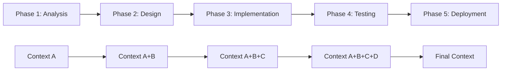

# Sequential Workflows

## Overview

Sequential workflows represent the most straightforward coordination pattern where tasks are executed in a linear order, with each phase depending on the completion of the previous phase. This pattern is ideal for processes that require step-by-step progression and cumulative context building.

## Pattern Characteristics

### Core Properties

- **Linear Execution**: Tasks execute one after another in a predetermined order
- **Context Accumulation**: Information builds progressively through each phase
- **Strong Dependencies**: Each phase requires output from the previous phase
- **Predictable Flow**: Clear, deterministic execution path
- **Simple Error Handling**: Failures can be isolated to specific phases

### Visual Representation



## When to Use Sequential Workflows

### Ideal Use Cases

1. **Step-by-Step Processes**
   - Software development lifecycle (analyze → design → implement → test → deploy)
   - Data processing pipelines with dependent transformations
   - Approval workflows with hierarchical decision points

2. **Knowledge Building Scenarios**
   - Research projects where each phase builds on previous findings
   - Educational content creation with progressive complexity
   - System analysis requiring layered understanding

3. **Quality-Critical Processes**
   - Manufacturing processes with quality gates
   - Compliance workflows with mandatory checkpoints
   - Security assessments with progressive validation

### Pattern Selection Criteria

Choose sequential workflows when:
- Tasks have strong interdependencies
- Context must flow linearly between phases
- Order of execution is critical
- Quality gates are required between phases
- Rollback to previous states is important

## Sequential Workflow Template

### Basic Template Structure

```markdown
[Extended thinking: Sequential workflow for {purpose}. Each phase builds upon previous results with careful context passing and validation checkpoints.]

## Phase 1: {Foundation Phase Name}
- Use Task tool with subagent_type="{foundation-agent}"
- Prompt: "{Detailed prompt for foundation work}"
- Output: {Expected foundational deliverables}
- Context for next phase: {Specific information to pass forward}
- Validation: {Quality checks before proceeding}

## Phase 2: {Building Phase Name}
- Use Task tool with subagent_type="{building-agent}"
- Prompt: "{Prompt including context from Phase 1: [specific context]}"
- Output: {Expected building deliverables}
- Context accumulation: {Combined context from Phase 1 + Phase 2}
- Validation: {Quality checks and consistency verification}

## Phase 3: {Enhancement Phase Name}
- Use Task tool with subagent_type="{enhancement-agent}"
- Prompt: "{Prompt with accumulated context: [Phase 1 + Phase 2 context]}"
- Output: {Expected enhancement deliverables}
- Context accumulation: {Full context chain}
- Validation: {Comprehensive quality assessment}

## Coordination Notes
- {Context validation requirements between phases}
- {Error handling and rollback procedures}
- {Quality gates and approval checkpoints}
- {Performance monitoring and optimization}
```

## Real-World Examples

### Example 1: Web Application Development

```markdown
[Extended thinking: Sequential workflow for web application development. Each phase builds upon previous results, ensuring proper architecture, implementation, and quality assurance.]

## Phase 1: Requirements Analysis & Architecture
- Use Task tool with subagent_type="backend-architect"
- Prompt: "Analyze requirements for a web application with user authentication, data management, and API endpoints. Design system architecture including database schema, API structure, and service boundaries."
- Output: System architecture, database schema, API specifications, technology stack recommendations
- Context for next phase: Architecture decisions, API contracts, data models, technical constraints

## Phase 2: Backend Implementation
- Use Task tool with subagent_type="backend-developer"
- Prompt: "Implement backend services using architecture from Phase 1: [API specifications, database schema, service boundaries]. Focus on authentication, data access layer, and RESTful API endpoints."
- Output: Backend code, database migrations, API implementation, authentication system
- Context accumulation: Architecture + Implementation details, API endpoints, database structure

## Phase 3: Frontend Development
- Use Task tool with subagent_type="frontend-developer"
- Prompt: "Create frontend application consuming APIs from Phase 2: [API endpoints, authentication system]. Implement user interface, state management, and API integration based on architecture: [system design]."
- Output: Frontend application, UI components, state management, API integration
- Context accumulation: Full stack implementation with frontend-backend integration

## Phase 4: Testing & Quality Assurance
- Use Task tool with subagent_type="test-automator"
- Prompt: "Create comprehensive test suite for application: [backend implementation, frontend application, API integration]. Include unit tests, integration tests, and end-to-end testing."
- Output: Test suites, test automation, quality reports, coverage analysis
- Context accumulation: Complete application with full test coverage

## Phase 5: Deployment & Monitoring
- Use Task tool with subagent_type="deployment-engineer"
- Prompt: "Deploy application to production using implementation: [backend + frontend + tests]. Set up monitoring, logging, and performance tracking."
- Output: Deployment configuration, monitoring setup, production environment
- Final context: Fully deployed and monitored application

## Coordination Notes
- Each phase must validate outputs before proceeding to next phase
- API contracts from Phase 1 must remain consistent through all phases
- Test results from Phase 4 must pass before deployment in Phase 5
- Rollback procedures available at each phase boundary
- Performance benchmarks established and monitored throughout
```

### Example 2: Data Processing Pipeline

```markdown
[Extended thinking: Sequential data processing workflow where each phase transforms and enriches data, building toward final analytics output.]

## Phase 1: Data Ingestion & Validation
- Use Task tool with subagent_type="data-engineer"
- Prompt: "Ingest raw data from multiple sources, validate data quality, and establish data lineage. Identify data issues and create data quality reports."
- Output: Clean raw data, validation reports, data quality metrics, ingestion logs
- Context for next phase: Data schema, quality issues, source mappings, validation rules

## Phase 2: Data Transformation & Enrichment
- Use Task tool with subagent_type="data-engineer"
- Prompt: "Transform raw data using validation results: [data quality metrics, validation rules]. Apply business rules, enrich with reference data, and create standardized data models."
- Output: Transformed datasets, enrichment mappings, business rule applications
- Context accumulation: Raw data + Transformed data + Enrichment metadata

## Phase 3: Analytics & Insights Generation
- Use Task tool with subagent_type="data-analyst"
- Prompt: "Generate analytics and insights from transformed data: [standardized data models, enrichment mappings]. Create statistical analysis, trend identification, and predictive models."
- Output: Analytics results, statistical models, trend analysis, insights report
- Context accumulation: Complete data pipeline with analytics outputs

## Phase 4: Visualization & Reporting
- Use Task tool with subagent_type="data-visualizer"
- Prompt: "Create visualizations and reports from analytics: [insights report, statistical models]. Design dashboards, charts, and executive summaries."
- Output: Interactive dashboards, visualization charts, executive reports
- Final context: End-to-end data pipeline with visual outputs

## Coordination Notes
- Data quality gates between each phase prevent propagation of bad data
- Schema validation ensures consistency across transformations
- Performance monitoring tracks processing time and resource usage
- Audit trail maintains complete data lineage from source to output
```

## Context Management in Sequential Workflows

### Context Accumulation Strategy

```python
class SequentialContextManager:
    """Manages context accumulation in sequential workflows"""
    
    def __init__(self):
        self.context_chain = []
        self.context_validators = {}
    
    async def add_phase_context(self, phase_name: str, context: Dict) -> Dict:
        """Add context from completed phase and return accumulated context"""
        # Validate new context
        if phase_name in self.context_validators:
            validation_result = await self.context_validators[phase_name].validate(context)
            if not validation_result.valid:
                raise ContextValidationError(f"Invalid context for {phase_name}")
        
        # Add to context chain
        phase_context = {
            'phase': phase_name,
            'timestamp': datetime.utcnow(),
            'data': context
        }
        self.context_chain.append(phase_context)
        
        # Return accumulated context
        return self._build_accumulated_context()
    
    def _build_accumulated_context(self) -> Dict:
        """Build accumulated context from all phases"""
        accumulated = {}
        
        for phase_context in self.context_chain:
            phase_name = phase_context['phase']
            phase_data = phase_context['data']
            
            # Add phase-specific context
            accumulated[f"{phase_name}_results"] = phase_data
            
            # Merge key decisions and artifacts
            if 'key_decisions' in phase_data:
                accumulated.setdefault('all_decisions', []).extend(phase_data['key_decisions'])
            
            if 'artifacts' in phase_data:
                accumulated.setdefault('all_artifacts', []).extend(phase_data['artifacts'])
        
        return accumulated
```

### Context Validation Patterns

```python
class SequentialContextValidator:
    """Validates context flow in sequential workflows"""
    
    def __init__(self):
        self.required_context_flow = {
            'phase_1': [],  # No prerequisites
            'phase_2': ['phase_1_results'],
            'phase_3': ['phase_1_results', 'phase_2_results'],
            'phase_4': ['phase_1_results', 'phase_2_results', 'phase_3_results']
        }
    
    async def validate_context_flow(self, phase_name: str, available_context: Dict) -> bool:
        """Validate that required context is available for phase"""
        required_context = self.required_context_flow.get(phase_name, [])
        
        for required_key in required_context:
            if required_key not in available_context:
                return False
            
            # Validate context quality
            if not self._is_valid_context(available_context[required_key]):
                return False
        
        return True
    
    def _is_valid_context(self, context_data: Any) -> bool:
        """Validate context data quality"""
        if context_data is None:
            return False
        
        if isinstance(context_data, dict) and len(context_data) == 0:
            return False
        
        if isinstance(context_data, str) and len(context_data.strip()) == 0:
            return False
        
        return True
```

## Error Handling in Sequential Workflows

### Phase-Level Error Recovery

```python
class SequentialErrorHandler:
    """Handle errors in sequential workflow execution"""
    
    def __init__(self):
        self.rollback_strategies = {}
        self.retry_policies = {}
        self.fallback_agents = {}
    
    async def handle_phase_error(
        self, 
        phase_name: str, 
        error: Exception, 
        context: Dict
    ) -> ErrorRecoveryResult:
        """Handle error in specific phase"""
        
        # Try retry with same agent
        if self._should_retry(phase_name, error):
            return await self._retry_phase(phase_name, context)
        
        # Try fallback agent
        if phase_name in self.fallback_agents:
            return await self._try_fallback_agent(phase_name, context)
        
        # Rollback to previous phase
        if self._can_rollback(phase_name):
            return await self._rollback_to_previous_phase(phase_name, context)
        
        # Escalate to manual intervention
        return ErrorRecoveryResult(
            strategy='manual_intervention',
            success=False,
            message=f"Phase {phase_name} failed and requires manual intervention"
        )
    
    async def _retry_phase(self, phase_name: str, context: Dict) -> ErrorRecoveryResult:
        """Retry failed phase with modified parameters"""
        retry_policy = self.retry_policies.get(phase_name, RetryPolicy())
        
        if retry_policy.can_retry():
            # Modify context or parameters for retry
            modified_context = await self._prepare_retry_context(context)
            
            return ErrorRecoveryResult(
                strategy='retry',
                success=True,
                modified_context=modified_context,
                message=f"Retrying {phase_name} with modified parameters"
            )
        
        return ErrorRecoveryResult(
            strategy='retry',
            success=False,
            message=f"Maximum retries exceeded for {phase_name}"
        )
```

### Rollback Mechanisms

```python
class SequentialRollbackManager:
    """Manage rollback operations in sequential workflows"""
    
    def __init__(self):
        self.phase_snapshots = {}
        self.rollback_handlers = {}
    
    async def create_phase_snapshot(self, phase_name: str, context: Dict):
        """Create snapshot before phase execution"""
        snapshot = PhaseSnapshot(
            phase_name=phase_name,
            timestamp=datetime.utcnow(),
            context=deepcopy(context),
            system_state=await self._capture_system_state()
        )
        
        self.phase_snapshots[phase_name] = snapshot
    
    async def rollback_to_phase(self, target_phase: str) -> RollbackResult:
        """Rollback workflow to specific phase"""
        if target_phase not in self.phase_snapshots:
            return RollbackResult(
                success=False,
                message=f"No snapshot available for phase {target_phase}"
            )
        
        snapshot = self.phase_snapshots[target_phase]
        
        try:
            # Restore context
            restored_context = snapshot.context
            
            # Restore system state if needed
            if target_phase in self.rollback_handlers:
                await self.rollback_handlers[target_phase].restore_state(snapshot.system_state)
            
            # Clean up subsequent snapshots
            self._cleanup_subsequent_snapshots(target_phase)
            
            return RollbackResult(
                success=True,
                restored_context=restored_context,
                message=f"Successfully rolled back to {target_phase}"
            )
            
        except Exception as e:
            return RollbackResult(
                success=False,
                message=f"Rollback failed: {str(e)}"
            )
```

## Performance Optimization

### Sequential Workflow Optimization Strategies

1. **Context Compression**
   ```python
   class SequentialContextOptimizer:
       """Optimize context size in sequential workflows"""
       
       async def optimize_context_chain(self, context_chain: List[Dict]) -> List[Dict]:
           """Compress context while preserving essential information"""
           optimized_chain = []
           
           for i, context in enumerate(context_chain):
               if i == 0:
                   # Keep first context as-is
                   optimized_chain.append(context)
               else:
                   # Compress previous contexts, keep current full
                   compressed_context = await self._compress_context(context)
                   optimized_chain.append(compressed_context)
           
           return optimized_chain
   ```

2. **Parallel Preparation**
   ```python
   class SequentialPreparationOptimizer:
       """Prepare next phase while current phase executes"""
       
       async def prepare_next_phase(self, current_phase: str, next_phase: str):
           """Prepare resources for next phase during current execution"""
           # Pre-load agent
           await self.agent_loader.preload_agent(next_phase)
           
           # Prepare context templates
           await self.context_preparer.prepare_templates(next_phase)
           
           # Validate dependencies
           await self.dependency_checker.validate_next_phase_deps(next_phase)
   ```

## Monitoring and Metrics

### Sequential Workflow Metrics

```python
class SequentialWorkflowMetrics:
    """Collect metrics for sequential workflow performance"""
    
    def __init__(self):
        self.phase_durations = []
        self.context_sizes = []
        self.error_rates = {}
        self.throughput_metrics = {}
    
    async def record_phase_completion(
        self, 
        phase_name: str, 
        duration: float, 
        context_size: int,
        success: bool
    ):
        """Record phase completion metrics"""
        self.phase_durations.append({
            'phase': phase_name,
            'duration': duration,
            'timestamp': datetime.utcnow()
        })
        
        self.context_sizes.append({
            'phase': phase_name,
            'size': context_size,
            'timestamp': datetime.utcnow()
        })
        
        # Update error rates
        phase_errors = self.error_rates.setdefault(phase_name, {'total': 0, 'errors': 0})
        phase_errors['total'] += 1
        if not success:
            phase_errors['errors'] += 1
    
    def get_performance_summary(self) -> Dict:
        """Generate performance summary"""
        return {
            'total_phases': len(self.phase_durations),
            'average_phase_duration': self._calculate_average_duration(),
            'context_growth_rate': self._calculate_context_growth(),
            'error_rates': self._calculate_error_rates(),
            'bottleneck_phases': self._identify_bottlenecks()
        }
```

## Best Practices

### Design Guidelines

1. **Clear Phase Boundaries**
   - Each phase should have a single, well-defined responsibility
   - Outputs should be clearly specified and validated
   - Dependencies should be explicit and minimal

2. **Context Management**
   - Pass only necessary context between phases
   - Validate context at phase boundaries
   - Compress context when it becomes large

3. **Error Handling**
   - Implement rollback mechanisms for each phase
   - Provide fallback agents for critical phases
   - Include retry logic with exponential backoff

4. **Performance Optimization**
   - Monitor phase execution times
   - Identify and optimize bottleneck phases
   - Use context compression for large workflows

### Common Pitfalls

1. **Context Bloat**
   - Avoid passing unnecessary information between phases
   - Implement context pruning strategies
   - Use references instead of full data when possible

2. **Tight Coupling**
   - Don't make phases overly dependent on specific implementations
   - Use well-defined interfaces between phases
   - Allow for agent substitution when needed

3. **Poor Error Handling**
   - Don't ignore potential failure points
   - Implement comprehensive rollback strategies
   - Provide clear error messages and recovery options

## Conclusion

Sequential workflows provide a robust foundation for many multi-agent coordination scenarios. Their linear nature makes them easy to understand, debug, and maintain, while their context accumulation capabilities enable sophisticated information building over multiple phases.

Key advantages:
- **Predictable execution flow**
- **Strong context continuity**
- **Simple error handling**
- **Easy debugging and monitoring**

Use sequential workflows when you need reliable, step-by-step processing with strong dependencies between phases and cumulative context building.