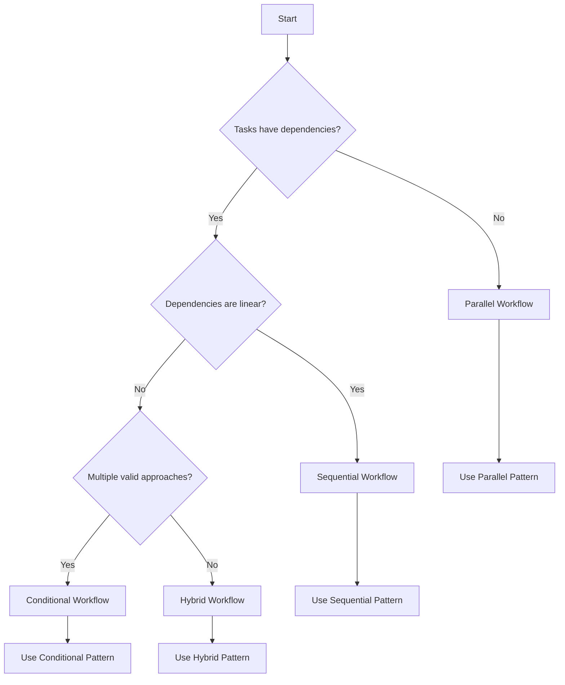

# Quick Start Guide

## Overview

This quick start guide helps you create your first workflow using the Workflow Creator Agent. Follow these steps to go from requirements to a fully functional multi-agent workflow in minutes.

## Prerequisites

Before you begin, ensure you have:
- Access to the Workflow Creator Agent
- Understanding of your project requirements
- Familiarity with the available agent ecosystem
- Basic knowledge of workflow patterns

## Step 1: Define Your Requirements

Start by clearly articulating what you want to accomplish.

### Requirements Template

```markdown
## Project Requirements

### Primary Objective:
[What is the main goal of this workflow?]

### Technical Domains:
- [ ] Frontend Development
- [ ] Backend Development
- [ ] Database Design
- [ ] Mobile Development
- [ ] DevOps/Deployment
- [ ] Testing/QA
- [ ] Security
- [ ] Performance
- [ ] Documentation

### Success Criteria:
1. [Specific, measurable outcome 1]
2. [Specific, measurable outcome 2]
3. [Specific, measurable outcome 3]

### Constraints:
- Time: [Timeline constraints]
- Resources: [Resource limitations]
- Technology: [Technology requirements/restrictions]
- Compliance: [Regulatory or policy requirements]

### Quality Requirements:
- Performance: [Performance expectations]
- Security: [Security requirements]
- Scalability: [Scalability needs]
- Maintainability: [Maintenance considerations]
```

### Example Requirements

```markdown
## Project Requirements

### Primary Objective:
Create a web application for task management with user authentication and real-time collaboration features.

### Technical Domains:
- [x] Frontend Development (React)
- [x] Backend Development (Node.js/Express)
- [x] Database Design (PostgreSQL)
- [x] Testing/QA
- [x] Security (Authentication/Authorization)
- [x] DevOps/Deployment

### Success Criteria:
1. Users can register, login, and manage their profiles
2. Users can create, edit, delete, and share tasks
3. Real-time updates when tasks are modified by collaborators
4. Secure authentication and data protection
5. Deployed and accessible via web browser

### Constraints:
- Time: 4-week development timeline
- Resources: Small development team
- Technology: Must use React frontend, Node.js backend
- Compliance: GDPR compliance for user data

### Quality Requirements:
- Performance: Page load times < 2 seconds
- Security: Secure authentication, encrypted data transmission
- Scalability: Support 1000+ concurrent users
- Maintainability: Clean, documented code with test coverage > 80%
```

## Step 2: Choose Your Workflow Pattern

Select the most appropriate workflow pattern based on your requirements.

### Pattern Selection Guide



### Pattern Recommendations

**For our task management example:**
- **Foundation**: Sequential (architecture → implementation)
- **Development**: Parallel (frontend + backend + database)
- **Integration**: Sequential (testing → deployment)
- **Result**: Hybrid workflow combining sequential and parallel patterns

## Step 3: Create Your Workflow

Use the Workflow Creator Agent to generate your workflow.

### Basic Workflow Request

```markdown
Create a comprehensive workflow for: [Your requirements from Step 1]

Requirements:
- [Copy your detailed requirements here]

Preferred Pattern: [Pattern from Step 2]

Additional Considerations:
- [Any specific agent preferences]
- [Performance requirements]
- [Error handling needs]
- [Integration requirements]
```

### Example Workflow Request

```markdown
Create a comprehensive workflow for: Task management web application with user authentication and real-time collaboration

Requirements:
- Frontend: React application with responsive design
- Backend: Node.js/Express API with real-time WebSocket support
- Database: PostgreSQL with proper schema design
- Authentication: Secure user registration and login
- Real-time: Live updates for collaborative task editing
- Testing: Comprehensive test coverage
- Deployment: Production-ready deployment setup
- Timeline: 4-week development cycle
- Team: Small development team
- Compliance: GDPR-compliant user data handling

Preferred Pattern: Hybrid (sequential foundation + parallel development + sequential integration)

Additional Considerations:
- Prioritize security and data protection
- Ensure scalable architecture for future growth
- Include comprehensive error handling
- Provide clear documentation for maintenance
```

## Step 4: Review Generated Workflow

Examine the generated workflow and validate it meets your needs.

### Workflow Review Checklist

```markdown
## Workflow Review Checklist

### Structure Review:
- [ ] All requirements addressed
- [ ] Logical phase organization
- [ ] Appropriate pattern selection
- [ ] Clear phase boundaries

### Agent Selection Review:
- [ ] Agents match task requirements
- [ ] Appropriate model selection (opus/sonnet/haiku)
- [ ] Fallback agents specified
- [ ] Agent capabilities align with needs

### Context Flow Review:
- [ ] Context flows logically between phases
- [ ] No unnecessary context bloat
- [ ] Critical information preserved
- [ ] Context validation points included

### Coordination Review:
- [ ] Clear coordination strategy
- [ ] Proper synchronization points
- [ ] Dependencies correctly identified
- [ ] Parallel opportunities utilized

### Error Handling Review:
- [ ] Error scenarios considered
- [ ] Recovery mechanisms defined
- [ ] Fallback strategies included
- [ ] Rollback procedures specified

### Performance Review:
- [ ] Execution time reasonable
- [ ] Resource usage optimized
- [ ] Bottlenecks identified and addressed
- [ ] Scalability considerations included
```

## Step 5: Execute Your Workflow

Run the workflow and monitor its execution.

### Execution Monitoring

```markdown
## Execution Monitoring Checklist

### Pre-Execution:
- [ ] Validate all required agents are available
- [ ] Confirm resource availability
- [ ] Review execution timeline
- [ ] Prepare monitoring tools

### During Execution:
- [ ] Monitor phase completion
- [ ] Track context flow
- [ ] Watch for errors or warnings
- [ ] Verify agent performance

### Post-Execution:
- [ ] Validate all deliverables
- [ ] Check success criteria fulfillment
- [ ] Review execution metrics
- [ ] Document lessons learned
```

### Common Execution Issues and Solutions

| Issue | Symptoms | Solution |
|-------|----------|----------|
| Agent Unavailable | Phase fails to start | Use fallback agent or retry |
| Context Too Large | Slow performance | Optimize context size |
| Integration Failure | Phase outputs don't match | Validate context transformation |
| Resource Exhaustion | Timeouts or failures | Scale resources or optimize |
| Validation Failure | Quality checks fail | Review and fix issues |

## Step 6: Validate Results

Ensure the workflow output meets your requirements.

### Results Validation Template

```markdown
## Results Validation

### Deliverables Check:
- [ ] All expected outputs produced
- [ ] Quality standards met
- [ ] Documentation complete
- [ ] Tests passing

### Requirements Fulfillment:
- [ ] Primary objective achieved
- [ ] Success criteria met
- [ ] Constraints respected
- [ ] Quality requirements satisfied

### Integration Validation:
- [ ] Components work together
- [ ] End-to-end functionality verified
- [ ] Performance requirements met
- [ ] Security requirements satisfied

### Deployment Readiness:
- [ ] Production deployment successful
- [ ] Monitoring and logging configured
- [ ] Backup and recovery procedures in place
- [ ] Documentation and handover complete
```

## Quick Start Templates

### Template 1: Simple Web Application

```markdown
Create a workflow for: Simple web application with CRUD operations

Requirements:
- Frontend: [React/Vue/Angular] with responsive design
- Backend: [Node.js/Python/Java] REST API
- Database: [PostgreSQL/MySQL/MongoDB]
- Authentication: Basic user login/registration
- Deployment: Cloud deployment (AWS/Azure/GCP)

Pattern: Sequential workflow with parallel testing

Timeline: 2-3 weeks
Team Size: 2-3 developers
```

### Template 2: Data Processing Pipeline

```markdown
Create a workflow for: Data processing and analytics pipeline

Requirements:
- Data Ingestion: Multiple data sources
- Data Processing: ETL/ELT pipeline
- Analytics: Data analysis and reporting
- Visualization: Dashboard and reports
- Deployment: Cloud-based infrastructure

Pattern: Sequential with parallel processing branches

Timeline: 3-4 weeks
Team Size: 2-4 developers
```

### Template 3: Mobile Application

```markdown
Create a workflow for: Cross-platform mobile application

Requirements:
- Mobile App: [React Native/Flutter/Native]
- Backend API: RESTful services
- Database: Cloud database solution
- Authentication: Social login integration
- Push Notifications: Real-time notifications
- App Store Deployment: iOS and Android stores

Pattern: Parallel development with sequential integration

Timeline: 4-6 weeks
Team Size: 3-5 developers
```

### Template 4: Microservices Architecture

```markdown
Create a workflow for: Microservices-based application

Requirements:
- Architecture: Microservices design
- Services: Multiple independent services
- API Gateway: Service orchestration
- Database: Per-service data storage
- Monitoring: Comprehensive observability
- Deployment: Container orchestration

Pattern: Hybrid with conditional service selection

Timeline: 6-8 weeks
Team Size: 4-8 developers
```

## Troubleshooting Common Issues

### Issue 1: Workflow Too Complex

**Symptoms:**
- Too many phases (>10)
- Complex dependencies
- Difficult to understand

**Solutions:**
- Simplify requirements
- Break into multiple workflows
- Use more appropriate pattern

### Issue 2: Poor Agent Selection

**Symptoms:**
- Low confidence scores
- Inappropriate agent capabilities
- Suboptimal results

**Solutions:**
- Review agent descriptions
- Adjust task requirements
- Use more specific prompts

### Issue 3: Context Problems

**Symptoms:**
- Context validation failures
- Information loss between phases
- Performance issues

**Solutions:**
- Optimize context size
- Improve context transformation
- Add validation checkpoints

### Issue 4: Execution Failures

**Symptoms:**
- Phases failing unexpectedly
- Resource exhaustion
- Timeout errors

**Solutions:**
- Implement better error handling
- Add fallback strategies
- Optimize resource usage

## Next Steps

After completing your first workflow:

1. **Analyze Results**: Review what worked well and what could be improved
2. **Optimize**: Refine the workflow based on lessons learned
3. **Document**: Create documentation for future reference
4. **Share**: Share successful patterns with your team
5. **Iterate**: Use insights to improve future workflows

## Additional Resources

- [Workflow Patterns Guide](../patterns/sequential-workflows.md)
- [Best Practices](../best-practices/workflow-design.md)
- [Example Workflows](../examples/e-commerce-workflow.md)
- [Troubleshooting Guide](../best-practices/error-handling.md)

## Support

If you encounter issues or need help:

1. Check the troubleshooting section above
2. Review the best practices documentation
3. Consult the example workflows
4. Reach out to the development team

Remember: Start simple, iterate quickly, and learn from each workflow execution to continuously improve your multi-agent orchestration skills.