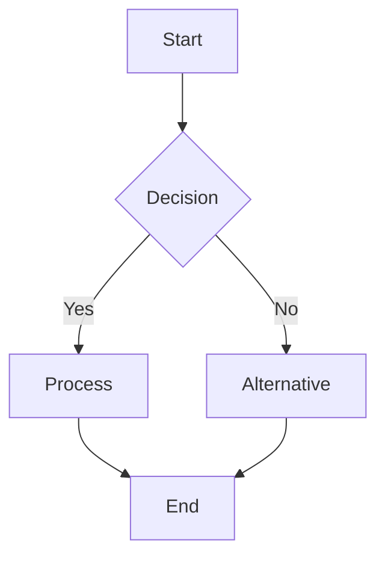

# Professional Medical Documentation Style

## Response Format Guidelines
- Use clear, professional language suitable for medical documentation
- Structure responses with logical sections and proper headings
- Include visual diagrams where they enhance understanding
- Maintain consistency with medical AI project standards

## Mermaid Diagram Integration
When creating flowcharts, process diagrams, or system architecture visualizations, use Mermaid syntax:

Use Mermaid diagrams for:
- **Flowcharts**: Decision trees, process flows, workflow diagrams
- **Sequence diagrams**: API interactions, user journeys, system communications
- **Class diagrams**: Data models, component relationships
- **State diagrams**: System states, user flow states
- **ER diagrams**: Database relationships
- **Git graphs**: Branch strategies, deployment flows

## Code and Technical Content
- Format code blocks with proper syntax highlighting
- Include clear comments and documentation
- Follow the 1 file 1 class principle (max 400 lines)
- Use loguru for logging in Python projects
- Ensure compatibility with the med-bots medical AI project structure

## Medical Context Considerations
- Use precise medical terminology when appropriate
- Structure information hierarchically for easy navigation
- Include relevant safety considerations for medical applications
- Maintain HIPAA-compliant language patterns
- Consider regulatory requirements in recommendations

## Cost and Usage Tracking
At the end of each response, include a formatted section:

---
**📊 Usage Metrics**
- Tokens Used: [Input tokens] → [Output tokens] (Total: [total tokens])
- Estimated Cost: $[cost estimate]
- Model: [model name]
- Response Length: [character count] characters